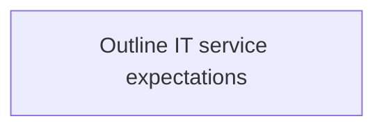
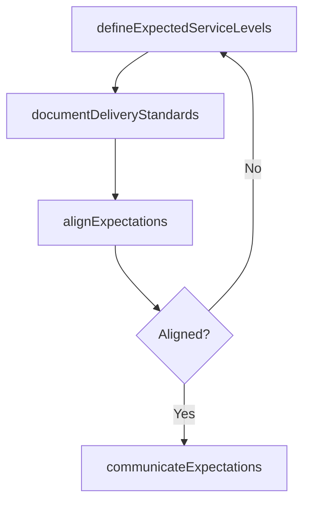

# Outline IT service expectations

> Business-as-Code definition for outlining IT service expectations. Models the process of defining expected service levels, documenting delivery standards, and aligning customer expectations with IT capabilities.

## Overview

Defining a roadmap to meet organizational expectations from information technology services while considering how it will affect the business.

## Process Hierarchy



## GraphDL

```yaml
outline:
  object: IT Service Expectations
  actor: ITServicePlanningManager
  result: ServiceExpectationsDocument
```

## Actions

| Action | Description |
|--------|-------------|
| defineExpectedServiceLevels | Establish target service levels for IT offerings |
| documentDeliveryStandards | Record expected delivery standards and timelines |
| alignExpectations | Reconcile customer expectations with IT delivery capacity |
| communicateExpectations | Share finalized service expectations with stakeholders |

## Events

| Event | Description |
|-------|-------------|
| expectedServiceLevelsDefined | Target service levels established for IT offerings |
| deliveryStandardsDocumented | IT delivery standards and timelines recorded |
| expectationsAligned | Customer expectations reconciled with IT capacity |
| expectationsCommunicated | Service expectations shared with stakeholders |

## Searches

| Search | Description |
|--------|-------------|
| getServiceExpectations | Retrieve defined service expectations by service or business unit |
| getExpectationGaps | List gaps between expectations and current IT capabilities |

## Process Flow



## RACI Matrix

| Activity | Responsible | Accountable | Consulted | Informed |
|----------|-------------|-------------|-----------|----------|
| defineExpectedServiceLevels | ITServicePlanningManager | CIO | BusinessUnitLeaders | EndUsers |
| alignExpectations | ITServicePlanningManager | CIO | ITOperations | Finance |

## Related Processes

| Process | Relationship |
|---------|-------------|
| 8.1.2.3 Develop IT visioning | Upstream - IT vision informs service expectations |
| 8.1.5 Develop and manage IT service levels | Downstream - expectations drive SLA definitions |

## Related Departments

| Department | Role |
|-----------|------|
| IT Service Management | Defines and communicates service expectations |
| Business Units | Provides input on expected service levels |

## Related Occupations

| Occupation | Involvement |
|-----------|-------------|
| IT Service Planning Manager | Leads service expectations definition |
| IT Business Analyst | Supports expectations analysis |

## KPIs

| KPI | Description | Unit |
|-----|-------------|------|
| Expectation Alignment Rate | Percentage of service expectations aligned with IT capacity | % |
| Expectation Communication Coverage | Percentage of stakeholders informed of service expectations | % |

## Usage

```typescript
import { outlineITServiceExpectations } from '@headlessly/outline-it-service-expectations'

const expectations = outlineITServiceExpectations()

// Define expected service levels
const levels = await expectations.defineExpectedServiceLevels({
  services: ['email', 'erp', 'collaboration'],
  uptimeTarget: 99.9,
  responseTimeTarget: '1-hour'
})

// Align expectations with capacity
const alignment = await expectations.alignExpectations({
  businessUnit: 'sales',
  currentCapacity: 'assessed'
})
```
