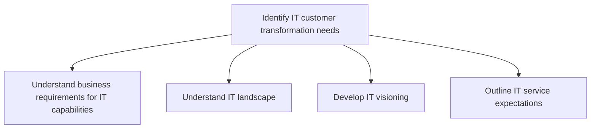
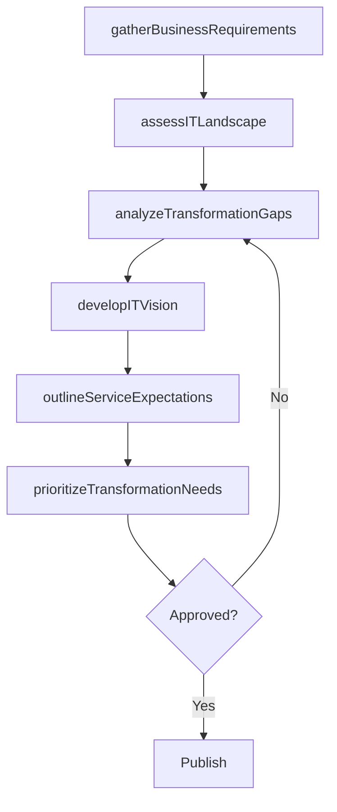

# Identify IT customer transformation needs

> Business-as-Code definition for identifying IT customer transformation needs. Models the process of mapping business requirements to IT capabilities, assessing the technology landscape, and defining IT vision and service expectations.

## Overview

Identifying changing needs of staff dependent on information technology based on continuous improvement to deliver results according to organizational goals.

## Process Hierarchy



## GraphDL

```yaml
identify:
  object: IT Customer Transformation Needs
  actor: ITTransformationConsultant
  result: TransformationNeedsAssessment
```

## Actions

| Action | Description |
|--------|-------------|
| gatherBusinessRequirements | Collect business requirements for current and future IT capabilities |
| assessITLandscape | Map and evaluate the current IT technology landscape |
| developITVision | Create a forward-looking IT vision aligned with business goals |
| outlineServiceExpectations | Define expected service levels and capabilities for IT transformation |
| analyzeTransformationGaps | Identify gaps between current state and desired transformation outcomes |
| prioritizeTransformationNeeds | Rank transformation needs by business impact and feasibility |

## Events

| Event | Description |
|-------|-------------|
| businessRequirementsGathered | Business requirements for IT capabilities documented |
| itLandscapeAssessed | Current IT landscape mapped and evaluated |
| itVisionDeveloped | IT vision statement and direction established |
| serviceExpectationsOutlined | IT service expectations defined and communicated |
| transformationGapsAnalyzed | Transformation gaps between current and target state identified |
| transformationNeedsPrioritized | Transformation needs ranked and approved |

## Searches

| Search | Description |
|--------|-------------|
| findTransformationNeeds | List transformation needs by business unit, priority, or status |
| getITLandscapeMap | Retrieve current IT landscape assessment and technology inventory |
| getTransformationGaps | List transformation gaps by severity or domain |
| getITVision | Retrieve the approved IT vision and strategic direction |

## Process Flow



## RACI Matrix

| Activity | Responsible | Accountable | Consulted | Informed |
|----------|-------------|-------------|-----------|----------|
| gatherBusinessRequirements | ITBusinessAnalyst | ITTransformationConsultant | BusinessUnitLeaders | CIO |
| assessITLandscape | EnterpriseArchitect | ITTransformationConsultant | ITOperations | ITServiceManager |
| developITVision | ITTransformationConsultant | CIO | ExecutiveTeam | AllStaff |
| prioritizeTransformationNeeds | ITTransformationConsultant | CIO | Finance | BusinessUnitLeaders |

## Sub-Processes

| ID | Name | Description |
|----|------|-------------|
| 8.1.2.1 | Understand business requirements for IT capabilities | Understanding business requirements for the existing IT environment as well as future IT needs. |
| 8.1.2.2 | Understand IT landscape | Understanding the complete logical structure and working of the organization's IT landscape. Assess  |
| 8.1.2.3 | Develop IT visioning | Developing goals to define IT vision. Define and document ideas, direction, and activities which ena |
| 8.1.2.4 | Outline IT service expectations | Defining a roadmap to meet organizational expectations from information technology services while co |

## Related Processes

| Process | Relationship |
|---------|-------------|
| 8.1.1 Understand IT customer needs | Upstream - customer needs inform transformation analysis |
| 8.1.4 Provide IT transformation guidance | Downstream - identified needs drive transformation guidance |
| 8.2.1 Define business technology and governance strategy | Parallel - strategy shapes transformation priorities |

## Related Departments

| Department | Role |
|-----------|------|
| IT Strategy and Planning | Leads transformation needs identification |
| Enterprise Architecture | Assesses technology landscape and feasibility |
| Business Units | Provide business context and requirements |
| Change Management | Evaluates organizational readiness for transformation |

## Related Occupations

| Occupation | Involvement |
|-----------|-------------|
| IT Transformation Consultant | Primary executor of transformation needs assessment |
| Enterprise Architect | Evaluates technology landscape and options |
| Business Analyst | Translates business needs into IT requirements |

## KPIs

| KPI | Description | Unit |
|-----|-------------|------|
| Transformation Needs Identified | Number of transformation needs documented per cycle | Count |
| Requirements Mapping Coverage | Percentage of business units with mapped IT requirements | % |
| Vision Alignment Score | Degree of alignment between IT vision and business strategy | Score (1-10) |

## Usage

```typescript
import { identifyITCustomerTransformationNeeds } from '@headlessly/identify-it-customer-transformation-needs'

const transformation = identifyITCustomerTransformationNeeds()

// Assess the IT landscape
const landscape = await transformation.assessITLandscape({
  scope: 'enterprise',
  includeEndOfLife: true
})

// Prioritize transformation needs
const priorities = await transformation.prioritizeTransformationNeeds({
  criteria: ['business-impact', 'technical-debt', 'cost-efficiency'],
  maxItems: 10
})
```
