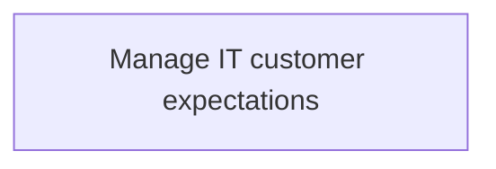
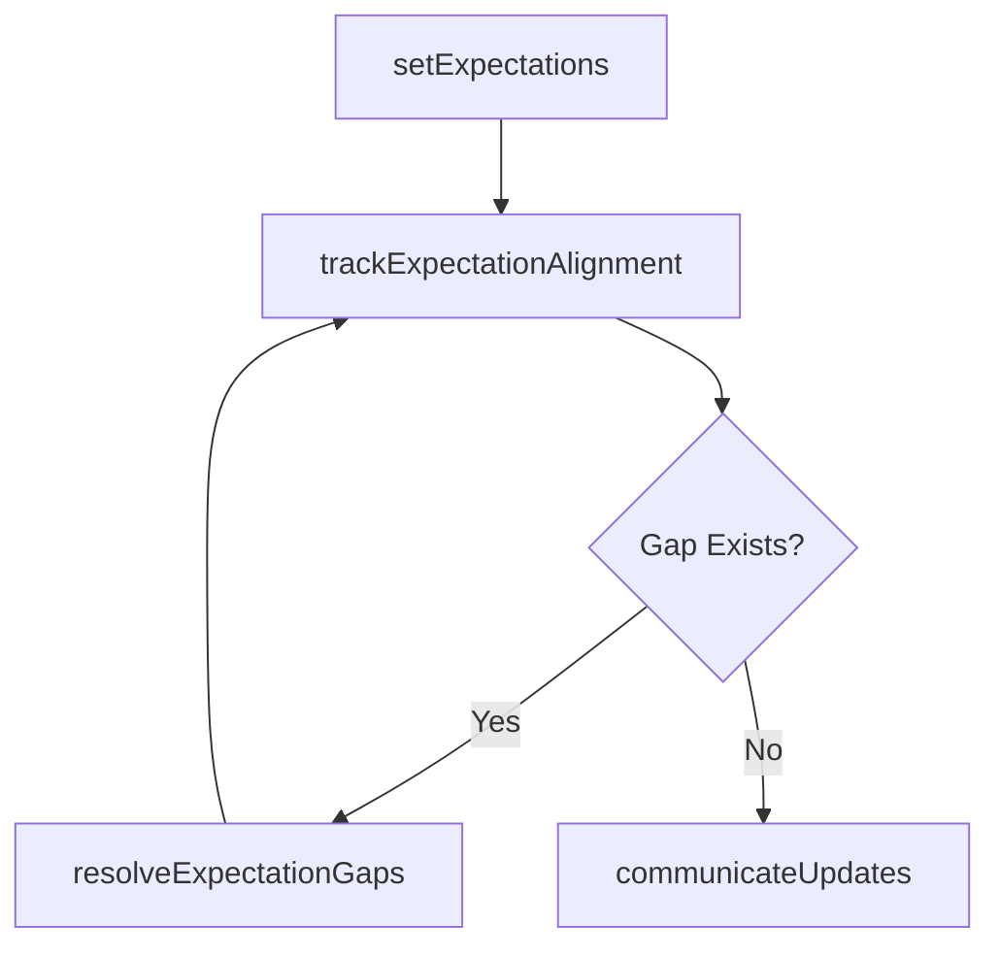

# Manage IT customer expectations

> Business-as-Code definition for managing IT customer expectations. Models the process of setting, tracking, and aligning customer expectations with IT service delivery capabilities.

## Overview

Managing customer expectations of the existing IT environment while considering how it will affect the business.

## Process Hierarchy



## GraphDL

```yaml
manage:
  object: IT Customer Expectations
  actor: ITRelationshipManager
  result: CustomerExpectationsReport
```

## Actions

| Action | Description |
|--------|-------------|
| setExpectations | Define realistic IT service expectations with customer stakeholders |
| trackExpectationAlignment | Monitor alignment between expectations and actual service delivery |
| communicateUpdates | Proactively inform customers about service changes or limitations |
| resolveExpectationGaps | Address mismatches between customer expectations and IT capabilities |

## Events

| Event | Description |
|-------|-------------|
| expectationsSet | IT customer expectations formally defined |
| expectationAlignmentTracked | Expectation alignment assessment completed |
| updatesCommunciated | Service updates communicated to customers |
| expectationGapsResolved | Expectation-capability gaps addressed |

## Searches

| Search | Description |
|--------|-------------|
| getExpectationStatus | Retrieve expectation alignment status by business unit |
| findExpectationGaps | List gaps between expectations and delivery |

## Process Flow



## RACI Matrix

| Activity | Responsible | Accountable | Consulted | Informed |
|----------|-------------|-------------|-----------|----------|
| setExpectations | ITRelationshipManager | CIO | BusinessUnitLeaders | EndUsers |
| trackExpectationAlignment | ITPerformanceAnalyst | ITRelationshipManager | ITOperations | BusinessUnitLeaders |

## Related Processes

| Process | Relationship |
|---------|-------------|
| 8.1.3.2 Define future IT services | Downstream - expectations shape future service planning |
| 8.1.5 Develop and manage IT service levels | Parallel - expectations inform SLA targets |

## Related Departments

| Department | Role |
|-----------|------|
| IT Service Management | Manages customer expectations |
| Business Units | Key stakeholders in expectation-setting |

## Related Occupations

| Occupation | Involvement |
|-----------|-------------|
| IT Relationship Manager | Leads expectation management |
| IT Performance Analyst | Tracks alignment metrics |

## KPIs

| KPI | Description | Unit |
|-----|-------------|------|
| Expectation Alignment Rate | Percentage of expectations met or exceeded | % |
| Customer Satisfaction | Satisfaction score from expectation management | Score (1-5) |

## Usage

```typescript
import { manageITCustomerExpectations } from '@headlessly/manage-it-customer-expectations'

const expectations = manageITCustomerExpectations()

const gaps = await expectations.trackExpectationAlignment({
  businessUnit: 'finance',
  period: 'Q4-2025'
})
```
