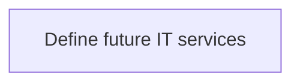
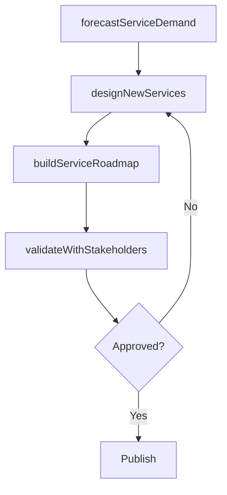

# Define future IT services

> Business-as-Code definition for defining future IT services. Models the process of forecasting service demand, designing new service offerings, and roadmapping IT service evolution.

## Overview

Defining the expected demand and usage of information technology services to meet organization's future business goals. Gather necessary information about the processes, resource requirements, and structures pertaining to planned business growth.

## Process Hierarchy



## GraphDL

```yaml
define:
  object: Future IT Services
  actor: ITServicePlanningManager
  result: FutureServiceRoadmap
```

## Actions

| Action | Description |
|--------|-------------|
| forecastServiceDemand | Project future IT service demand based on business trends |
| designNewServices | Define specifications for new IT service offerings |
| buildServiceRoadmap | Create a phased plan for IT service evolution |
| validateWithStakeholders | Confirm future service plans with business stakeholders |

## Events

| Event | Description |
|-------|-------------|
| serviceDemandForecasted | Future service demand projections completed |
| newServicesDesigned | New IT service specifications documented |
| serviceRoadmapBuilt | IT service evolution roadmap published |
| stakeholderValidationCompleted | Future service plans validated by stakeholders |

## Searches

| Search | Description |
|--------|-------------|
| getFutureServiceRoadmap | Retrieve the IT service evolution roadmap |
| findPlannedServices | List planned new IT services by timeline or category |

## Process Flow



## RACI Matrix

| Activity | Responsible | Accountable | Consulted | Informed |
|----------|-------------|-------------|-----------|----------|
| forecastServiceDemand | ITServicePlanningManager | CIO | BusinessUnitLeaders | Finance |
| designNewServices | ITServiceDesigner | ITServicePlanningManager | EnterpriseArchitect | ITOperations |

## Related Processes

| Process | Relationship |
|---------|-------------|
| 8.1.3.1 Manage IT customer expectations | Upstream - expectations inform future service design |
| 8.5 Develop and manage services/solutions | Downstream - service designs feed solution development |

## Related Departments

| Department | Role |
|-----------|------|
| IT Service Management | Leads future service planning |
| Enterprise Architecture | Validates technical feasibility |

## Related Occupations

| Occupation | Involvement |
|-----------|-------------|
| IT Service Planning Manager | Leads future service definition |
| IT Service Designer | Designs new service specifications |

## KPIs

| KPI | Description | Unit |
|-----|-------------|------|
| Forecast Accuracy | Accuracy of service demand projections | % |
| Service Pipeline | Number of new services in development pipeline | Count |

## Usage

```typescript
import { defineFutureITServices } from '@headlessly/define-future-it-services'

const futureServices = defineFutureITServices()

const forecast = await futureServices.forecastServiceDemand({
  horizon: '12-months',
  businessDrivers: ['digital-transformation', 'workforce-expansion']
})
```
