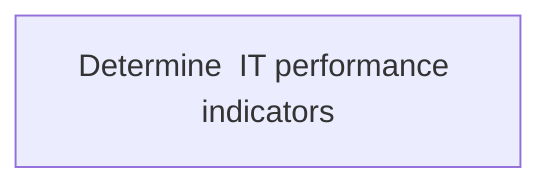
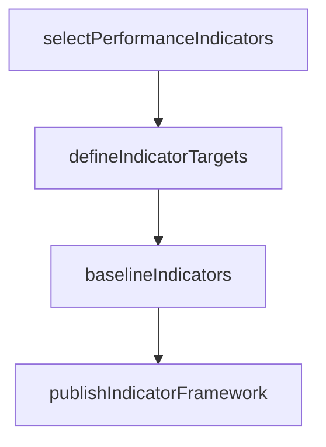

# Determine  IT performance indicators

> Business-as-Code definition for determining IT performance indicators. Models the process of selecting, defining, and baselining KPIs to measure IT service delivery effectiveness.

## Overview

Determining IT KPIs crucial to the organization's success. Measure indicators such as IT costs as percentage of revenue, IT maintenance ratio, and system downtime in an effort to evaluate the performance of IT across the organization.

## Process Hierarchy



## GraphDL

```yaml
determine:
  object: IT Performance Indicators
  actor: ITPerformanceAnalyst
  result: ITPerformanceIndicatorFramework
```

## Actions

| Action | Description |
|--------|-------------|
| selectPerformanceIndicators | Choose relevant KPIs for IT service measurement |
| defineIndicatorTargets | Set target values and thresholds for each KPI |
| baselineIndicators | Establish baseline measurements for selected indicators |
| publishIndicatorFramework | Distribute the performance indicator framework to stakeholders |

## Events

| Event | Description |
|-------|-------------|
| performanceIndicatorsSelected | IT performance KPIs chosen and documented |
| indicatorTargetsDefined | KPI target values and thresholds set |
| indicatorsBaselined | Baseline measurements established |
| indicatorFrameworkPublished | Performance indicator framework distributed |

## Searches

| Search | Description |
|--------|-------------|
| getPerformanceIndicators | Retrieve defined IT performance indicators and targets |
| getIndicatorBaselines | Get baseline measurements for KPIs |

## Process Flow



## RACI Matrix

| Activity | Responsible | Accountable | Consulted | Informed |
|----------|-------------|-------------|-----------|----------|
| selectPerformanceIndicators | ITPerformanceAnalyst | ITServicePlanningManager | BusinessUnitLeaders | CIO |
| defineIndicatorTargets | ITPerformanceAnalyst | ITServicePlanningManager | Finance | ITOperations |

## Related Processes

| Process | Relationship |
|---------|-------------|
| 8.1.7 Analyze service performance | Downstream - indicators enable performance measurement |
| 8.2.5 Control IT management system | Parallel - indicators feed management controls |

## Related Departments

| Department | Role |
|-----------|------|
| IT Performance Management | Defines and maintains KPI framework |
| IT Operations | Provides operational data for baselining |

## Related Occupations

| Occupation | Involvement |
|-----------|-------------|
| IT Performance Analyst | Leads indicator definition and measurement |
| IT Service Planning Manager | Approves indicator framework |

## KPIs

| KPI | Description | Unit |
|-----|-------------|------|
| Indicator Coverage | Percentage of IT services with defined KPIs | % |
| Baseline Currency | Percentage of indicators with baselines updated within 6 months | % |

## Usage

```typescript
import { determineITPerformanceIndicators } from '@headlessly/determine-it-performance-indicators'

const indicators = determineITPerformanceIndicators()

const kpis = await indicators.selectPerformanceIndicators({
  domain: 'service-delivery',
  categories: ['availability', 'performance', 'satisfaction']
})
```
