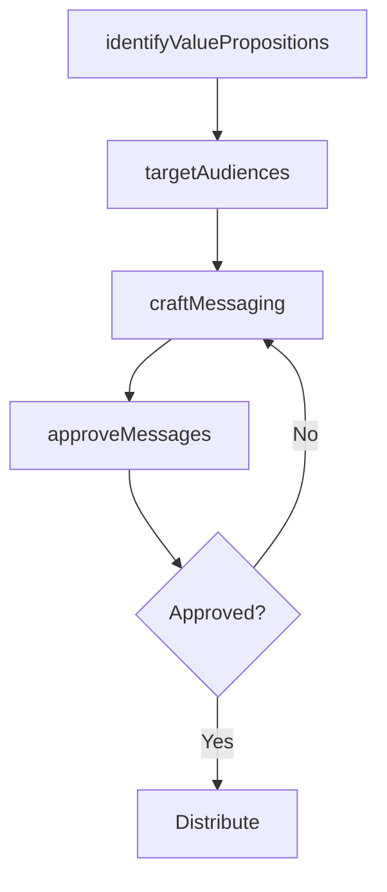

# Create IT marketing messages

> Business-as-Code definition for creating IT marketing messages. Models the process of crafting value propositions, positioning statements, and communication content that promote IT services to internal customers.

## Overview

Developing concise statements that position the value proposition around the pressing concerns of the internal IT user base, thereby showing how the IT offerings are the right fit for a segment of IT customers.

## Process Hierarchy


## GraphDL

```yaml
create:
  object: IT Marketing Messages
  actor: ITCommunicationsLead
  result: ITMarketingMessage
```

## Actions

| Action | Description |
|--------|-------------|
| identifyValuePropositions | Define key value propositions for IT service offerings |
| craftMessaging | Develop clear, compelling marketing messages for IT services |
| targetAudiences | Segment internal audiences for targeted IT communications |
| approveMessages | Review and approve marketing messages before distribution |

## Events

| Event | Description |
|-------|-------------|
| valuePropositionsIdentified | IT service value propositions defined |
| messagingCrafted | IT marketing messages developed |
| audiencesTargeted | Internal audiences segmented for messaging |
| messagesApproved | IT marketing messages approved for distribution |

## Searches

| Search | Description |
|--------|-------------|
| findMarketingMessages | List IT marketing messages by service or audience |
| getMessagePerformance | Retrieve engagement metrics for IT communications |

## Process Flow



## RACI Matrix

| Activity | Responsible | Accountable | Consulted | Informed |
|----------|-------------|-------------|-----------|----------|
| craftMessaging | ITCommunicationsLead | ITServicePlanningManager | Marketing | BusinessUnitLeaders |
| approveMessages | ITServicePlanningManager | CIO | ITCommunicationsLead | EndUsers |

## Related Processes

| Process | Relationship |
|---------|-------------|
| 8.1.3.5 Create IT service marketing plan | Downstream - messages are incorporated into marketing plan |
| 8.1.6.4 Communicate IT capabilities | Parallel - marketing messages support capability communications |

## Related Departments

| Department | Role |
|-----------|------|
| IT Communications | Creates and manages IT marketing content |
| Corporate Marketing | Provides branding and messaging guidance |

## Related Occupations

| Occupation | Involvement |
|-----------|-------------|
| IT Communications Lead | Crafts IT marketing messages |
| IT Service Manager | Provides service context for messaging |

## KPIs

| KPI | Description | Unit |
|-----|-------------|------|
| Message Engagement Rate | Percentage of target audience engaging with messages | % |
| Brand Awareness | IT service awareness score among internal users | Score (1-5) |

## Usage

```typescript
import { createITMarketingMessages } from '@headlessly/create-it-marketing-messages'

const messaging = createITMarketingMessages()

const messages = await messaging.craftMessaging({
  service: 'self-service-analytics',
  audience: 'business-analysts',
  tone: 'professional',
  channels: ['email', 'intranet']
})
```
