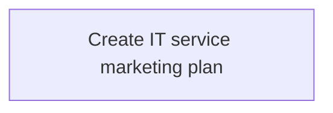
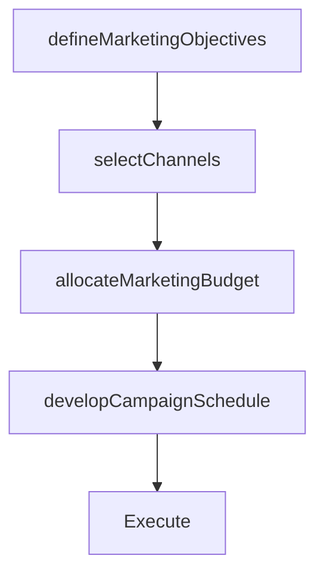

# Create IT service marketing plan

> Business-as-Code definition for creating IT service marketing plans. Models the process of developing comprehensive marketing strategies for IT service adoption, including budgeting, channels, and campaign scheduling.

## Overview

Creating a marketing strategy for IT offerings to customers. Plan processes for making budgets; identifying and developing media; and managing marketing content and promotional activities.

## Process Hierarchy



## GraphDL

```yaml
create:
  object: IT Service Marketing Plan
  actor: ITCommunicationsLead
  result: ITServiceMarketingPlan
```

## Actions

| Action | Description |
|--------|-------------|
| defineMarketingObjectives | Set objectives for IT service marketing campaigns |
| selectChannels | Choose communication channels for IT service promotion |
| developCampaignSchedule | Plan timing and sequencing of marketing activities |
| allocateMarketingBudget | Set budgets for IT service marketing initiatives |

## Events

| Event | Description |
|-------|-------------|
| marketingObjectivesDefined | IT service marketing objectives established |
| channelsSelected | Communication channels chosen for campaigns |
| campaignScheduleDeveloped | Marketing campaign schedule finalized |
| marketingBudgetAllocated | Marketing budget approved and allocated |

## Searches

| Search | Description |
|--------|-------------|
| getMarketingPlan | Retrieve IT service marketing plan details |
| findCampaigns | List marketing campaigns by status or service |

## Process Flow



## RACI Matrix

| Activity | Responsible | Accountable | Consulted | Informed |
|----------|-------------|-------------|-----------|----------|
| defineMarketingObjectives | ITCommunicationsLead | ITServicePlanningManager | BusinessUnitLeaders | CIO |
| allocateMarketingBudget | ITCommunicationsLead | CIO | Finance | ITServicePlanningManager |

## Related Processes

| Process | Relationship |
|---------|-------------|
| 8.1.3.4 Create IT marketing messages | Upstream - messages are key component of marketing plan |
| 8.1.6 Manage IT customer relationships | Parallel - marketing supports relationship management |

## Related Departments

| Department | Role |
|-----------|------|
| IT Communications | Develops and executes marketing plan |
| Finance | Validates marketing budget allocation |

## Related Occupations

| Occupation | Involvement |
|-----------|-------------|
| IT Communications Lead | Creates and manages marketing plan |
| IT Service Planning Manager | Approves marketing strategy |

## KPIs

| KPI | Description | Unit |
|-----|-------------|------|
| Campaign Effectiveness | Service adoption lift attributable to marketing campaigns | % |
| Marketing ROI | Return on investment for IT marketing spend | % |

## Usage

```typescript
import { createITServiceMarketingPlan } from '@headlessly/create-it-service-marketing-plan'

const plan = createITServiceMarketingPlan()

const campaign = await plan.developCampaignSchedule({
  service: 'cloud-collaboration-suite',
  launchDate: '2026-01-15',
  channels: ['email', 'town-hall', 'intranet-banner']
})
```
