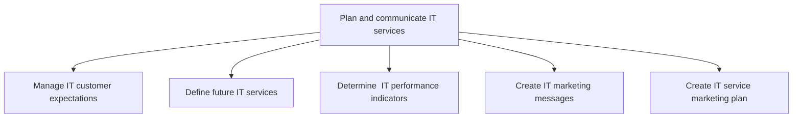
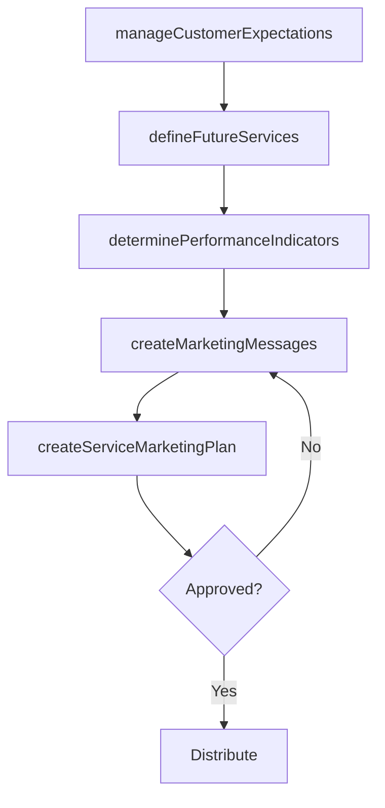

# Plan and communicate IT services

> Business-as-Code definition for IT service planning and communication. Models the process of managing customer expectations, defining future services, establishing performance indicators, and marketing IT offerings internally.

## Overview

Create and design an organized and curated collection of all IT-related services that can be performed by, for, or within the organization. Maintain and convey information about deliverables, prices, contact points, and processes for requesting an information technology service.

## Process Hierarchy



## GraphDL

```yaml
plan:
  object: And Communicate IT Services
  actor: ITServicePlanningManager
  result: ITServiceCommunicationPlan
```

## Actions

| Action | Description |
|--------|-------------|
| manageCustomerExpectations | Set and align customer expectations for current IT services |
| defineFutureServices | Identify and plan new IT services to meet emerging business needs |
| determinePerformanceIndicators | Establish KPIs and metrics for IT service measurement |
| createMarketingMessages | Develop value propositions and communications for IT offerings |
| createServiceMarketingPlan | Build a comprehensive marketing strategy for IT services |

## Events

| Event | Description |
|-------|-------------|
| customerExpectationsManaged | Customer expectations documented and communicated |
| futureServicesDefined | Future IT service roadmap published |
| performanceIndicatorsDetermined | IT performance KPIs established and baselined |
| marketingMessagesCreated | IT service value proposition messages approved |
| serviceMarketingPlanCreated | IT service marketing plan finalized and distributed |

## Searches

| Search | Description |
|--------|-------------|
| findServicePlans | List IT service plans by status, business unit, or timeline |
| getPerformanceIndicators | Retrieve defined IT performance indicators and targets |
| getServiceRoadmap | Get the IT service roadmap with milestones and timelines |
| findMarketingMaterials | List IT service marketing materials by audience or service |

## Process Flow



## RACI Matrix

| Activity | Responsible | Accountable | Consulted | Informed |
|----------|-------------|-------------|-----------|----------|
| manageCustomerExpectations | ITRelationshipManager | ITServicePlanningManager | BusinessUnitLeaders | EndUsers |
| defineFutureServices | ITServicePlanningManager | CIO | EnterpriseArchitect | Finance |
| determinePerformanceIndicators | ITPerformanceAnalyst | ITServicePlanningManager | ITOperations | CIO |
| createServiceMarketingPlan | ITCommunicationsLead | ITServicePlanningManager | Marketing | BusinessUnitLeaders |

## Sub-Processes

| ID | Name | Description |
|----|------|-------------|
| 8.1.3.1 | Manage IT customer expectations | Managing customer expectations of the existing IT environment while considering how it will affect t |
| 8.1.3.2 | Define future IT services | Defining the expected demand and usage of information technology services to meet organization's fut |
| 8.1.3.3 | Determine  IT performance indicators | Determining IT KPIs crucial to the organization's success. Measure indicators such as IT costs as pe |
| 8.1.3.4 | Create IT marketing messages | Developing concise statements that position the value proposition around the pressing concerns of th |
| 8.1.3.5 | Create IT service marketing plan | Creating a marketing strategy for IT offerings to customers. Plan processes for making budgets; iden |

## Related Processes

| Process | Relationship |
|---------|-------------|
| 8.1.1 Understand IT customer needs | Upstream - customer needs inform service planning |
| 8.1.5 Develop and manage IT service levels | Downstream - service plans feed SLA definitions |
| 8.1.7 Analyze service performance | Downstream - KPIs enable performance analysis |

## Related Departments

| Department | Role |
|-----------|------|
| IT Service Management | Leads service planning and catalog development |
| Corporate Communications | Supports internal marketing of IT services |
| Finance | Validates service pricing and budget alignment |
| Business Units | Provides demand signals and adoption feedback |

## Related Occupations

| Occupation | Involvement |
|-----------|-------------|
| IT Service Planning Manager | Leads service roadmap and communication planning |
| IT Communications Specialist | Develops marketing messages and materials |
| IT Performance Analyst | Defines and tracks service performance indicators |

## KPIs

| KPI | Description | Unit |
|-----|-------------|------|
| Service Catalog Completeness | Percentage of IT services documented in the catalog | % |
| Communication Reach | Percentage of target audience reached by IT service communications | % |
| Service Awareness Score | Employee awareness of available IT services | Score (1-5) |
| Service Request Accuracy | Percentage of service requests correctly routed on first contact | % |

## Usage

```typescript
import { planAndCommunicateITServices } from '@headlessly/plan-and-communicate-it-services'

const servicePlan = planAndCommunicateITServices()

// Define future IT services
const roadmap = await servicePlan.defineFutureServices({
  planningHorizon: '12-months',
  alignedTo: 'digital-transformation-strategy'
})

// Create marketing plan for a new service
const plan = await servicePlan.createServiceMarketingPlan({
  service: 'self-service-analytics-platform',
  targetAudience: ['business-analysts', 'department-heads']
})
```
