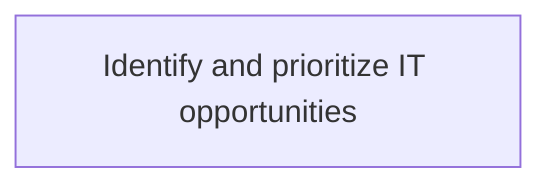
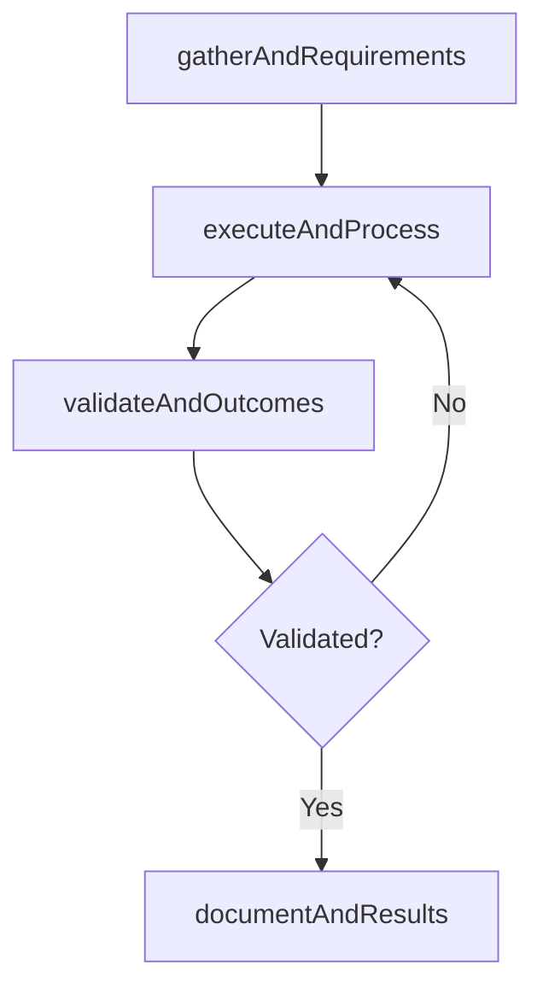

# Identify and prioritize IT opportunities

> Business-as-Code definition for identify and prioritize it opportunities. Models the process of identifying it opportunities on the basis of collection and analysis of it customer requirements, then prioritize the id.

## Overview

Identifying IT opportunities on the basis of collection and analysis of IT customer requirements, then prioritize the identified IT opportunities on the basis of their importance.

## Process Hierarchy



## GraphDL

```yaml
identify:
  object: And Prioritize IT Opportunities
  actor: ITPerformanceAnalyst
  result: IdentifyAndPrioritizeItOpportunities
```

## Actions

| Action | Description |
|--------|-------------|
| gatherAndRequirements | Collect requirements and inputs for identify and prioritize it opportunities |
| executeAndProcess | Perform the core activities of identify and prioritize it opportunities |
| validateAndOutcomes | Verify that outcomes meet defined criteria and standards |
| documentAndResults | Record findings and results for stakeholder review |

## Events

| Event | Description |
|-------|-------------|
| andRequirementsGathered | Requirements for identify and prioritize it opportunities collected |
| andProcessExecuted | Core activities of identify and prioritize it opportunities completed |
| andOutcomesValidated | Outcomes verified against defined criteria |
| andResultsDocumented | Results recorded and distributed to stakeholders |

## Searches

| Search | Description |
|--------|-------------|
| getAndStatus | Retrieve current status of identify and prioritize it opportunities |
| findAndRecords | List records related to identify and prioritize it opportunities by date or status |
| getAndReport | Retrieve summary report for identify and prioritize it opportunities |

## Process Flow



## RACI Matrix

| Activity | Responsible | Accountable | Consulted | Informed |
|----------|-------------|-------------|-----------|----------|
| gatherAndRequirements | ITPerformanceAnalyst | ITBusinessAnalyst | BusinessUnitLeaders | CIO |
| executeAndProcess | ITPerformanceAnalyst | ITBusinessAnalyst | ITOperations | ITServiceManager |
| validateAndOutcomes | ITPerformanceAnalyst | ITBusinessAnalyst | QualityAssurance | ITServiceManager |

## Related Processes

| Process | Relationship |
|---------|-------------|
| 8.1.4 Parent process | Parent - provides context and governance |
| 8.1.4.5 Sibling activity | Parallel - complementary activity in the same process |

## Related Departments

| Department | Role |
|-----------|------|
| IT Service Management | Coordinates customer-facing IT processes |
| Business Units | Primary consumers and requirements source |
| Enterprise Architecture | Advises on technical feasibility |

## Related Occupations

| Occupation | Involvement |
|-----------|-------------|
| IT Business Analyst | Gathers requirements and performs analysis |
| IT Relationship Manager | Manages stakeholder engagement |

## KPIs

| KPI | Description | Unit |
|-----|-------------|------|
| Completion Rate | Percentage of identify and prioritize it opportunities activities completed on schedule | % |
| Quality Score | Quality assessment score for identify and prioritize it opportunities outputs | Score (1-10) |
| Cycle Time | Average time to complete identify and prioritize it opportunities | Days |

## Usage

```typescript
import { identifyAndPrioritizeItOpportunities } from '@headlessly/identify-and-prioritize-it-opportunities'

const process = identifyAndPrioritizeItOpportunities()

// Execute the core process
const result = await process.executeAndProcess({
  scope: 'department',
  priority: 'high'
})

// Validate outcomes
const validation = await process.validateAndOutcomes({
  criteria: 'standard',
  period: 'Q4-2025'
})
```
