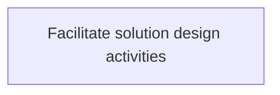
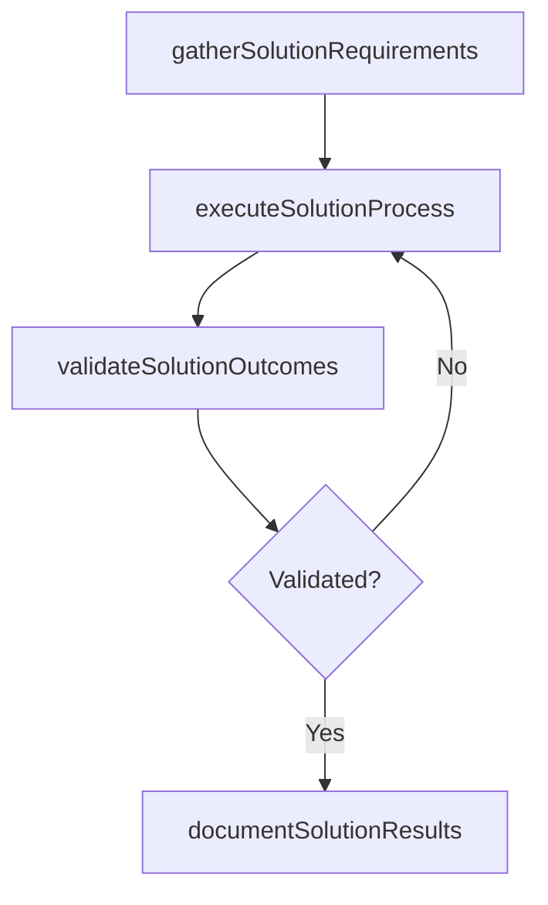

# Facilitate solution design activities

> Business-as-Code definition for facilitate solution design activities. Models the process of providing a plan of action to provide solution to it customers. the solution design should be based on the collection an.

## Overview

Providing a plan of action to provide solution to IT customers. The solution design should be based on the collection and analysis of IT customer requirements.

## Process Hierarchy



## GraphDL

```yaml
facilitate:
  object: Solution Design Activities
  actor: ITRelationshipManager
  result: FacilitateSolutionDesignActivities
```

## Actions

| Action | Description |
|--------|-------------|
| gatherSolutionRequirements | Collect requirements and inputs for facilitate solution design activities |
| executeSolutionProcess | Perform the core activities of facilitate solution design activities |
| validateSolutionOutcomes | Verify that outcomes meet defined criteria and standards |
| documentSolutionResults | Record findings and results for stakeholder review |

## Events

| Event | Description |
|-------|-------------|
| solutionRequirementsGathered | Requirements for facilitate solution design activities collected |
| solutionProcessExecuted | Core activities of facilitate solution design activities completed |
| solutionOutcomesValidated | Outcomes verified against defined criteria |
| solutionResultsDocumented | Results recorded and distributed to stakeholders |

## Searches

| Search | Description |
|--------|-------------|
| getSolutionStatus | Retrieve current status of facilitate solution design activities |
| findSolutionRecords | List records related to facilitate solution design activities by date or status |
| getSolutionReport | Retrieve summary report for facilitate solution design activities |

## Process Flow



## RACI Matrix

| Activity | Responsible | Accountable | Consulted | Informed |
|----------|-------------|-------------|-----------|----------|
| gatherSolutionRequirements | ITRelationshipManager | ITServicePlanningManager | BusinessUnitLeaders | CIO |
| executeSolutionProcess | ITRelationshipManager | ITServicePlanningManager | ITOperations | ITServiceManager |
| validateSolutionOutcomes | ITRelationshipManager | ITServicePlanningManager | QualityAssurance | ITServiceManager |

## Related Processes

| Process | Relationship |
|---------|-------------|
| 8.1.4 Parent process | Parent - provides context and governance |
| 8.1.4.6 Sibling activity | Parallel - complementary activity in the same process |

## Related Departments

| Department | Role |
|-----------|------|
| IT Service Management | Coordinates customer-facing IT processes |
| Business Units | Primary consumers and requirements source |
| Enterprise Architecture | Advises on technical feasibility |

## Related Occupations

| Occupation | Involvement |
|-----------|-------------|
| IT Business Analyst | Gathers requirements and performs analysis |
| IT Relationship Manager | Manages stakeholder engagement |

## KPIs

| KPI | Description | Unit |
|-----|-------------|------|
| Completion Rate | Percentage of facilitate solution design activities activities completed on schedule | % |
| Quality Score | Quality assessment score for facilitate solution design activities outputs | Score (1-10) |
| Cycle Time | Average time to complete facilitate solution design activities | Days |

## Usage

```typescript
import { facilitateSolutionDesignActivities } from '@headlessly/facilitate-solution-design-activities'

const process = facilitateSolutionDesignActivities()

// Execute the core process
const result = await process.executeSolutionProcess({
  scope: 'department',
  priority: 'high'
})

// Validate outcomes
const validation = await process.validateSolutionOutcomes({
  criteria: 'standard',
  period: 'Q4-2025'
})
```
