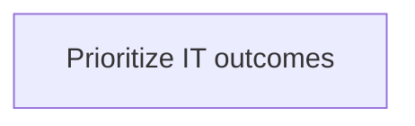
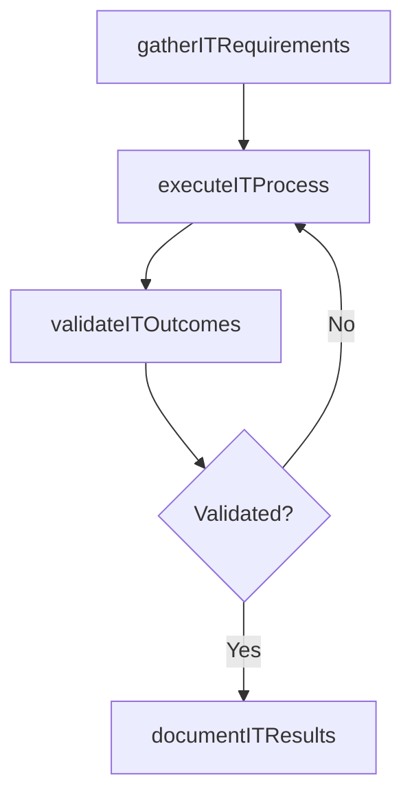

# Prioritize IT outcomes

> Business-as-Code definition for prioritize it outcomes. Models the process of prioritizing it outcomes based on need, effectiveness, and efficiency.

## Overview

Prioritizing IT outcomes based on need, effectiveness, and efficiency.

## Process Hierarchy



## GraphDL

```yaml
prioritize:
  object: IT Outcomes
  actor: ITBusinessAnalyst
  result: PrioritizeItOutcomes
```

## Actions

| Action | Description |
|--------|-------------|
| gatherITRequirements | Collect requirements and inputs for prioritize it outcomes |
| executeITProcess | Perform the core activities of prioritize it outcomes |
| validateITOutcomes | Verify that outcomes meet defined criteria and standards |
| documentITResults | Record findings and results for stakeholder review |

## Events

| Event | Description |
|-------|-------------|
| itRequirementsGathered | Requirements for prioritize it outcomes collected |
| itProcessExecuted | Core activities of prioritize it outcomes completed |
| itOutcomesValidated | Outcomes verified against defined criteria |
| itResultsDocumented | Results recorded and distributed to stakeholders |

## Searches

| Search | Description |
|--------|-------------|
| getITStatus | Retrieve current status of prioritize it outcomes |
| findITRecords | List records related to prioritize it outcomes by date or status |
| getITReport | Retrieve summary report for prioritize it outcomes |

## Process Flow



## RACI Matrix

| Activity | Responsible | Accountable | Consulted | Informed |
|----------|-------------|-------------|-----------|----------|
| gatherITRequirements | ITBusinessAnalyst | ITRelationshipManager | BusinessUnitLeaders | CIO |
| executeITProcess | ITBusinessAnalyst | ITRelationshipManager | ITOperations | ITServiceManager |
| validateITOutcomes | ITBusinessAnalyst | ITRelationshipManager | QualityAssurance | ITServiceManager |

## Related Processes

| Process | Relationship |
|---------|-------------|
| 8.1.4 Parent process | Parent - provides context and governance |
| 8.1.4.7 Sibling activity | Parallel - complementary activity in the same process |

## Related Departments

| Department | Role |
|-----------|------|
| IT Service Management | Coordinates customer-facing IT processes |
| Business Units | Primary consumers and requirements source |
| Enterprise Architecture | Advises on technical feasibility |

## Related Occupations

| Occupation | Involvement |
|-----------|-------------|
| IT Business Analyst | Gathers requirements and performs analysis |
| IT Relationship Manager | Manages stakeholder engagement |

## KPIs

| KPI | Description | Unit |
|-----|-------------|------|
| Completion Rate | Percentage of prioritize it outcomes activities completed on schedule | % |
| Quality Score | Quality assessment score for prioritize it outcomes outputs | Score (1-10) |
| Cycle Time | Average time to complete prioritize it outcomes | Days |

## Usage

```typescript
import { prioritizeItOutcomes } from '@headlessly/prioritize-it-outcomes'

const process = prioritizeItOutcomes()

// Execute the core process
const result = await process.executeITProcess({
  scope: 'department',
  priority: 'high'
})

// Validate outcomes
const validation = await process.validateITOutcomes({
  criteria: 'standard',
  period: 'Q4-2025'
})
```
