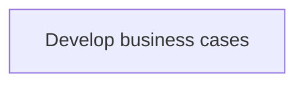
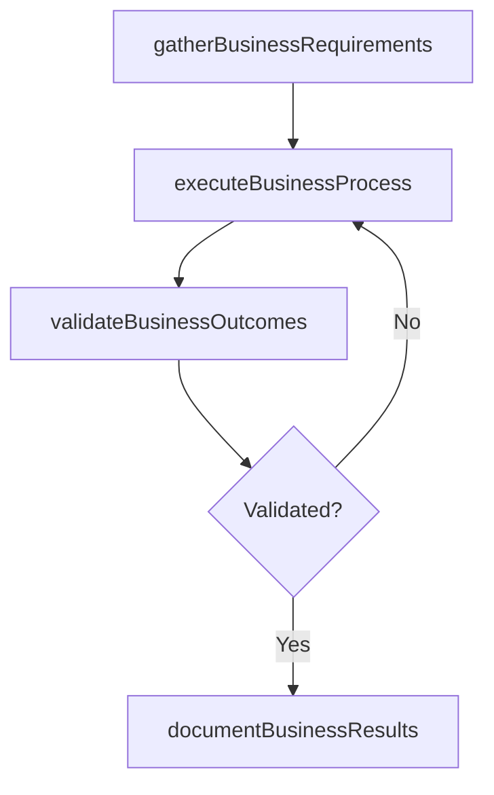

# Develop business cases

> Business-as-Code definition for develop business cases. Models the process of create a business case with value proposition indicating current situation, proposed solution, financial analysis, and m.

## Overview

Create a business case with value proposition indicating current situation, proposed solution, financial analysis, and measurable benefits to the IT customers.

## Process Hierarchy



## GraphDL

```yaml
develop:
  object: Business Cases
  actor: ITServicePlanningManager
  result: DevelopBusinessCases
```

## Actions

| Action | Description |
|--------|-------------|
| gatherBusinessRequirements | Collect requirements and inputs for develop business cases |
| executeBusinessProcess | Perform the core activities of develop business cases |
| validateBusinessOutcomes | Verify that outcomes meet defined criteria and standards |
| documentBusinessResults | Record findings and results for stakeholder review |

## Events

| Event | Description |
|-------|-------------|
| businessRequirementsGathered | Requirements for develop business cases collected |
| businessProcessExecuted | Core activities of develop business cases completed |
| businessOutcomesValidated | Outcomes verified against defined criteria |
| businessResultsDocumented | Results recorded and distributed to stakeholders |

## Searches

| Search | Description |
|--------|-------------|
| getBusinessStatus | Retrieve current status of develop business cases |
| findBusinessRecords | List records related to develop business cases by date or status |
| getBusinessReport | Retrieve summary report for develop business cases |

## Process Flow



## RACI Matrix

| Activity | Responsible | Accountable | Consulted | Informed |
|----------|-------------|-------------|-----------|----------|
| gatherBusinessRequirements | ITServicePlanningManager | ITPerformanceAnalyst | BusinessUnitLeaders | CIO |
| executeBusinessProcess | ITServicePlanningManager | ITPerformanceAnalyst | ITOperations | ITServiceManager |
| validateBusinessOutcomes | ITServicePlanningManager | ITPerformanceAnalyst | QualityAssurance | ITServiceManager |

## Related Processes

| Process | Relationship |
|---------|-------------|
| 8.1.4 Parent process | Parent - provides context and governance |
| 8.1.4.8 Sibling activity | Parallel - complementary activity in the same process |

## Related Departments

| Department | Role |
|-----------|------|
| IT Service Management | Coordinates customer-facing IT processes |
| Business Units | Primary consumers and requirements source |
| Enterprise Architecture | Advises on technical feasibility |

## Related Occupations

| Occupation | Involvement |
|-----------|-------------|
| IT Business Analyst | Gathers requirements and performs analysis |
| IT Relationship Manager | Manages stakeholder engagement |

## KPIs

| KPI | Description | Unit |
|-----|-------------|------|
| Completion Rate | Percentage of develop business cases activities completed on schedule | % |
| Quality Score | Quality assessment score for develop business cases outputs | Score (1-10) |
| Cycle Time | Average time to complete develop business cases | Days |

## Usage

```typescript
import { developBusinessCases } from '@headlessly/develop-business-cases'

const process = developBusinessCases()

// Execute the core process
const result = await process.executeBusinessProcess({
  scope: 'department',
  priority: 'high'
})

// Validate outcomes
const validation = await process.validateBusinessOutcomes({
  criteria: 'standard',
  period: 'Q4-2025'
})
```
