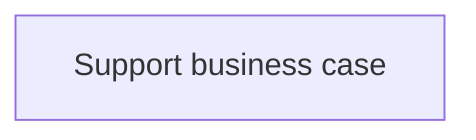
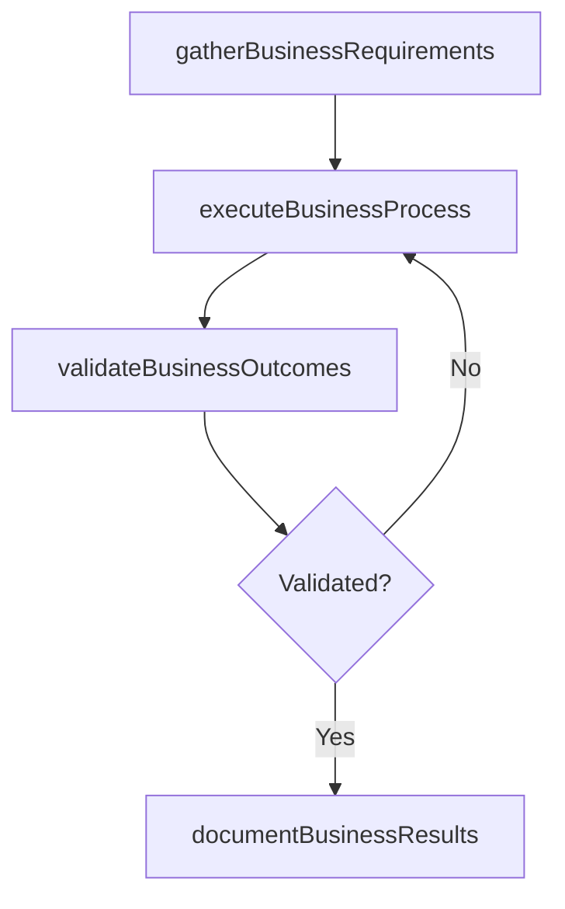

# Support business case

> Business-as-Code definition for support business case. Models the process of supporting business case with supporting research, business analysis, and background information on it transformation.

## Overview

Supporting business case with supporting research, business analysis, and background information on IT transformation.

## Process Hierarchy



## GraphDL

```yaml
support:
  object: Business Case
  actor: ITPerformanceAnalyst
  result: SupportBusinessCase
```

## Actions

| Action | Description |
|--------|-------------|
| gatherBusinessRequirements | Collect requirements and inputs for support business case |
| executeBusinessProcess | Perform the core activities of support business case |
| validateBusinessOutcomes | Verify that outcomes meet defined criteria and standards |
| documentBusinessResults | Record findings and results for stakeholder review |

## Events

| Event | Description |
|-------|-------------|
| businessRequirementsGathered | Requirements for support business case collected |
| businessProcessExecuted | Core activities of support business case completed |
| businessOutcomesValidated | Outcomes verified against defined criteria |
| businessResultsDocumented | Results recorded and distributed to stakeholders |

## Searches

| Search | Description |
|--------|-------------|
| getBusinessStatus | Retrieve current status of support business case |
| findBusinessRecords | List records related to support business case by date or status |
| getBusinessReport | Retrieve summary report for support business case |

## Process Flow



## RACI Matrix

| Activity | Responsible | Accountable | Consulted | Informed |
|----------|-------------|-------------|-----------|----------|
| gatherBusinessRequirements | ITPerformanceAnalyst | ITBusinessAnalyst | BusinessUnitLeaders | CIO |
| executeBusinessProcess | ITPerformanceAnalyst | ITBusinessAnalyst | ITOperations | ITServiceManager |
| validateBusinessOutcomes | ITPerformanceAnalyst | ITBusinessAnalyst | QualityAssurance | ITServiceManager |

## Related Processes

| Process | Relationship |
|---------|-------------|
| 8.1.4 Parent process | Parent - provides context and governance |
| 8.1.4.9 Sibling activity | Parallel - complementary activity in the same process |

## Related Departments

| Department | Role |
|-----------|------|
| IT Service Management | Coordinates customer-facing IT processes |
| Business Units | Primary consumers and requirements source |
| Enterprise Architecture | Advises on technical feasibility |

## Related Occupations

| Occupation | Involvement |
|-----------|-------------|
| IT Business Analyst | Gathers requirements and performs analysis |
| IT Relationship Manager | Manages stakeholder engagement |

## KPIs

| KPI | Description | Unit |
|-----|-------------|------|
| Completion Rate | Percentage of support business case activities completed on schedule | % |
| Quality Score | Quality assessment score for support business case outputs | Score (1-10) |
| Cycle Time | Average time to complete support business case | Days |

## Usage

```typescript
import { supportBusinessCase } from '@headlessly/support-business-case'

const process = supportBusinessCase()

// Execute the core process
const result = await process.executeBusinessProcess({
  scope: 'department',
  priority: 'high'
})

// Validate outcomes
const validation = await process.validateBusinessOutcomes({
  criteria: 'standard',
  period: 'Q4-2025'
})
```
