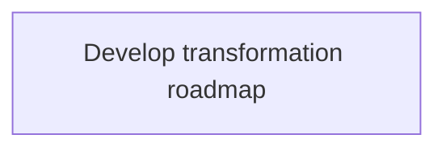
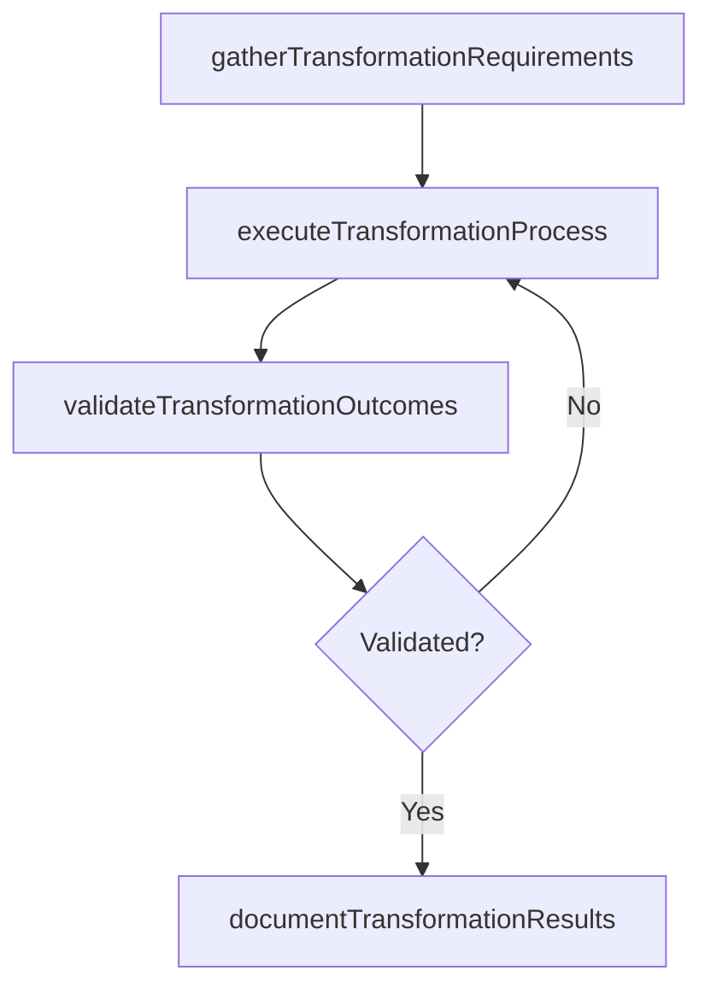

# Develop transformation roadmap

> Business-as-Code definition for develop transformation roadmap. Models the process of creating a blueprint for execution of it transformation from the existing state to the planned organizational structure .

## Overview

Creating a blueprint for execution of IT transformation from the existing state to the planned organizational structure based on the value proposition and projected business growth.

## Process Hierarchy



## GraphDL

```yaml
develop:
  object: Transformation Roadmap
  actor: ITPerformanceAnalyst
  result: DevelopTransformationRoadmap
```

## Actions

| Action | Description |
|--------|-------------|
| gatherTransformationRequirements | Collect requirements and inputs for develop transformation roadmap |
| executeTransformationProcess | Perform the core activities of develop transformation roadmap |
| validateTransformationOutcomes | Verify that outcomes meet defined criteria and standards |
| documentTransformationResults | Record findings and results for stakeholder review |

## Events

| Event | Description |
|-------|-------------|
| transformationRequirementsGathered | Requirements for develop transformation roadmap collected |
| transformationProcessExecuted | Core activities of develop transformation roadmap completed |
| transformationOutcomesValidated | Outcomes verified against defined criteria |
| transformationResultsDocumented | Results recorded and distributed to stakeholders |

## Searches

| Search | Description |
|--------|-------------|
| getTransformationStatus | Retrieve current status of develop transformation roadmap |
| findTransformationRecords | List records related to develop transformation roadmap by date or status |
| getTransformationReport | Retrieve summary report for develop transformation roadmap |

## Process Flow



## RACI Matrix

| Activity | Responsible | Accountable | Consulted | Informed |
|----------|-------------|-------------|-----------|----------|
| gatherTransformationRequirements | ITPerformanceAnalyst | ITBusinessAnalyst | BusinessUnitLeaders | CIO |
| executeTransformationProcess | ITPerformanceAnalyst | ITBusinessAnalyst | ITOperations | ITServiceManager |
| validateTransformationOutcomes | ITPerformanceAnalyst | ITBusinessAnalyst | QualityAssurance | ITServiceManager |

## Related Processes

| Process | Relationship |
|---------|-------------|
| 8.1.4 Parent process | Parent - provides context and governance |
| 8.1.4.10 Sibling activity | Parallel - complementary activity in the same process |

## Related Departments

| Department | Role |
|-----------|------|
| IT Service Management | Coordinates customer-facing IT processes |
| Business Units | Primary consumers and requirements source |
| Enterprise Architecture | Advises on technical feasibility |

## Related Occupations

| Occupation | Involvement |
|-----------|-------------|
| IT Business Analyst | Gathers requirements and performs analysis |
| IT Relationship Manager | Manages stakeholder engagement |

## KPIs

| KPI | Description | Unit |
|-----|-------------|------|
| Completion Rate | Percentage of develop transformation roadmap activities completed on schedule | % |
| Quality Score | Quality assessment score for develop transformation roadmap outputs | Score (1-10) |
| Cycle Time | Average time to complete develop transformation roadmap | Days |

## Usage

```typescript
import { developTransformationRoadmap } from '@headlessly/develop-transformation-roadmap'

const process = developTransformationRoadmap()

// Execute the core process
const result = await process.executeTransformationProcess({
  scope: 'department',
  priority: 'high'
})

// Validate outcomes
const validation = await process.validateTransformationOutcomes({
  criteria: 'standard',
  period: 'Q4-2025'
})
```
