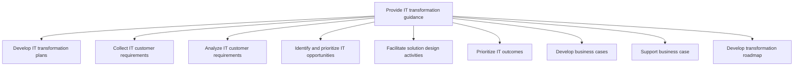
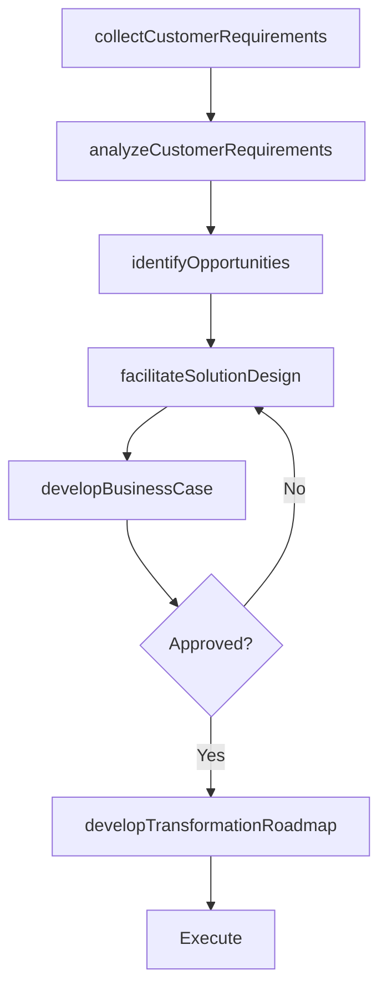

# Provide IT transformation guidance

> Business-as-Code definition for IT transformation guidance. Models the end-to-end process of collecting requirements, analyzing opportunities, designing solutions, building business cases, and developing transformation roadmaps.

## Overview

Understanding the necessity of IT transformation for the business. Collect and analyze customer requirements. Identify opportunities and prioritize outcomes. Develop and support business case for transformation. Develop transformation plan and roadmap.

## Process Hierarchy



## GraphDL

```yaml
provide:
  object: IT Transformation Guidance
  actor: ITTransformationAdvisor
  result: TransformationRoadmap
```

## Actions

| Action | Description |
|--------|-------------|
| collectCustomerRequirements | Gather IT customer requirements for transformation initiatives |
| analyzeCustomerRequirements | Assess collected requirements for feasibility and alignment |
| identifyOpportunities | Discover and prioritize IT transformation opportunities |
| facilitateSolutionDesign | Coordinate solution design workshops and technical evaluation |
| developBusinessCase | Build financial and strategic justification for transformation |
| developTransformationRoadmap | Create phased execution plan for IT transformation |

## Events

| Event | Description |
|-------|-------------|
| customerRequirementsCollected | IT customer transformation requirements documented |
| customerRequirementsAnalyzed | Requirements analyzed for feasibility and impact |
| opportunitiesIdentified | Transformation opportunities cataloged and prioritized |
| solutionDesignFacilitated | Solution design workshops completed with recommendations |
| businessCaseDeveloped | Transformation business case approved by stakeholders |
| transformationRoadmapDeveloped | Phased transformation roadmap published |

## Searches

| Search | Description |
|--------|-------------|
| findTransformationProjects | List transformation initiatives by status, priority, or business unit |
| getBusinessCase | Retrieve business case details for a transformation initiative |
| getTransformationRoadmap | Get the current transformation roadmap with milestones |
| findRequirements | List customer requirements by category or fulfillment status |

## Process Flow



## RACI Matrix

| Activity | Responsible | Accountable | Consulted | Informed |
|----------|-------------|-------------|-----------|----------|
| collectCustomerRequirements | ITBusinessAnalyst | ITTransformationAdvisor | BusinessUnitLeaders | CIO |
| analyzeCustomerRequirements | ITBusinessAnalyst | ITTransformationAdvisor | EnterpriseArchitect | Finance |
| facilitateSolutionDesign | SolutionArchitect | ITTransformationAdvisor | DevelopmentTeams | ITOperations |
| developBusinessCase | ITTransformationAdvisor | CIO | Finance | ExecutiveTeam |
| developTransformationRoadmap | ITTransformationAdvisor | CIO | ProjectManagement | BusinessUnitLeaders |

## Sub-Processes

| ID | Name | Description |
|----|------|-------------|
| 8.1.4.1 | Develop IT transformation plans | Developing a robust plan to replace or upgrade an organization's information technology systems. Und |
| 8.1.4.2 | Collect IT customer requirements | Identifying existing or potential IT gaps between the expected business performance levels and curre |
| 8.1.4.3 | Analyze IT customer requirements | Assessing identified IT gaps to plan for remediation efforts to allow outcomes to meet established p |
| 8.1.4.4 | Identify and prioritize IT opportunities | Identifying IT opportunities on the basis of collection and analysis of IT customer requirements, th |
| 8.1.4.5 | Facilitate solution design activities | Providing a plan of action to provide solution to IT customers. The solution design should be based  |
| 8.1.4.6 | Prioritize IT outcomes | Prioritizing IT outcomes based on need, effectiveness, and efficiency. |
| 8.1.4.7 | Develop business cases | Create a business case with value proposition indicating current situation, proposed solution, finan |
| 8.1.4.8 | Support business case | Supporting business case with supporting research, business analysis, and background information on  |
| 8.1.4.9 | Develop transformation roadmap | Creating a blueprint for execution of IT transformation from the existing state to the planned organ |

## Related Processes

| Process | Relationship |
|---------|-------------|
| 8.1.2 Identify IT customer transformation needs | Upstream - transformation needs drive guidance activities |
| 8.2.3 Define and maintain enterprise architecture | Parallel - architecture standards constrain solution design |
| 8.5 Develop and manage services/solutions | Downstream - approved roadmaps initiate solution development |

## Related Departments

| Department | Role |
|-----------|------|
| IT Transformation Office | Leads transformation advisory and roadmap development |
| Enterprise Architecture | Provides technical feasibility and design guidance |
| Finance | Reviews and approves business case financials |
| Project Management Office | Plans and oversees transformation execution |

## Related Occupations

| Occupation | Involvement |
|-----------|-------------|
| IT Transformation Advisor | Primary executor of transformation guidance |
| Solution Architect | Designs technical solutions for transformation |
| Business Analyst | Gathers and analyzes customer requirements |

## KPIs

| KPI | Description | Unit |
|-----|-------------|------|
| Business Case Approval Rate | Percentage of submitted business cases approved | % |
| Roadmap Milestone Adherence | Percentage of roadmap milestones completed on time | % |
| Requirements Coverage | Percentage of customer requirements addressed in roadmap | % |
| Transformation Initiative ROI | Return on investment for completed transformation projects | % |

## Usage

```typescript
import { provideITTransformationGuidance } from '@headlessly/provide-it-transformation-guidance'

const guidance = provideITTransformationGuidance()

// Collect and analyze requirements
const requirements = await guidance.collectCustomerRequirements({
  businessUnit: 'supply-chain',
  scope: 'warehouse-automation'
})

// Develop the business case
const businessCase = await guidance.developBusinessCase({
  initiative: 'warehouse-automation',
  investmentHorizon: '3-year',
  expectedROI: 0.25
})
```
