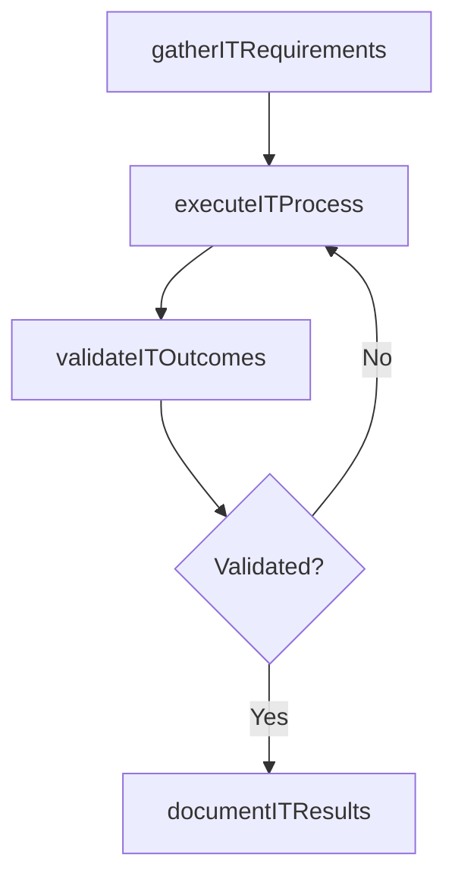

# Forecast IT service demand

> Business-as-Code definition for forecast it service demand. Models the process of forecasting demand for it services using current business growth, research, and customer feedback. refine these forecast.

## Overview

Forecasting demand for IT services using current business growth, research, and customer feedback. Refine these forecasts, inspect the approach used in creating forecasts, and determine its accuracy.

## Process Hierarchy


## GraphDL

```yaml
forecast:
  object: IT Service Demand
  actor: ITServicePlanningManager
  result: ForecastItServiceDemand
```

## Actions

| Action | Description |
|--------|-------------|
| gatherITRequirements | Collect requirements and inputs for forecast it service demand |
| executeITProcess | Perform the core activities of forecast it service demand |
| validateITOutcomes | Verify that outcomes meet defined criteria and standards |
| documentITResults | Record findings and results for stakeholder review |

## Events

| Event | Description |
|-------|-------------|
| itRequirementsGathered | Requirements for forecast it service demand collected |
| itProcessExecuted | Core activities of forecast it service demand completed |
| itOutcomesValidated | Outcomes verified against defined criteria |
| itResultsDocumented | Results recorded and distributed to stakeholders |

## Searches

| Search | Description |
|--------|-------------|
| getITStatus | Retrieve current status of forecast it service demand |
| findITRecords | List records related to forecast it service demand by date or status |
| getITReport | Retrieve summary report for forecast it service demand |

## Process Flow



## RACI Matrix

| Activity | Responsible | Accountable | Consulted | Informed |
|----------|-------------|-------------|-----------|----------|
| gatherITRequirements | ITServicePlanningManager | ITPerformanceAnalyst | BusinessUnitLeaders | CIO |
| executeITProcess | ITServicePlanningManager | ITPerformanceAnalyst | ITOperations | ITServiceManager |
| validateITOutcomes | ITServicePlanningManager | ITPerformanceAnalyst | QualityAssurance | ITServiceManager |

## Related Processes

| Process | Relationship |
|---------|-------------|
| 8.1.5 Parent process | Parent - provides context and governance |
| 8.1.5.3 Sibling activity | Parallel - complementary activity in the same process |

## Related Departments

| Department | Role |
|-----------|------|
| IT Service Management | Coordinates customer-facing IT processes |
| Business Units | Primary consumers and requirements source |
| Enterprise Architecture | Advises on technical feasibility |

## Related Occupations

| Occupation | Involvement |
|-----------|-------------|
| IT Business Analyst | Gathers requirements and performs analysis |
| IT Relationship Manager | Manages stakeholder engagement |

## KPIs

| KPI | Description | Unit |
|-----|-------------|------|
| Completion Rate | Percentage of forecast it service demand activities completed on schedule | % |
| Quality Score | Quality assessment score for forecast it service demand outputs | Score (1-10) |
| Cycle Time | Average time to complete forecast it service demand | Days |

## Usage

```typescript
import { forecastItServiceDemand } from '@headlessly/forecast-it-service-demand'

const process = forecastItServiceDemand()

// Execute the core process
const result = await process.executeITProcess({
  scope: 'department',
  priority: 'high'
})

// Validate outcomes
const validation = await process.validateITOutcomes({
  criteria: 'standard',
  period: 'Q4-2025'
})
```
