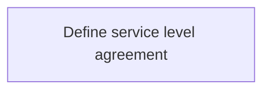
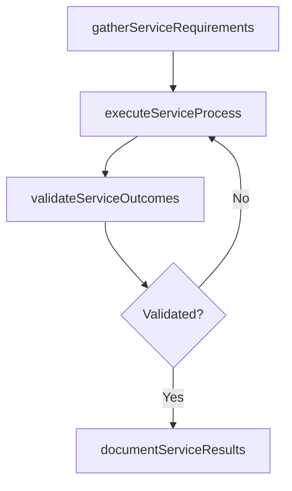

# Define service level agreement

> Business-as-Code definition for define service level agreement. Models the process of designing and maintaining commitment of service by performance evaluation of it services and communicate the results to .

## Overview

Designing and maintaining commitment of service by performance evaluation of IT services and communicate the results to the management.

## Process Hierarchy



## GraphDL

```yaml
define:
  object: Service Level Agreement
  actor: ITRelationshipManager
  result: DefineServiceLevelAgreement
```

## Actions

| Action | Description |
|--------|-------------|
| gatherServiceRequirements | Collect requirements and inputs for define service level agreement |
| executeServiceProcess | Perform the core activities of define service level agreement |
| validateServiceOutcomes | Verify that outcomes meet defined criteria and standards |
| documentServiceResults | Record findings and results for stakeholder review |

## Events

| Event | Description |
|-------|-------------|
| serviceRequirementsGathered | Requirements for define service level agreement collected |
| serviceProcessExecuted | Core activities of define service level agreement completed |
| serviceOutcomesValidated | Outcomes verified against defined criteria |
| serviceResultsDocumented | Results recorded and distributed to stakeholders |

## Searches

| Search | Description |
|--------|-------------|
| getServiceStatus | Retrieve current status of define service level agreement |
| findServiceRecords | List records related to define service level agreement by date or status |
| getServiceReport | Retrieve summary report for define service level agreement |

## Process Flow



## RACI Matrix

| Activity | Responsible | Accountable | Consulted | Informed |
|----------|-------------|-------------|-----------|----------|
| gatherServiceRequirements | ITRelationshipManager | ITServicePlanningManager | BusinessUnitLeaders | CIO |
| executeServiceProcess | ITRelationshipManager | ITServicePlanningManager | ITOperations | ITServiceManager |
| validateServiceOutcomes | ITRelationshipManager | ITServicePlanningManager | QualityAssurance | ITServiceManager |

## Related Processes

| Process | Relationship |
|---------|-------------|
| 8.1.5 Parent process | Parent - provides context and governance |
| 8.1.5.5 Sibling activity | Parallel - complementary activity in the same process |

## Related Departments

| Department | Role |
|-----------|------|
| IT Service Management | Coordinates customer-facing IT processes |
| Business Units | Primary consumers and requirements source |
| Enterprise Architecture | Advises on technical feasibility |

## Related Occupations

| Occupation | Involvement |
|-----------|-------------|
| IT Business Analyst | Gathers requirements and performs analysis |
| IT Relationship Manager | Manages stakeholder engagement |

## KPIs

| KPI | Description | Unit |
|-----|-------------|------|
| Completion Rate | Percentage of define service level agreement activities completed on schedule | % |
| Quality Score | Quality assessment score for define service level agreement outputs | Score (1-10) |
| Cycle Time | Average time to complete define service level agreement | Days |

## Usage

```typescript
import { defineServiceLevelAgreement } from '@headlessly/define-service-level-agreement'

const process = defineServiceLevelAgreement()

// Execute the core process
const result = await process.executeServiceProcess({
  scope: 'department',
  priority: 'high'
})

// Validate outcomes
const validation = await process.validateServiceOutcomes({
  criteria: 'standard',
  period: 'Q4-2025'
})
```
