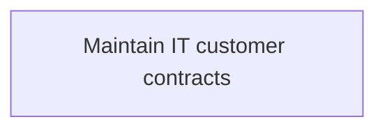
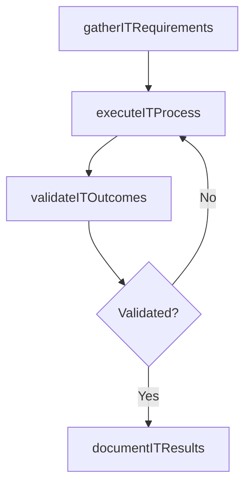

# Maintain IT customer contracts

> Business-as-Code definition for maintain it customer contracts. Models the process of maintaining and documenting commitment of service to staff for information technology contracts including providing soft.

## Overview

Maintaining and documenting commitment of service to staff for information technology contracts including providing software or hardware solution through communication channels like phone, email, and on-site services.

## Process Hierarchy



## GraphDL

```yaml
maintain:
  object: IT Customer Contracts
  actor: ITPerformanceAnalyst
  result: MaintainItCustomerContracts
```

## Actions

| Action | Description |
|--------|-------------|
| gatherITRequirements | Collect requirements and inputs for maintain it customer contracts |
| executeITProcess | Perform the core activities of maintain it customer contracts |
| validateITOutcomes | Verify that outcomes meet defined criteria and standards |
| documentITResults | Record findings and results for stakeholder review |

## Events

| Event | Description |
|-------|-------------|
| itRequirementsGathered | Requirements for maintain it customer contracts collected |
| itProcessExecuted | Core activities of maintain it customer contracts completed |
| itOutcomesValidated | Outcomes verified against defined criteria |
| itResultsDocumented | Results recorded and distributed to stakeholders |

## Searches

| Search | Description |
|--------|-------------|
| getITStatus | Retrieve current status of maintain it customer contracts |
| findITRecords | List records related to maintain it customer contracts by date or status |
| getITReport | Retrieve summary report for maintain it customer contracts |

## Process Flow



## RACI Matrix

| Activity | Responsible | Accountable | Consulted | Informed |
|----------|-------------|-------------|-----------|----------|
| gatherITRequirements | ITPerformanceAnalyst | ITBusinessAnalyst | BusinessUnitLeaders | CIO |
| executeITProcess | ITPerformanceAnalyst | ITBusinessAnalyst | ITOperations | ITServiceManager |
| validateITOutcomes | ITPerformanceAnalyst | ITBusinessAnalyst | QualityAssurance | ITServiceManager |

## Related Processes

| Process | Relationship |
|---------|-------------|
| 8.1.5 Parent process | Parent - provides context and governance |
| 8.1.5.6 Sibling activity | Parallel - complementary activity in the same process |

## Related Departments

| Department | Role |
|-----------|------|
| IT Service Management | Coordinates customer-facing IT processes |
| Business Units | Primary consumers and requirements source |
| Enterprise Architecture | Advises on technical feasibility |

## Related Occupations

| Occupation | Involvement |
|-----------|-------------|
| IT Business Analyst | Gathers requirements and performs analysis |
| IT Relationship Manager | Manages stakeholder engagement |

## KPIs

| KPI | Description | Unit |
|-----|-------------|------|
| Completion Rate | Percentage of maintain it customer contracts activities completed on schedule | % |
| Quality Score | Quality assessment score for maintain it customer contracts outputs | Score (1-10) |
| Cycle Time | Average time to complete maintain it customer contracts | Days |

## Usage

```typescript
import { maintainItCustomerContracts } from '@headlessly/maintain-it-customer-contracts'

const process = maintainItCustomerContracts()

// Execute the core process
const result = await process.executeITProcess({
  scope: 'department',
  priority: 'high'
})

// Validate outcomes
const validation = await process.validateITOutcomes({
  criteria: 'standard',
  period: 'Q4-2025'
})
```
