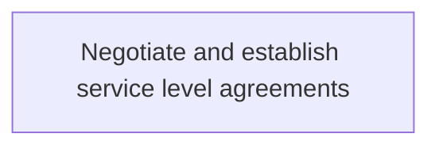
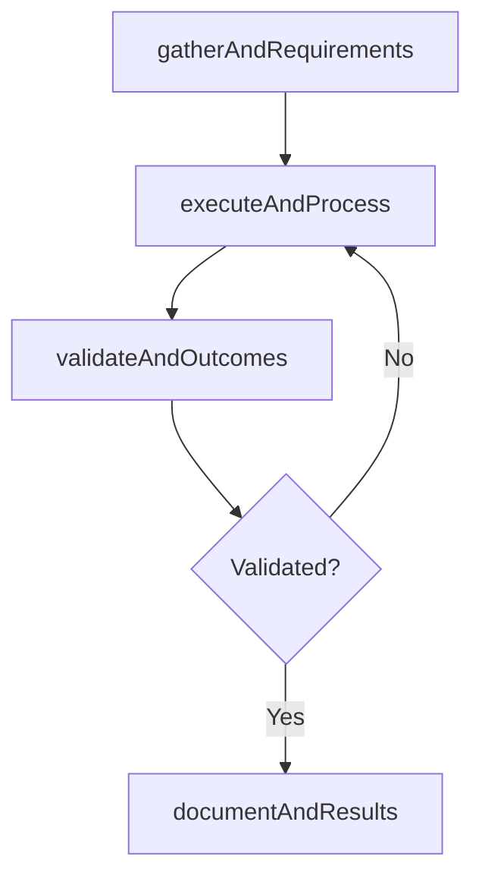

# Negotiate and establish service level agreements

> Business-as-Code definition for negotiate and establish service level agreements. Models the process of establish a service level agreement, which is a negotiated agreement designed to create a common understanding about ser.

## Overview

Establish a service level agreement, which is a negotiated agreement designed to create a common understanding about services, priorities, and responsibilities.

## Process Hierarchy



## GraphDL

```yaml
negotiate:
  object: And Establish Service Level Agreements
  actor: ITServicePlanningManager
  result: NegotiateAndEstablishServiceLevelAgreements
```

## Actions

| Action | Description |
|--------|-------------|
| gatherAndRequirements | Collect requirements and inputs for negotiate and establish service level agreements |
| executeAndProcess | Perform the core activities of negotiate and establish service level agreements |
| validateAndOutcomes | Verify that outcomes meet defined criteria and standards |
| documentAndResults | Record findings and results for stakeholder review |

## Events

| Event | Description |
|-------|-------------|
| andRequirementsGathered | Requirements for negotiate and establish service level agreements collected |
| andProcessExecuted | Core activities of negotiate and establish service level agreements completed |
| andOutcomesValidated | Outcomes verified against defined criteria |
| andResultsDocumented | Results recorded and distributed to stakeholders |

## Searches

| Search | Description |
|--------|-------------|
| getAndStatus | Retrieve current status of negotiate and establish service level agreements |
| findAndRecords | List records related to negotiate and establish service level agreements by date or status |
| getAndReport | Retrieve summary report for negotiate and establish service level agreements |

## Process Flow



## RACI Matrix

| Activity | Responsible | Accountable | Consulted | Informed |
|----------|-------------|-------------|-----------|----------|
| gatherAndRequirements | ITServicePlanningManager | ITPerformanceAnalyst | BusinessUnitLeaders | CIO |
| executeAndProcess | ITServicePlanningManager | ITPerformanceAnalyst | ITOperations | ITServiceManager |
| validateAndOutcomes | ITServicePlanningManager | ITPerformanceAnalyst | QualityAssurance | ITServiceManager |

## Related Processes

| Process | Relationship |
|---------|-------------|
| 8.1.5 Parent process | Parent - provides context and governance |
| 8.1.5.7 Sibling activity | Parallel - complementary activity in the same process |

## Related Departments

| Department | Role |
|-----------|------|
| IT Service Management | Coordinates customer-facing IT processes |
| Business Units | Primary consumers and requirements source |
| Enterprise Architecture | Advises on technical feasibility |

## Related Occupations

| Occupation | Involvement |
|-----------|-------------|
| IT Business Analyst | Gathers requirements and performs analysis |
| IT Relationship Manager | Manages stakeholder engagement |

## KPIs

| KPI | Description | Unit |
|-----|-------------|------|
| Completion Rate | Percentage of negotiate and establish service level agreements activities completed on schedule | % |
| Quality Score | Quality assessment score for negotiate and establish service level agreements outputs | Score (1-10) |
| Cycle Time | Average time to complete negotiate and establish service level agreements | Days |

## Usage

```typescript
import { negotiateAndEstablishServiceLevelAgreements } from '@headlessly/negotiate-and-establish-service-level-agreements'

const process = negotiateAndEstablishServiceLevelAgreements()

// Execute the core process
const result = await process.executeAndProcess({
  scope: 'department',
  priority: 'high'
})

// Validate outcomes
const validation = await process.validateAndOutcomes({
  criteria: 'standard',
  period: 'Q4-2025'
})
```
