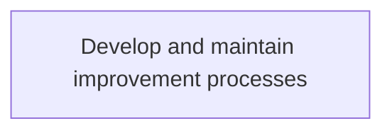
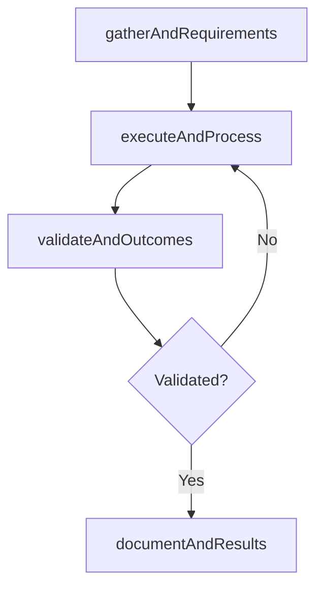

# Develop and maintain improvement processes

> Business-as-Code definition for develop and maintain improvement processes. Models the process of conveying the improvement opportunities for the business and level of it services. leverage the results obtained from th.

## Overview

Conveying the improvement opportunities for the business and level of IT services. Leverage the results obtained from the performance metrics of the business and IT service levels to identify and recognize any opportunities that would improve or enhance the efficiency of the business and IT service-level structure. Communicate these opportunities to management in order for the improvements to take effect.

## Process Hierarchy



## GraphDL

```yaml
develop:
  object: And Maintain Improvement Processes
  actor: ITPerformanceAnalyst
  result: DevelopAndMaintainImprovementProcesses
```

## Actions

| Action | Description |
|--------|-------------|
| gatherAndRequirements | Collect requirements and inputs for develop and maintain improvement processes |
| executeAndProcess | Perform the core activities of develop and maintain improvement processes |
| validateAndOutcomes | Verify that outcomes meet defined criteria and standards |
| documentAndResults | Record findings and results for stakeholder review |

## Events

| Event | Description |
|-------|-------------|
| andRequirementsGathered | Requirements for develop and maintain improvement processes collected |
| andProcessExecuted | Core activities of develop and maintain improvement processes completed |
| andOutcomesValidated | Outcomes verified against defined criteria |
| andResultsDocumented | Results recorded and distributed to stakeholders |

## Searches

| Search | Description |
|--------|-------------|
| getAndStatus | Retrieve current status of develop and maintain improvement processes |
| findAndRecords | List records related to develop and maintain improvement processes by date or status |
| getAndReport | Retrieve summary report for develop and maintain improvement processes |

## Process Flow



## RACI Matrix

| Activity | Responsible | Accountable | Consulted | Informed |
|----------|-------------|-------------|-----------|----------|
| gatherAndRequirements | ITPerformanceAnalyst | ITBusinessAnalyst | BusinessUnitLeaders | CIO |
| executeAndProcess | ITPerformanceAnalyst | ITBusinessAnalyst | ITOperations | ITServiceManager |
| validateAndOutcomes | ITPerformanceAnalyst | ITBusinessAnalyst | QualityAssurance | ITServiceManager |

## Related Processes

| Process | Relationship |
|---------|-------------|
| 8.1.5 Parent process | Parent - provides context and governance |
| 8.1.5.8 Sibling activity | Parallel - complementary activity in the same process |

## Related Departments

| Department | Role |
|-----------|------|
| IT Service Management | Coordinates customer-facing IT processes |
| Business Units | Primary consumers and requirements source |
| Enterprise Architecture | Advises on technical feasibility |

## Related Occupations

| Occupation | Involvement |
|-----------|-------------|
| IT Business Analyst | Gathers requirements and performs analysis |
| IT Relationship Manager | Manages stakeholder engagement |

## KPIs

| KPI | Description | Unit |
|-----|-------------|------|
| Completion Rate | Percentage of develop and maintain improvement processes activities completed on schedule | % |
| Quality Score | Quality assessment score for develop and maintain improvement processes outputs | Score (1-10) |
| Cycle Time | Average time to complete develop and maintain improvement processes | Days |

## Usage

```typescript
import { developAndMaintainImprovementProcesses } from '@headlessly/develop-and-maintain-improvement-processes'

const process = developAndMaintainImprovementProcesses()

// Execute the core process
const result = await process.executeAndProcess({
  scope: 'department',
  priority: 'high'
})

// Validate outcomes
const validation = await process.validateAndOutcomes({
  criteria: 'standard',
  period: 'Q4-2025'
})
```
