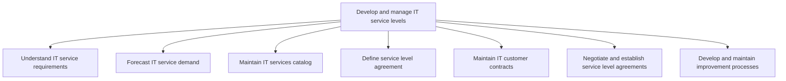
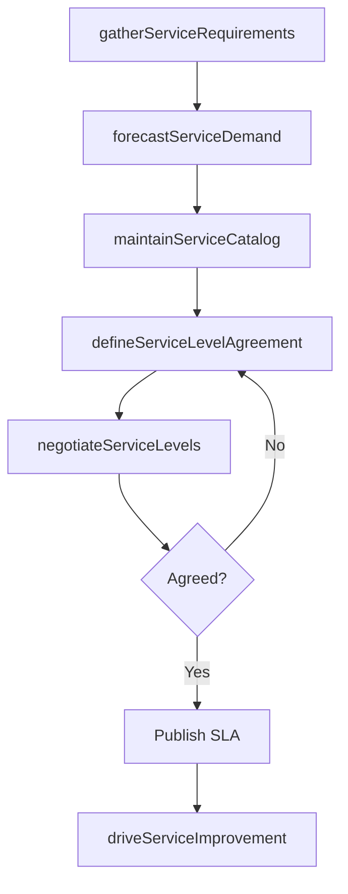

# Develop and manage IT service levels

> Business-as-Code definition for IT service level management. Models the lifecycle of defining service requirements, forecasting demand, maintaining the service catalog, negotiating SLAs, and driving continuous improvement.

## Overview

Establishing and maintaining service levels for the provision of IT services and solutions. Design and maintain the IT services and solution catalogue, as well as service level agreements. Evaluate the performance of IT service level agreements. Communicate the results to the management.

## Process Hierarchy



## GraphDL

```yaml
develop:
  object: And Manage IT Service Levels
  actor: ServiceLevelManager
  result: ServiceLevelAgreement
```

## Actions

| Action | Description |
|--------|-------------|
| gatherServiceRequirements | Collect and document IT service requirements from stakeholders |
| forecastServiceDemand | Project future IT service demand based on business growth trends |
| maintainServiceCatalog | Update and publish the IT services catalog with current offerings |
| defineServiceLevelAgreement | Draft SLA terms including targets, penalties, and escalation paths |
| negotiateServiceLevels | Negotiate SLA terms with business unit stakeholders |
| driveServiceImprovement | Identify and implement service level improvement opportunities |

## Events

| Event | Description |
|-------|-------------|
| serviceRequirementsGathered | IT service requirements documented and validated |
| serviceDemandForecasted | IT service demand projections published |
| serviceCatalogMaintained | IT services catalog updated and published |
| serviceLevelAgreementDefined | SLA drafted with targets and terms |
| serviceLevelsNegotiated | SLA terms agreed upon with stakeholders |
| serviceImprovementDriven | Service improvement initiative launched or completed |

## Searches

| Search | Description |
|--------|-------------|
| findServiceLevelAgreements | List SLAs filtered by service, business unit, or compliance status |
| getServiceCatalog | Retrieve the current IT services catalog |
| getServiceDemandForecast | Get demand projections for IT services by period |
| findImprovementInitiatives | List open service improvement initiatives by priority |

## Process Flow



## RACI Matrix

| Activity | Responsible | Accountable | Consulted | Informed |
|----------|-------------|-------------|-----------|----------|
| gatherServiceRequirements | ITBusinessAnalyst | ServiceLevelManager | BusinessUnitLeaders | ITOperations |
| forecastServiceDemand | ITCapacityPlanner | ServiceLevelManager | Finance | CIO |
| maintainServiceCatalog | ServiceCatalogManager | ServiceLevelManager | ITOperations | EndUsers |
| negotiateServiceLevels | ServiceLevelManager | CIO | Legal | BusinessUnitLeaders |
| driveServiceImprovement | ServiceLevelManager | CIO | ITOperations | BusinessUnitLeaders |

## Sub-Processes

| ID | Name | Description |
|----|------|-------------|
| 8.1.5.1 | Understand IT service requirements | Understand requirements related to information technology services considering enterprise-level effe |
| 8.1.5.2 | Forecast IT service demand | Forecasting demand for IT services using current business growth, research, and customer feedback. R |
| 8.1.5.3 | Maintain IT services catalog | Maintain information about IT deliverables, prices, contact points, and processes for requesting a s |
| 8.1.5.4 | Define service level agreement | Designing and maintaining commitment of service by performance evaluation of IT services and communi |
| 8.1.5.5 | Maintain IT customer contracts | Maintaining and documenting commitment of service to staff for information technology contracts incl |
| 8.1.5.6 | Negotiate and establish service level agreements | Establish a service level agreement, which is a negotiated agreement designed to create a common und |
| 8.1.5.7 | Develop and maintain improvement processes | Conveying the improvement opportunities for the business and level of IT services. Leverage the resu |

## Related Processes

| Process | Relationship |
|---------|-------------|
| 8.1.3 Plan and communicate IT services | Upstream - service plans inform SLA definitions |
| 8.1.7 Analyze service performance | Downstream - SLAs provide the baseline for performance analysis |
| 8.7 Create and manage support services/solutions | Parallel - support services are governed by SLAs |

## Related Departments

| Department | Role |
|-----------|------|
| IT Service Management | Owns service level definition and management |
| IT Operations | Delivers services and reports on SLA metrics |
| Legal | Reviews SLA contractual terms |
| Finance | Validates service costing and chargeback models |

## Related Occupations

| Occupation | Involvement |
|-----------|-------------|
| Service Level Manager | Primary executor of SLA lifecycle management |
| IT Capacity Planner | Forecasts demand and resource requirements |
| Contract Manager | Manages contractual aspects of SLAs |

## KPIs

| KPI | Description | Unit |
|-----|-------------|------|
| SLA Coverage | Percentage of IT services with active SLAs | % |
| SLA Compliance Rate | Percentage of SLA targets met or exceeded | % |
| Service Catalog Currency | Percentage of catalog entries updated within the last quarter | % |
| Service Improvement Rate | Number of improvement initiatives completed per period | Count/Quarter |

## Usage

```typescript
import { developAndManageITServiceLevels } from '@headlessly/develop-and-manage-it-service-levels'

const slaManager = developAndManageITServiceLevels()

// Define a new SLA for cloud hosting
const sla = await slaManager.defineServiceLevelAgreement({
  service: 'cloud-hosting',
  uptimeTarget: 99.95,
  responseTime: '4-hours',
  reviewCadence: 'monthly'
})

// Forecast demand for Q1
const forecast = await slaManager.forecastServiceDemand({
  period: 'Q1-2026',
  services: ['cloud-hosting', 'help-desk', 'network-services']
})
```
