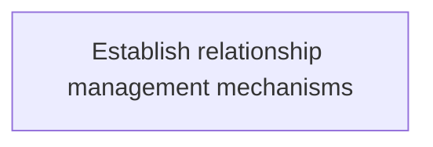
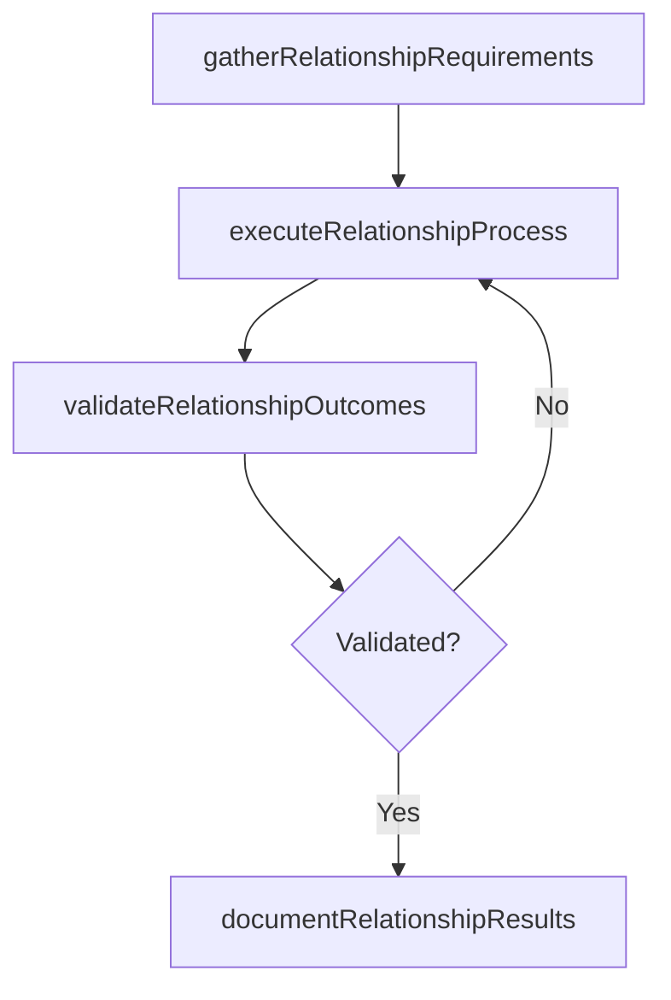

# Establish relationship management mechanisms

> Business-as-Code definition for establish relationship management mechanisms. Models the process of create mechanisms for effective public relationship in order to preserve the image and goodwill of the organization thro.

## Overview

Create mechanisms for effective public relationship in order to preserve the image and goodwill of the organization through the process.

## Process Hierarchy



## GraphDL

```yaml
establish:
  object: Relationship Management Mechanisms
  actor: ITPerformanceAnalyst
  result: EstablishRelationshipManagementMechanisms
```

## Actions

| Action | Description |
|--------|-------------|
| gatherRelationshipRequirements | Collect requirements and inputs for establish relationship management mechanisms |
| executeRelationshipProcess | Perform the core activities of establish relationship management mechanisms |
| validateRelationshipOutcomes | Verify that outcomes meet defined criteria and standards |
| documentRelationshipResults | Record findings and results for stakeholder review |

## Events

| Event | Description |
|-------|-------------|
| relationshipRequirementsGathered | Requirements for establish relationship management mechanisms collected |
| relationshipProcessExecuted | Core activities of establish relationship management mechanisms completed |
| relationshipOutcomesValidated | Outcomes verified against defined criteria |
| relationshipResultsDocumented | Results recorded and distributed to stakeholders |

## Searches

| Search | Description |
|--------|-------------|
| getRelationshipStatus | Retrieve current status of establish relationship management mechanisms |
| findRelationshipRecords | List records related to establish relationship management mechanisms by date or status |
| getRelationshipReport | Retrieve summary report for establish relationship management mechanisms |

## Process Flow



## RACI Matrix

| Activity | Responsible | Accountable | Consulted | Informed |
|----------|-------------|-------------|-----------|----------|
| gatherRelationshipRequirements | ITPerformanceAnalyst | ITBusinessAnalyst | BusinessUnitLeaders | CIO |
| executeRelationshipProcess | ITPerformanceAnalyst | ITBusinessAnalyst | ITOperations | ITServiceManager |
| validateRelationshipOutcomes | ITPerformanceAnalyst | ITBusinessAnalyst | QualityAssurance | ITServiceManager |

## Related Processes

| Process | Relationship |
|---------|-------------|
| 8.1.6 Parent process | Parent - provides context and governance |
| 8.1.6.2 Sibling activity | Parallel - complementary activity in the same process |

## Related Departments

| Department | Role |
|-----------|------|
| IT Service Management | Coordinates customer-facing IT processes |
| Business Units | Primary consumers and requirements source |
| Enterprise Architecture | Advises on technical feasibility |

## Related Occupations

| Occupation | Involvement |
|-----------|-------------|
| IT Business Analyst | Gathers requirements and performs analysis |
| IT Relationship Manager | Manages stakeholder engagement |

## KPIs

| KPI | Description | Unit |
|-----|-------------|------|
| Completion Rate | Percentage of establish relationship management mechanisms activities completed on schedule | % |
| Quality Score | Quality assessment score for establish relationship management mechanisms outputs | Score (1-10) |
| Cycle Time | Average time to complete establish relationship management mechanisms | Days |

## Usage

```typescript
import { establishRelationshipManagementMechanisms } from '@headlessly/establish-relationship-management-mechanisms'

const process = establishRelationshipManagementMechanisms()

// Execute the core process
const result = await process.executeRelationshipProcess({
  scope: 'department',
  priority: 'high'
})

// Validate outcomes
const validation = await process.validateRelationshipOutcomes({
  criteria: 'standard',
  period: 'Q4-2025'
})
```
