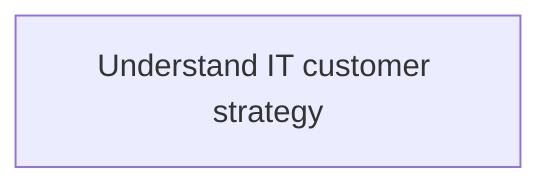
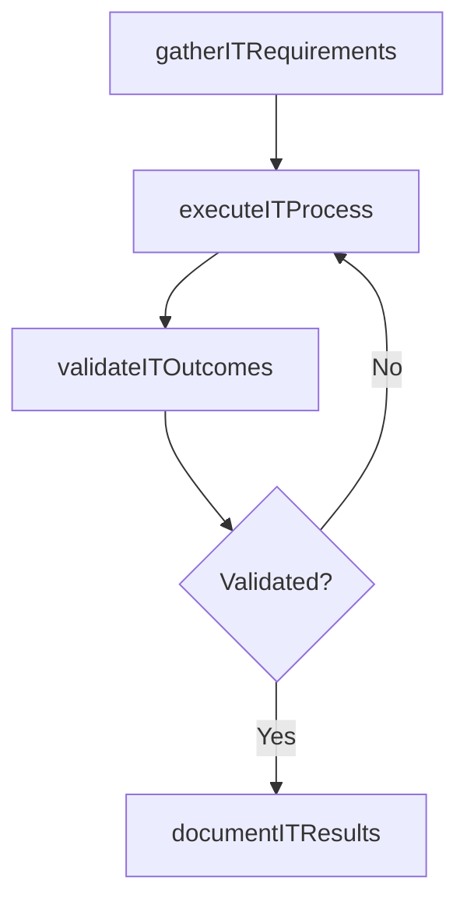

# Understand IT customer strategy

> Business-as-Code definition for understand it customer strategy. Models the process of understanding the strategy for staff dependent on information technology. create a plan to create services and solutions.

## Overview

Understanding the strategy for staff dependent on information technology. Create a plan to create services and solutions, conduct daily operations, and train new employees.

## Process Hierarchy



## GraphDL

```yaml
understand:
  object: IT Customer Strategy
  actor: ITServicePlanningManager
  result: UnderstandItCustomerStrategy
```

## Actions

| Action | Description |
|--------|-------------|
| gatherITRequirements | Collect requirements and inputs for understand it customer strategy |
| executeITProcess | Perform the core activities of understand it customer strategy |
| validateITOutcomes | Verify that outcomes meet defined criteria and standards |
| documentITResults | Record findings and results for stakeholder review |

## Events

| Event | Description |
|-------|-------------|
| itRequirementsGathered | Requirements for understand it customer strategy collected |
| itProcessExecuted | Core activities of understand it customer strategy completed |
| itOutcomesValidated | Outcomes verified against defined criteria |
| itResultsDocumented | Results recorded and distributed to stakeholders |

## Searches

| Search | Description |
|--------|-------------|
| getITStatus | Retrieve current status of understand it customer strategy |
| findITRecords | List records related to understand it customer strategy by date or status |
| getITReport | Retrieve summary report for understand it customer strategy |

## Process Flow



## RACI Matrix

| Activity | Responsible | Accountable | Consulted | Informed |
|----------|-------------|-------------|-----------|----------|
| gatherITRequirements | ITServicePlanningManager | ITPerformanceAnalyst | BusinessUnitLeaders | CIO |
| executeITProcess | ITServicePlanningManager | ITPerformanceAnalyst | ITOperations | ITServiceManager |
| validateITOutcomes | ITServicePlanningManager | ITPerformanceAnalyst | QualityAssurance | ITServiceManager |

## Related Processes

| Process | Relationship |
|---------|-------------|
| 8.1.6 Parent process | Parent - provides context and governance |
| 8.1.6.3 Sibling activity | Parallel - complementary activity in the same process |

## Related Departments

| Department | Role |
|-----------|------|
| IT Service Management | Coordinates customer-facing IT processes |
| Business Units | Primary consumers and requirements source |
| Enterprise Architecture | Advises on technical feasibility |

## Related Occupations

| Occupation | Involvement |
|-----------|-------------|
| IT Business Analyst | Gathers requirements and performs analysis |
| IT Relationship Manager | Manages stakeholder engagement |

## KPIs

| KPI | Description | Unit |
|-----|-------------|------|
| Completion Rate | Percentage of understand it customer strategy activities completed on schedule | % |
| Quality Score | Quality assessment score for understand it customer strategy outputs | Score (1-10) |
| Cycle Time | Average time to complete understand it customer strategy | Days |

## Usage

```typescript
import { understandItCustomerStrategy } from '@headlessly/understand-it-customer-strategy'

const process = understandItCustomerStrategy()

// Execute the core process
const result = await process.executeITProcess({
  scope: 'department',
  priority: 'high'
})

// Validate outcomes
const validation = await process.validateITOutcomes({
  criteria: 'standard',
  period: 'Q4-2025'
})
```
