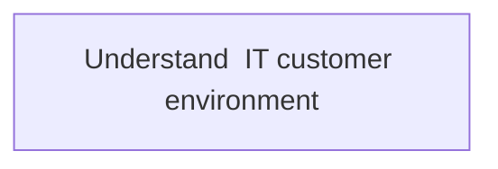
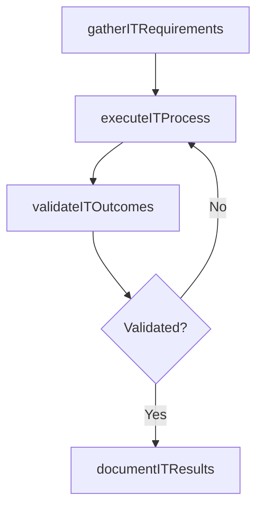

# Understand  IT customer environment

> Business-as-Code definition for understand  it customer environment. Models the process of understanding the environment of staff dependent on information technology. assess and evaluate services and solutions u.

## Overview

Understanding the environment of staff dependent on information technology. Assess and evaluate services and solutions used by customers to conduct daily operations, and train new employees.

## Process Hierarchy



## GraphDL

```yaml
understand:
  object: IT Customer Environment
  actor: ITBusinessAnalyst
  result: UnderstandItCustomerEnvironment
```

## Actions

| Action | Description |
|--------|-------------|
| gatherITRequirements | Collect requirements and inputs for understand  it customer environment |
| executeITProcess | Perform the core activities of understand  it customer environment |
| validateITOutcomes | Verify that outcomes meet defined criteria and standards |
| documentITResults | Record findings and results for stakeholder review |

## Events

| Event | Description |
|-------|-------------|
| itRequirementsGathered | Requirements for understand  it customer environment collected |
| itProcessExecuted | Core activities of understand  it customer environment completed |
| itOutcomesValidated | Outcomes verified against defined criteria |
| itResultsDocumented | Results recorded and distributed to stakeholders |

## Searches

| Search | Description |
|--------|-------------|
| getITStatus | Retrieve current status of understand  it customer environment |
| findITRecords | List records related to understand  it customer environment by date or status |
| getITReport | Retrieve summary report for understand  it customer environment |

## Process Flow



## RACI Matrix

| Activity | Responsible | Accountable | Consulted | Informed |
|----------|-------------|-------------|-----------|----------|
| gatherITRequirements | ITBusinessAnalyst | ITRelationshipManager | BusinessUnitLeaders | CIO |
| executeITProcess | ITBusinessAnalyst | ITRelationshipManager | ITOperations | ITServiceManager |
| validateITOutcomes | ITBusinessAnalyst | ITRelationshipManager | QualityAssurance | ITServiceManager |

## Related Processes

| Process | Relationship |
|---------|-------------|
| 8.1.6 Parent process | Parent - provides context and governance |
| 8.1.6.4 Sibling activity | Parallel - complementary activity in the same process |

## Related Departments

| Department | Role |
|-----------|------|
| IT Service Management | Coordinates customer-facing IT processes |
| Business Units | Primary consumers and requirements source |
| Enterprise Architecture | Advises on technical feasibility |

## Related Occupations

| Occupation | Involvement |
|-----------|-------------|
| IT Business Analyst | Gathers requirements and performs analysis |
| IT Relationship Manager | Manages stakeholder engagement |

## KPIs

| KPI | Description | Unit |
|-----|-------------|------|
| Completion Rate | Percentage of understand  it customer environment activities completed on schedule | % |
| Quality Score | Quality assessment score for understand  it customer environment outputs | Score (1-10) |
| Cycle Time | Average time to complete understand  it customer environment | Days |

## Usage

```typescript
import { understandItCustomerEnvironment } from '@headlessly/understand-it-customer-environment'

const process = understandItCustomerEnvironment()

// Execute the core process
const result = await process.executeITProcess({
  scope: 'department',
  priority: 'high'
})

// Validate outcomes
const validation = await process.validateITOutcomes({
  criteria: 'standard',
  period: 'Q4-2025'
})
```
