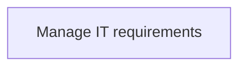
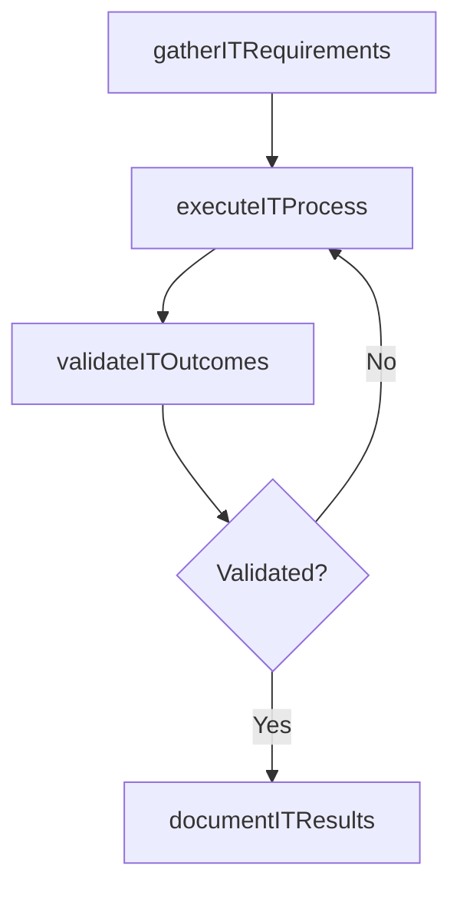

# Manage IT requirements

> Business-as-Code definition for manage it requirements. Models the process of managing the it requirements for business objectives. identify the requirements of hardware and software equipment to st.

## Overview

Managing the IT requirements for business objectives. Identify the requirements of hardware and software equipment to store, retrieve, transmit, and manipulate data related to business operations. Consider factors such as functional, design, growth phases, and delivery schedule while managing IT requirements.

## Process Hierarchy



## GraphDL

```yaml
manage:
  object: IT Requirements
  actor: ITRelationshipManager
  result: ManageItRequirements
```

## Actions

| Action | Description |
|--------|-------------|
| gatherITRequirements | Collect requirements and inputs for manage it requirements |
| executeITProcess | Perform the core activities of manage it requirements |
| validateITOutcomes | Verify that outcomes meet defined criteria and standards |
| documentITResults | Record findings and results for stakeholder review |

## Events

| Event | Description |
|-------|-------------|
| itRequirementsGathered | Requirements for manage it requirements collected |
| itProcessExecuted | Core activities of manage it requirements completed |
| itOutcomesValidated | Outcomes verified against defined criteria |
| itResultsDocumented | Results recorded and distributed to stakeholders |

## Searches

| Search | Description |
|--------|-------------|
| getITStatus | Retrieve current status of manage it requirements |
| findITRecords | List records related to manage it requirements by date or status |
| getITReport | Retrieve summary report for manage it requirements |

## Process Flow



## RACI Matrix

| Activity | Responsible | Accountable | Consulted | Informed |
|----------|-------------|-------------|-----------|----------|
| gatherITRequirements | ITRelationshipManager | ITServicePlanningManager | BusinessUnitLeaders | CIO |
| executeITProcess | ITRelationshipManager | ITServicePlanningManager | ITOperations | ITServiceManager |
| validateITOutcomes | ITRelationshipManager | ITServicePlanningManager | QualityAssurance | ITServiceManager |

## Related Processes

| Process | Relationship |
|---------|-------------|
| 8.1.6 Parent process | Parent - provides context and governance |
| 8.1.6.6 Sibling activity | Parallel - complementary activity in the same process |

## Related Departments

| Department | Role |
|-----------|------|
| IT Service Management | Coordinates customer-facing IT processes |
| Business Units | Primary consumers and requirements source |
| Enterprise Architecture | Advises on technical feasibility |

## Related Occupations

| Occupation | Involvement |
|-----------|-------------|
| IT Business Analyst | Gathers requirements and performs analysis |
| IT Relationship Manager | Manages stakeholder engagement |

## KPIs

| KPI | Description | Unit |
|-----|-------------|------|
| Completion Rate | Percentage of manage it requirements activities completed on schedule | % |
| Quality Score | Quality assessment score for manage it requirements outputs | Score (1-10) |
| Cycle Time | Average time to complete manage it requirements | Days |

## Usage

```typescript
import { manageItRequirements } from '@headlessly/manage-it-requirements'

const process = manageItRequirements()

// Execute the core process
const result = await process.executeITProcess({
  scope: 'department',
  priority: 'high'
})

// Validate outcomes
const validation = await process.validateITOutcomes({
  criteria: 'standard',
  period: 'Q4-2025'
})
```
