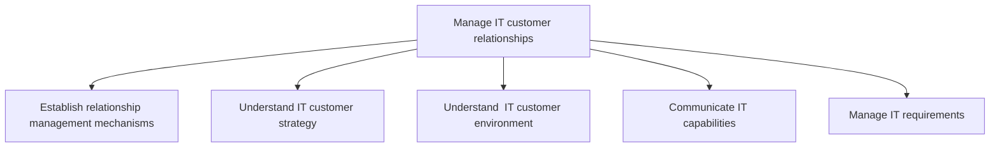
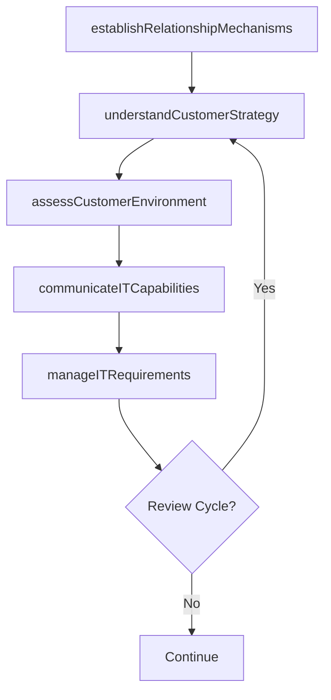

# Manage IT customer relationships

> Business-as-Code definition for IT customer relationship management. Models the process of establishing engagement mechanisms, understanding customer strategy and environment, communicating IT capabilities, and managing ongoing requirements.

## Overview

Managing the IT relationship with its customers by systematically coordinating interactions over multiple touch points on a regular basis. Coordinate the IT's efforts to reach out to its customers, which include emails, social-media interactions, newsletters, and direct conversations.

## Process Hierarchy



## GraphDL

```yaml
manage:
  object: IT Customer Relationships
  actor: ITRelationshipManager
  result: CustomerEngagementRecord
```

## Actions

| Action | Description |
|--------|-------------|
| establishRelationshipMechanisms | Set up governance structures and engagement channels with customers |
| understandCustomerStrategy | Map business unit strategic priorities to IT engagement plans |
| assessCustomerEnvironment | Evaluate the technology environment and maturity of customer groups |
| communicateITCapabilities | Present IT service offerings and roadmap to customer stakeholders |
| manageITRequirements | Track, prioritize, and fulfill ongoing IT requirements from customers |

## Events

| Event | Description |
|-------|-------------|
| relationshipMechanismsEstablished | Customer engagement governance and channels launched |
| customerStrategyUnderstood | Business unit strategic priorities documented for IT alignment |
| customerEnvironmentAssessed | Customer technology environment evaluated and profiled |
| itCapabilitiesCommunicated | IT capabilities presentation delivered to stakeholders |
| itRequirementsManaged | IT requirements backlog updated and prioritized |

## Searches

| Search | Description |
|--------|-------------|
| findCustomerEngagements | List customer engagement activities by business unit or period |
| getRequirementsBacklog | Retrieve open IT requirements by priority or category |
| getCustomerProfile | Get a specific business unit's IT relationship profile |
| findCommunicationHistory | List IT communications sent to a customer group |

## Process Flow



## RACI Matrix

| Activity | Responsible | Accountable | Consulted | Informed |
|----------|-------------|-------------|-----------|----------|
| establishRelationshipMechanisms | ITRelationshipManager | CIO | BusinessUnitLeaders | ITServiceManager |
| understandCustomerStrategy | ITRelationshipManager | CIO | BusinessUnitLeaders | EnterpriseArchitect |
| communicateITCapabilities | ITCommunicationsLead | ITRelationshipManager | ITServiceManager | EndUsers |
| manageITRequirements | ITBusinessAnalyst | ITRelationshipManager | ITOperations | BusinessUnitLeaders |

## Sub-Processes

| ID | Name | Description |
|----|------|-------------|
| 8.1.6.1 | Establish relationship management mechanisms | Create mechanisms for effective public relationship in order to preserve the image and goodwill of t |
| 8.1.6.2 | Understand IT customer strategy | Understanding the strategy for staff dependent on information technology. Create a plan to create se |
| 8.1.6.3 | Understand  IT customer environment | Understanding the environment of staff dependent on information technology. Assess and evaluate serv |
| 8.1.6.4 | Communicate IT capabilities | Conveying the goals and objectives of the IT function and how it contributes to the overall business |
| 8.1.6.5 | Manage IT requirements | Managing the IT requirements for business objectives. Identify the requirements of hardware and soft |

## Related Processes

| Process | Relationship |
|---------|-------------|
| 8.1.1 Understand IT customer needs | Upstream - needs assessments inform relationship strategy |
| 8.1.5 Develop and manage IT service levels | Parallel - SLAs formalize relationship commitments |
| 8.1.7 Analyze service performance | Downstream - performance data informs relationship reviews |

## Related Departments

| Department | Role |
|-----------|------|
| IT Service Management | Manages customer engagement and requirements |
| Business Units | Key stakeholders in the IT relationship |
| Corporate Communications | Supports IT messaging and stakeholder updates |

## Related Occupations

| Occupation | Involvement |
|-----------|-------------|
| IT Relationship Manager | Primary executor of customer relationship activities |
| IT Business Analyst | Supports requirements gathering and analysis |
| IT Communications Specialist | Develops and delivers IT capability communications |

## KPIs

| KPI | Description | Unit |
|-----|-------------|------|
| Customer Satisfaction Score | Periodic satisfaction rating from IT customers | Score (1-5) |
| Engagement Cadence Compliance | Percentage of scheduled engagement sessions held on time | % |
| Requirements Fulfillment Rate | Percentage of tracked requirements addressed per period | % |
| Stakeholder Coverage | Percentage of business units with active IT relationship manager | % |

## Usage

```typescript
import { manageITCustomerRelationships } from '@headlessly/manage-it-customer-relationships'

const crm = manageITCustomerRelationships()

// Establish engagement mechanisms for a business unit
const engagement = await crm.establishRelationshipMechanisms({
  businessUnit: 'sales',
  cadence: 'bi-weekly',
  channels: ['steering-committee', 'email-newsletter', 'office-hours']
})

// Communicate IT capabilities
const comms = await crm.communicateITCapabilities({
  audience: 'all-business-units',
  format: 'quarterly-town-hall',
  topics: ['cloud-migration-update', 'new-analytics-platform']
})
```
