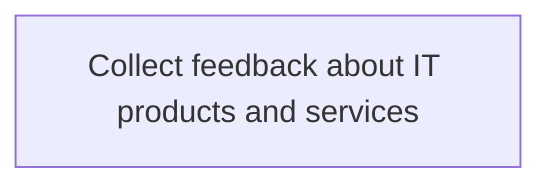
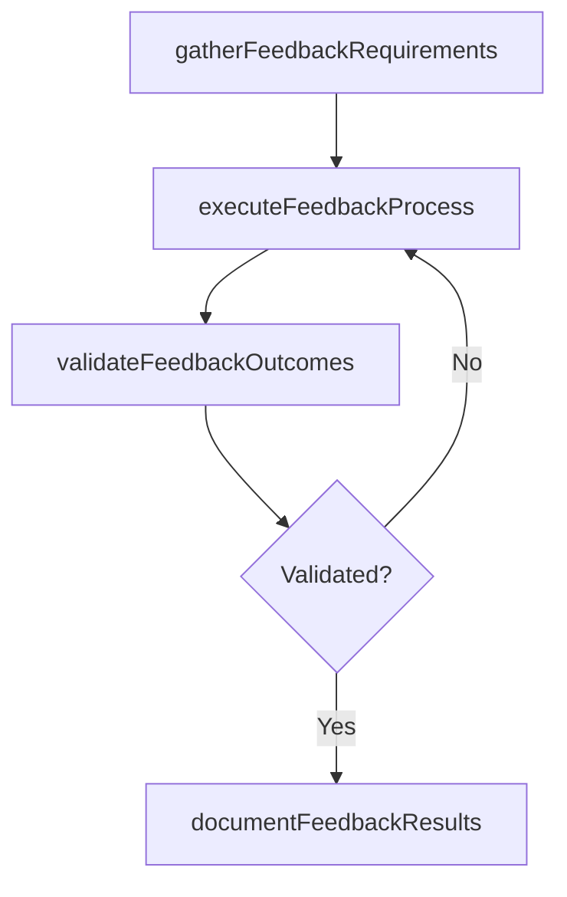

# Collect feedback about IT products and services

> Business-as-Code definition for collect feedback about it products and services. Models the process of collecting customer feedback about it products and services effectiveness based on overall satisfaction. the data is col.

## Overview

Collecting customer feedback about IT products and services effectiveness based on overall satisfaction. The data is collected through surveys, customer responses, and feedbacks based on the delivered products/services.

## Process Hierarchy



## GraphDL

```yaml
collect:
  object: Feedback About IT Products And Services
  actor: ITRelationshipManager
  result: CollectFeedbackAboutItProductsAndServices
```

## Actions

| Action | Description |
|--------|-------------|
| gatherFeedbackRequirements | Collect requirements and inputs for collect feedback about it products and services |
| executeFeedbackProcess | Perform the core activities of collect feedback about it products and services |
| validateFeedbackOutcomes | Verify that outcomes meet defined criteria and standards |
| documentFeedbackResults | Record findings and results for stakeholder review |

## Events

| Event | Description |
|-------|-------------|
| feedbackRequirementsGathered | Requirements for collect feedback about it products and services collected |
| feedbackProcessExecuted | Core activities of collect feedback about it products and services completed |
| feedbackOutcomesValidated | Outcomes verified against defined criteria |
| feedbackResultsDocumented | Results recorded and distributed to stakeholders |

## Searches

| Search | Description |
|--------|-------------|
| getFeedbackStatus | Retrieve current status of collect feedback about it products and services |
| findFeedbackRecords | List records related to collect feedback about it products and services by date or status |
| getFeedbackReport | Retrieve summary report for collect feedback about it products and services |

## Process Flow



## RACI Matrix

| Activity | Responsible | Accountable | Consulted | Informed |
|----------|-------------|-------------|-----------|----------|
| gatherFeedbackRequirements | ITRelationshipManager | ITServicePlanningManager | BusinessUnitLeaders | CIO |
| executeFeedbackProcess | ITRelationshipManager | ITServicePlanningManager | ITOperations | ITServiceManager |
| validateFeedbackOutcomes | ITRelationshipManager | ITServicePlanningManager | QualityAssurance | ITServiceManager |

## Related Processes

| Process | Relationship |
|---------|-------------|
| 8.1.7 Parent process | Parent - provides context and governance |
| 8.1.7.4 Sibling activity | Parallel - complementary activity in the same process |

## Related Departments

| Department | Role |
|-----------|------|
| IT Service Management | Coordinates customer-facing IT processes |
| Business Units | Primary consumers and requirements source |
| Enterprise Architecture | Advises on technical feasibility |

## Related Occupations

| Occupation | Involvement |
|-----------|-------------|
| IT Business Analyst | Gathers requirements and performs analysis |
| IT Relationship Manager | Manages stakeholder engagement |

## KPIs

| KPI | Description | Unit |
|-----|-------------|------|
| Completion Rate | Percentage of collect feedback about it products and services activities completed on schedule | % |
| Quality Score | Quality assessment score for collect feedback about it products and services outputs | Score (1-10) |
| Cycle Time | Average time to complete collect feedback about it products and services | Days |

## Usage

```typescript
import { collectFeedbackAboutItProductsAndServices } from '@headlessly/collect-feedback-about-it-products-and-services'

const process = collectFeedbackAboutItProductsAndServices()

// Execute the core process
const result = await process.executeFeedbackProcess({
  scope: 'department',
  priority: 'high'
})

// Validate outcomes
const validation = await process.validateFeedbackOutcomes({
  criteria: 'standard',
  period: 'Q4-2025'
})
```
