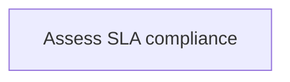
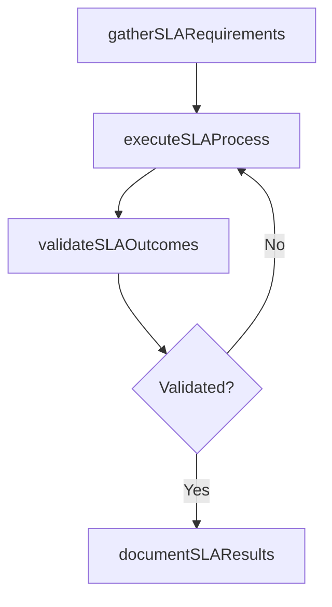

# Assess SLA compliance

> Business-as-Code definition for assess sla compliance. Models the process of gather data from each service target defined in an sla for a time segment or review period to evaluate an overall perfor.

## Overview

Gather data from each service target defined in an SLA for a time segment or review period to evaluate an overall performance percentage.

## Process Hierarchy



## GraphDL

```yaml
assess:
  object: SLA Compliance
  actor: ITRelationshipManager
  result: AssessSlaCompliance
```

## Actions

| Action | Description |
|--------|-------------|
| gatherSLARequirements | Collect requirements and inputs for assess sla compliance |
| executeSLAProcess | Perform the core activities of assess sla compliance |
| validateSLAOutcomes | Verify that outcomes meet defined criteria and standards |
| documentSLAResults | Record findings and results for stakeholder review |

## Events

| Event | Description |
|-------|-------------|
| slaRequirementsGathered | Requirements for assess sla compliance collected |
| slaProcessExecuted | Core activities of assess sla compliance completed |
| slaOutcomesValidated | Outcomes verified against defined criteria |
| slaResultsDocumented | Results recorded and distributed to stakeholders |

## Searches

| Search | Description |
|--------|-------------|
| getSLAStatus | Retrieve current status of assess sla compliance |
| findSLARecords | List records related to assess sla compliance by date or status |
| getSLAReport | Retrieve summary report for assess sla compliance |

## Process Flow



## RACI Matrix

| Activity | Responsible | Accountable | Consulted | Informed |
|----------|-------------|-------------|-----------|----------|
| gatherSLARequirements | ITRelationshipManager | ITServicePlanningManager | BusinessUnitLeaders | CIO |
| executeSLAProcess | ITRelationshipManager | ITServicePlanningManager | ITOperations | ITServiceManager |
| validateSLAOutcomes | ITRelationshipManager | ITServicePlanningManager | QualityAssurance | ITServiceManager |

## Related Processes

| Process | Relationship |
|---------|-------------|
| 8.1.7 Parent process | Parent - provides context and governance |
| 8.1.7.2 Sibling activity | Parallel - complementary activity in the same process |

## Related Departments

| Department | Role |
|-----------|------|
| IT Service Management | Coordinates customer-facing IT processes |
| Business Units | Primary consumers and requirements source |
| Enterprise Architecture | Advises on technical feasibility |

## Related Occupations

| Occupation | Involvement |
|-----------|-------------|
| IT Business Analyst | Gathers requirements and performs analysis |
| IT Relationship Manager | Manages stakeholder engagement |

## KPIs

| KPI | Description | Unit |
|-----|-------------|------|
| Completion Rate | Percentage of assess sla compliance activities completed on schedule | % |
| Quality Score | Quality assessment score for assess sla compliance outputs | Score (1-10) |
| Cycle Time | Average time to complete assess sla compliance | Days |

## Usage

```typescript
import { assessSlaCompliance } from '@headlessly/assess-sla-compliance'

const process = assessSlaCompliance()

// Execute the core process
const result = await process.executeSLAProcess({
  scope: 'department',
  priority: 'high'
})

// Validate outcomes
const validation = await process.validateSLAOutcomes({
  criteria: 'standard',
  period: 'Q4-2025'
})
```
