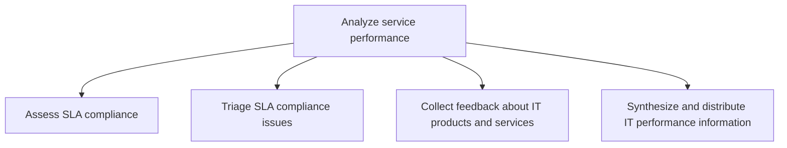
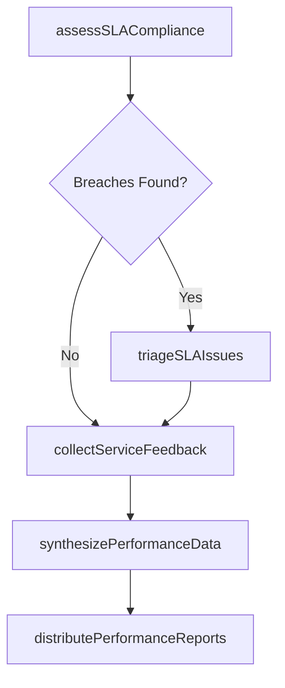

# Analyze service performance

> Business-as-Code definition for IT service performance analysis. Models the process of assessing SLA compliance, triaging issues, collecting feedback, and synthesizing performance information for stakeholders.

## Overview

Proactively manage IT service levels against IT customer requirements.

## Process Hierarchy



## GraphDL

```yaml
analyze:
  object: Service Performance
  actor: ITPerformanceAnalyst
  result: ServicePerformanceReport
```

## Actions

| Action | Description |
|--------|-------------|
| assessSLACompliance | Evaluate IT service delivery against SLA targets |
| triageSLAIssues | Prioritize SLA compliance issues and assign remediation owners |
| collectServiceFeedback | Gather customer feedback on IT product and service quality |
| synthesizePerformanceData | Aggregate performance metrics into actionable reports |
| distributePerformanceReports | Share performance reports with stakeholders and management |

## Events

| Event | Description |
|-------|-------------|
| slaComplianceAssessed | SLA compliance evaluation completed for the review period |
| slaIssuesTriaged | SLA compliance issues prioritized with remediation plans |
| serviceFeedbackCollected | Customer feedback on IT services compiled |
| performanceDataSynthesized | Performance metrics aggregated and analyzed |
| performanceReportsDistributed | Service performance reports delivered to stakeholders |

## Searches

| Search | Description |
|--------|-------------|
| getSLAComplianceReport | Retrieve SLA compliance data for a service or period |
| findSLABreaches | List SLA breaches filtered by severity, service, or period |
| getServiceFeedback | Retrieve collected customer feedback by service or topic |
| getPerformanceTrends | Get performance trend data over multiple periods |

## Process Flow



## RACI Matrix

| Activity | Responsible | Accountable | Consulted | Informed |
|----------|-------------|-------------|-----------|----------|
| assessSLACompliance | ITPerformanceAnalyst | ServiceLevelManager | ITOperations | CIO |
| triageSLAIssues | ServiceLevelManager | ITServiceManager | ITOperations | BusinessUnitLeaders |
| collectServiceFeedback | ITPerformanceAnalyst | ServiceLevelManager | BusinessUnitLeaders | EndUsers |
| distributePerformanceReports | ITPerformanceAnalyst | CIO | ServiceLevelManager | ExecutiveTeam |

## Sub-Processes

| ID | Name | Description |
|----|------|-------------|
| 8.1.7.1 | Assess SLA compliance | Gather data from each service target defined in an SLA for a time segment or review period to evalua |
| 8.1.7.2 | Triage SLA compliance issues | Prioritizing SLA compliance issues and plan for remediation. |
| 8.1.7.3 | Collect feedback about IT products and services | Collecting customer feedback about IT products and services effectiveness based on overall satisfact |
| 8.1.7.4 | Synthesize and distribute IT performance information | Providing stakeholders with collected IT performance measures for further development based on evalu |

## Related Processes

| Process | Relationship |
|---------|-------------|
| 8.1.5 Develop and manage IT service levels | Upstream - SLAs define the baseline for performance analysis |
| 8.1.6 Manage IT customer relationships | Parallel - performance data informs customer engagement |
| 8.2.5 Control IT management system | Downstream - performance data feeds IT governance reporting |

## Related Departments

| Department | Role |
|-----------|------|
| IT Service Management | Owns service performance monitoring and reporting |
| IT Operations | Provides operational metrics and incident data |
| Business Units | Consumers of performance reports and feedback providers |

## Related Occupations

| Occupation | Involvement |
|-----------|-------------|
| IT Performance Analyst | Primary executor of performance analysis and reporting |
| Service Level Manager | Accountable for SLA compliance outcomes |
| IT Operations Manager | Provides operational performance data |

## KPIs

| KPI | Description | Unit |
|-----|-------------|------|
| SLA Compliance Rate | Percentage of SLA targets met across all services | % |
| Mean Time to Remediate | Average time to resolve SLA compliance issues | Hours |
| Customer Feedback Score | Average satisfaction score from service feedback surveys | Score (1-5) |
| Report Timeliness | Percentage of performance reports delivered on schedule | % |

## Usage

```typescript
import { analyzeServicePerformance } from '@headlessly/analyze-service-performance'

const performance = analyzeServicePerformance()

// Assess SLA compliance for the quarter
const compliance = await performance.assessSLACompliance({
  period: 'Q4-2025',
  services: ['email', 'erp', 'cloud-hosting']
})

// Collect feedback across services
const feedback = await performance.collectServiceFeedback({
  surveyType: 'quarterly-csat',
  targetAudience: 'all-business-units'
})
```
