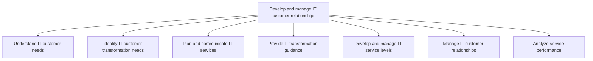
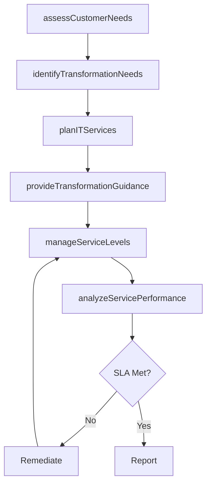

# Develop and manage IT customer relationships

> Business-as-Code definition for IT customer relationship management. Models the end-to-end process of understanding customer needs, planning IT services, managing service levels, and analyzing service performance.

## Overview

Creating and administering relationships with IT customers. Understanding customer needs including high-level business requirements for IT transformation. Plan for and communicate IT services along with establishing IT service levels, providing transformation guidance, and performance analysis that foster IT customer relationships.

## Process Hierarchy



## GraphDL

```yaml
develop:
  object: And Manage IT Customer Relationships
  actor: ITRelationshipManager
  result: CustomerRelationshipPlan
```

## Actions

| Action | Description |
|--------|-------------|
| assessCustomerNeeds | Evaluate business unit IT requirements and operational capabilities |
| identifyTransformationNeeds | Determine IT transformation requirements aligned to business goals |
| planITServices | Design and organize the IT service catalog and communication plan |
| provideTransformationGuidance | Advise business units on IT-enabled transformation opportunities |
| manageServiceLevels | Establish and monitor SLAs for IT service delivery |
| analyzeServicePerformance | Measure and report IT service performance against commitments |

## Events

| Event | Description |
|-------|-------------|
| customerNeedsAssessed | Business unit IT requirements evaluated and documented |
| transformationNeedsIdentified | IT transformation gaps and opportunities cataloged |
| itServicesPlanned | IT service catalog and roadmap published |
| transformationGuidanceProvided | Business unit advised on transformation approach |
| serviceLevelsManaged | SLA terms established or updated for IT services |
| servicePerformanceAnalyzed | IT service performance report generated and reviewed |

## Searches

| Search | Description |
|--------|-------------|
| findCustomerRequirements | List IT customer requirements by business unit or priority |
| getServiceLevelAgreements | Retrieve active SLAs and their compliance status |
| getServicePerformanceReport | Get IT service performance metrics over a specified period |
| findTransformationOpportunities | List open IT transformation opportunities by business unit |

## Process Flow



## RACI Matrix

| Activity | Responsible | Accountable | Consulted | Informed |
|----------|-------------|-------------|-----------|----------|
| assessCustomerNeeds | ITBusinessAnalyst | ITRelationshipManager | BusinessUnitLeaders | CIO |
| identifyTransformationNeeds | ITBusinessAnalyst | ITRelationshipManager | EnterpriseArchitect | VP Operations |
| planITServices | ITServiceManager | CIO | BusinessUnitLeaders | EndUsers |
| manageServiceLevels | ITServiceManager | ITRelationshipManager | Finance | BusinessUnitLeaders |
| analyzeServicePerformance | ITPerformanceAnalyst | ITServiceManager | BusinessUnitLeaders | CIO |

## Sub-Processes

| ID | Name | Description |
|----|------|-------------|
| 8.1.1 | Understand IT customer needs | Assessing the customer communities along with current IT operational capabilities and usage. |
| 8.1.2 | Identify IT customer transformation needs | Identifying changing needs of staff dependent on information technology based on continuous improvem |
| 8.1.3 | Plan and communicate IT services | Create and design an organized and curated collection of all IT-related services that can be perform |
| 8.1.4 | Provide IT transformation guidance | Understanding the necessity of IT transformation for the business. Collect and analyze customer requ |
| 8.1.5 | Develop and manage IT service levels | Establishing and maintaining service levels for the provision of IT services and solutions. Design a |
| 8.1.6 | Manage IT customer relationships | Managing the IT relationship with its customers by systematically coordinating interactions over mul |
| 8.1.7 | Analyze service performance | Proactively manage IT service levels against IT customer requirements. |

## Related Processes

| Process | Relationship |
|---------|-------------|
| 8.2 Develop and manage IT business strategy | Upstream - IT strategy informs customer engagement approach |
| 8.5 Develop and manage services/solutions | Downstream - service design consumes customer requirements |
| 8.7 Create and manage support services/solutions | Downstream - support services fulfill customer needs |

## Related Departments

| Department | Role |
|-----------|------|
| IT Service Management | Primary owner of customer relationship processes |
| Business Units | Key customers providing requirements and feedback |
| Enterprise Architecture | Advises on technology transformation feasibility |
| Finance | Validates cost models and service pricing |

## Related Occupations

| Occupation | Involvement |
|-----------|-------------|
| IT Relationship Manager | Primary executor of customer engagement |
| IT Business Analyst | Gathers and analyzes customer requirements |
| Service Level Manager | Negotiates and monitors SLAs |

## KPIs

| KPI | Description | Unit |
|-----|-------------|------|
| Customer Satisfaction Score | Average satisfaction rating from IT customer surveys | Score (1-5) |
| SLA Compliance Rate | Percentage of SLAs meeting or exceeding targets | % |
| Requirements Fulfillment Rate | Proportion of customer requirements addressed on time | % |
| Service Adoption Rate | Percentage of available IT services actively utilized | % |

## Usage

```typescript
import { developAndManageITCustomerRelationships } from '@headlessly/develop-and-manage-it-customer-relationships'

const relationships = developAndManageITCustomerRelationships()

// Assess needs for a business unit
const needs = await relationships.assessCustomerNeeds({
  businessUnit: 'marketing',
  includeTransformationGaps: true
})

// Monitor SLA compliance across all services
const slaReport = await relationships.analyzeServicePerformance({
  period: 'Q4-2025',
  threshold: 0.95
})
```
