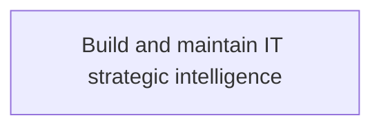
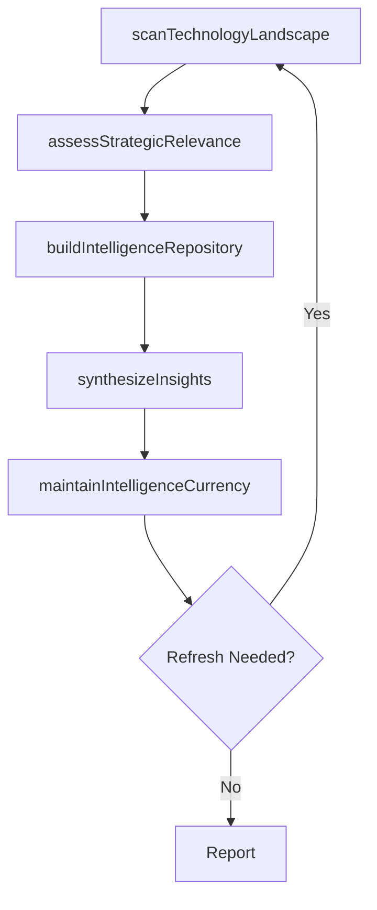

# Build and maintain IT strategic intelligence

> Business-as-Code definition for building and maintaining IT strategic intelligence. Models the continuous scanning, assessment, and synthesis of technology trends and competitive intelligence to inform IT strategy and organizational decision-making.

## Overview

Building and maintaining intelligence towards changing organizational goals, supporting management, and operational or functional levels of the business. It is the ability to understand business trends that present threats or opportunities for IT in an organization.

## Process Hierarchy



## GraphDL

```yaml
build:
  object: IT Strategic Intelligence
  actor: ITInnovationLead
  result: ItStrategicIntelligenceReport
```

## Actions

| Action | Description |
|--------|-------------|
| scanTechnologyLandscape | Survey emerging technologies, industry trends, and competitive IT capabilities |
| assessStrategicRelevance | Evaluate identified technologies and trends for alignment with business objectives |
| buildIntelligenceRepository | Compile and organize strategic IT intelligence into a centralized knowledge base |
| synthesizeInsights | Distill raw intelligence into actionable strategic insights and recommendations |
| maintainIntelligenceCurrency | Continuously refresh and validate strategic intelligence to ensure relevance |

## Events

| Event | Description |
|-------|-------------|
| technologyLandscapeScanned | Technology landscape survey completed with findings cataloged |
| strategicRelevanceAssessed | Technologies and trends evaluated for business alignment |
| intelligenceRepositoryBuilt | Centralized IT intelligence knowledge base established or updated |
| insightsSynthesized | Strategic insights and recommendations produced from raw intelligence |
| intelligenceCurrencyMaintained | Strategic intelligence reviewed and refreshed for accuracy |

## Searches

| Search | Description |
|--------|-------------|
| getStrategicIntelligence | Retrieve current IT strategic intelligence by domain or technology area |
| findTechnologyTrends | List emerging technology trends filtered by relevance or maturity |
| getInsightsReport | Retrieve synthesized strategic insights and recommendations |

## Process Flow



## RACI Matrix

| Activity | Responsible | Accountable | Consulted | Informed |
|----------|-------------|-------------|-----------|----------|
| scanTechnologyLandscape | ITInnovationLead | CTO | BusinessUnitLeaders | CIO |
| assessStrategicRelevance | ITStrategyAnalyst | CTO | EnterpriseArchitect | BusinessUnitLeaders |
| synthesizeInsights | ITInnovationLead | CTO | ITOperations | ExecutiveTeam |

## Related Processes

| Process | Relationship |
|---------|-------------|
| 8.2.1 Parent process | Parent - provides context and governance |
| 8.2.1.2 Sibling activity | Parallel - complementary activity in the same process |

## Related Departments

| Department | Role |
|-----------|------|
| IT Strategy and Planning | Owns strategy and governance activities |
| Enterprise Architecture | Provides technical architecture guidance |
| Finance | Validates budgets and investment models |

## Related Occupations

| Occupation | Involvement |
|-----------|-------------|
| IT Strategy Analyst | Conducts strategic research and analysis |
| Enterprise Architect | Designs technology architecture |

## KPIs

| KPI | Description | Unit |
|-----|-------------|------|
| Intelligence Refresh Rate | Frequency of strategic intelligence updates per quarter | Count |
| Trend Identification Lead Time | Average weeks ahead of industry a relevant trend was identified | Weeks |
| Insight Actionability Score | Percentage of synthesized insights that led to strategic decisions | % |
| Repository Coverage | Percentage of strategic technology domains covered in the intelligence base | % |

## Usage

```typescript
import { buildAndMaintainItStrategicIntelligence } from '@headlessly/build-and-maintain-it-strategic-intelligence'

const intelligence = buildAndMaintainItStrategicIntelligence()

// Scan the technology landscape
const landscape = await intelligence.scanTechnologyLandscape({
  domains: ['cloud-native', 'artificial-intelligence', 'cybersecurity'],
  sources: ['analyst-reports', 'patent-filings', 'conference-proceedings'],
  lookbackMonths: 6
})

// Synthesize strategic insights
const insights = await intelligence.synthesizeInsights({
  landscapeId: landscape.id,
  focusAreas: ['competitive-advantage', 'cost-reduction', 'risk-mitigation'],
  audience: 'executive-team'
})
```
