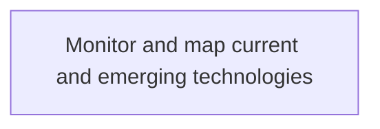
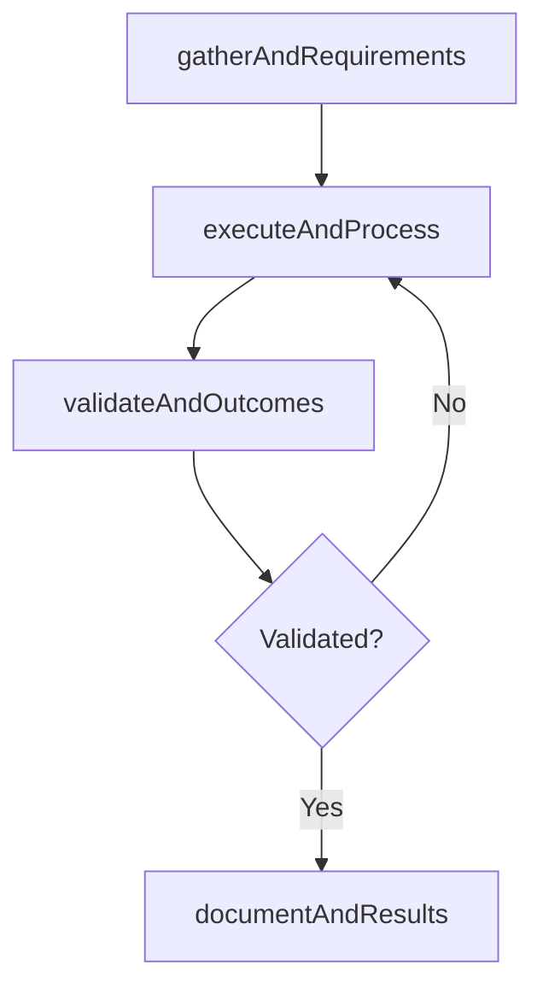

# Monitor and map current and emerging technologies

> Business-as-Code definition for monitor and map current and emerging technologies. Models the process of monitoring and evaluating existing and forthcoming technologies to meet the current and future growth plans for business.

## Overview

Monitoring and evaluating existing and forthcoming technologies to meet the current and future growth plans for business operations.

## Process Hierarchy



## GraphDL

```yaml
monitor:
  object: And Map Current And Emerging Technologies
  actor: ITPortfolioManager
  result: MonitorAndMapCurrentAndEmergingTechnologies
```

## Actions

| Action | Description |
|--------|-------------|
| gatherAndRequirements | Collect requirements and inputs for monitor and map current and emerging technologies |
| executeAndProcess | Perform the core activities of monitor and map current and emerging technologies |
| validateAndOutcomes | Verify that outcomes meet defined criteria and standards |
| documentAndResults | Record findings and results for stakeholder review |

## Events

| Event | Description |
|-------|-------------|
| andRequirementsGathered | Requirements for monitor and map current and emerging technologies collected |
| andProcessExecuted | Core activities of monitor and map current and emerging technologies completed |
| andOutcomesValidated | Outcomes verified against defined criteria |
| andResultsDocumented | Results recorded and distributed to stakeholders |

## Searches

| Search | Description |
|--------|-------------|
| getAndStatus | Retrieve current status of monitor and map current and emerging technologies |
| findAndRecords | List records related to monitor and map current and emerging technologies by date or status |
| getAndReport | Retrieve summary report for monitor and map current and emerging technologies |

## Process Flow



## RACI Matrix

| Activity | Responsible | Accountable | Consulted | Informed |
|----------|-------------|-------------|-----------|----------|
| gatherAndRequirements | ITPortfolioManager | ITInnovationLead | BusinessUnitLeaders | CIO |
| executeAndProcess | ITPortfolioManager | ITInnovationLead | ITOperations | ITServiceManager |
| validateAndOutcomes | ITPortfolioManager | ITInnovationLead | QualityAssurance | ITServiceManager |

## Related Processes

| Process | Relationship |
|---------|-------------|
| 8.2.1 Parent process | Parent - provides context and governance |
| 8.2.1.3 Sibling activity | Parallel - complementary activity in the same process |

## Related Departments

| Department | Role |
|-----------|------|
| IT Strategy and Planning | Owns strategy and governance activities |
| Enterprise Architecture | Provides technical architecture guidance |
| Finance | Validates budgets and investment models |

## Related Occupations

| Occupation | Involvement |
|-----------|-------------|
| IT Strategy Analyst | Conducts strategic research and analysis |
| Enterprise Architect | Designs technology architecture |

## KPIs

| KPI | Description | Unit |
|-----|-------------|------|
| Completion Rate | Percentage of monitor and map current and emerging technologies activities completed on schedule | % |
| Quality Score | Quality assessment score for monitor and map current and emerging technologies outputs | Score (1-10) |
| Cycle Time | Average time to complete monitor and map current and emerging technologies | Days |

## Usage

```typescript
import { monitorAndMapCurrentAndEmergingTechnologies } from '@headlessly/monitor-and-map-current-and-emerging-technologies'

const process = monitorAndMapCurrentAndEmergingTechnologies()

// Execute the core process
const result = await process.executeAndProcess({
  scope: 'department',
  priority: 'high'
})

// Validate outcomes
const validation = await process.validateAndOutcomes({
  criteria: 'standard',
  period: 'Q4-2025'
})
```
