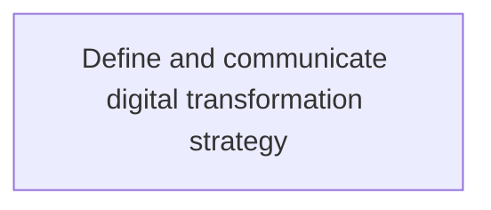
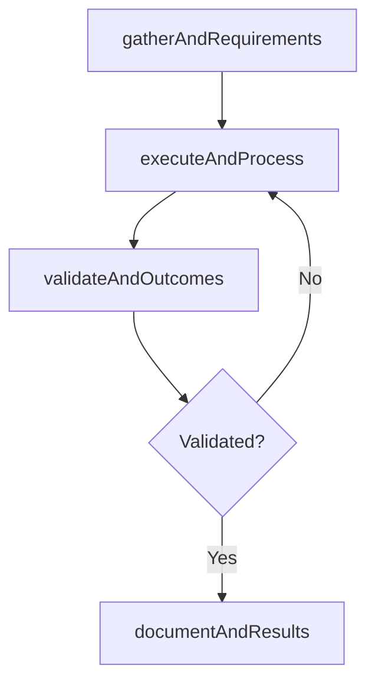

# Define and communicate digital transformation strategy

> Business-as-Code definition for define and communicate digital transformation strategy. Models the process of defining the integration of digital technology into business operations and service delivery, and convey the strategy to.

## Overview

Defining the integration of digital technology into business operations and service delivery, and convey the strategy to different segments of business. It is always backed by continuous improvement followed by periodic review and change per requirement of the business.

## Process Hierarchy



## GraphDL

```yaml
define:
  object: And Communicate Digital Transformation Strategy
  actor: ITStrategyAnalyst
  result: DefineAndCommunicateDigitalTransformationStrategy
```

## Actions

| Action | Description |
|--------|-------------|
| gatherAndRequirements | Collect requirements and inputs for define and communicate digital transformation strategy |
| executeAndProcess | Perform the core activities of define and communicate digital transformation strategy |
| validateAndOutcomes | Verify that outcomes meet defined criteria and standards |
| documentAndResults | Record findings and results for stakeholder review |

## Events

| Event | Description |
|-------|-------------|
| andRequirementsGathered | Requirements for define and communicate digital transformation strategy collected |
| andProcessExecuted | Core activities of define and communicate digital transformation strategy completed |
| andOutcomesValidated | Outcomes verified against defined criteria |
| andResultsDocumented | Results recorded and distributed to stakeholders |

## Searches

| Search | Description |
|--------|-------------|
| getAndStatus | Retrieve current status of define and communicate digital transformation strategy |
| findAndRecords | List records related to define and communicate digital transformation strategy by date or status |
| getAndReport | Retrieve summary report for define and communicate digital transformation strategy |

## Process Flow



## RACI Matrix

| Activity | Responsible | Accountable | Consulted | Informed |
|----------|-------------|-------------|-----------|----------|
| gatherAndRequirements | ITStrategyAnalyst | EnterpriseArchitect | BusinessUnitLeaders | CIO |
| executeAndProcess | ITStrategyAnalyst | EnterpriseArchitect | ITOperations | ITServiceManager |
| validateAndOutcomes | ITStrategyAnalyst | EnterpriseArchitect | QualityAssurance | ITServiceManager |

## Related Processes

| Process | Relationship |
|---------|-------------|
| 8.2.1 Parent process | Parent - provides context and governance |
| 8.2.1.4 Sibling activity | Parallel - complementary activity in the same process |

## Related Departments

| Department | Role |
|-----------|------|
| IT Strategy and Planning | Owns strategy and governance activities |
| Enterprise Architecture | Provides technical architecture guidance |
| Finance | Validates budgets and investment models |

## Related Occupations

| Occupation | Involvement |
|-----------|-------------|
| IT Strategy Analyst | Conducts strategic research and analysis |
| Enterprise Architect | Designs technology architecture |

## KPIs

| KPI | Description | Unit |
|-----|-------------|------|
| Completion Rate | Percentage of define and communicate digital transformation strategy activities completed on schedule | % |
| Quality Score | Quality assessment score for define and communicate digital transformation strategy outputs | Score (1-10) |
| Cycle Time | Average time to complete define and communicate digital transformation strategy | Days |

## Usage

```typescript
import { defineAndCommunicateDigitalTransformationStrategy } from '@headlessly/define-and-communicate-digital-transformation-strategy'

const process = defineAndCommunicateDigitalTransformationStrategy()

// Execute the core process
const result = await process.executeAndProcess({
  scope: 'department',
  priority: 'high'
})

// Validate outcomes
const validation = await process.validateAndOutcomes({
  criteria: 'standard',
  period: 'Q4-2025'
})
```
