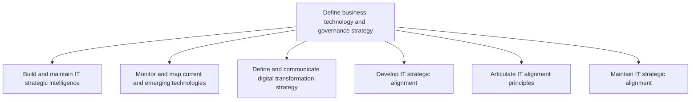
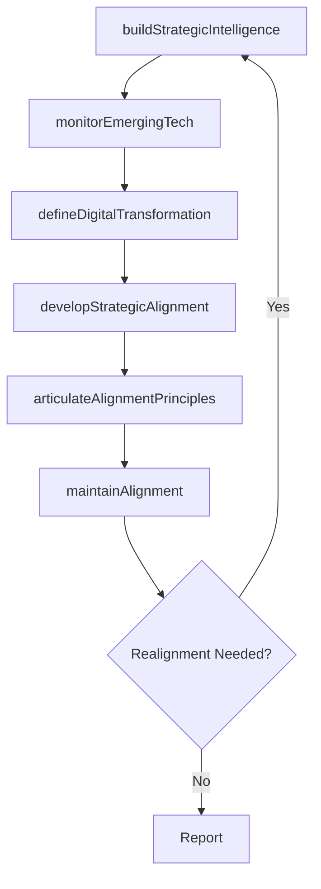

# Define business technology and governance strategy

> Business-as-Code definition for business technology and governance strategy. Models the process of building IT strategic intelligence, monitoring emerging technologies, defining digital transformation strategy, and maintaining IT-business alignment.

## Overview

Defining the need of technology in business and systematic implementation of IT investments. It comprises of assessing competitive technology components to ensure structural analysis, development, usage and security of technology for efficient business operations.

## Process Hierarchy



## GraphDL

```yaml
define:
  object: Business Technology And Governance Strategy
  actor: ITStrategyDirector
  result: TechnologyGovernanceStrategy
```

## Actions

| Action | Description |
|--------|-------------|
| buildStrategicIntelligence | Gather and maintain IT market and technology intelligence |
| monitorEmergingTech | Track and evaluate current and emerging technology trends |
| defineDigitalTransformation | Formulate and communicate the digital transformation strategy |
| developStrategicAlignment | Align IT strategy with business objectives and priorities |
| articulateAlignmentPrinciples | Document and communicate IT governance alignment principles |
| maintainAlignment | Continuously monitor and adjust IT-business strategic alignment |

## Events

| Event | Description |
|-------|-------------|
| strategicIntelligenceBuilt | IT strategic intelligence report compiled and distributed |
| emergingTechMonitored | Technology landscape scan completed with findings |
| digitalTransformationDefined | Digital transformation strategy approved and communicated |
| strategicAlignmentDeveloped | IT strategic alignment framework established |
| alignmentPrinciplesArticulated | IT governance principles documented and published |
| alignmentMaintained | IT-business alignment reviewed and confirmed current |

## Searches

| Search | Description |
|--------|-------------|
| getStrategicIntelligence | Retrieve current IT strategic intelligence briefings |
| findEmergingTechnologies | List emerging technologies by maturity, relevance, or domain |
| getAlignmentScorecard | Retrieve IT-business alignment metrics and scores |
| getDigitalTransformationStrategy | Get the current digital transformation strategy document |

## Process Flow



## RACI Matrix

| Activity | Responsible | Accountable | Consulted | Informed |
|----------|-------------|-------------|-----------|----------|
| buildStrategicIntelligence | ITStrategyAnalyst | ITStrategyDirector | BusinessUnitLeaders | CIO |
| monitorEmergingTech | TechnologyResearcher | CTO | EnterpriseArchitect | ITStrategyDirector |
| defineDigitalTransformation | ITStrategyDirector | CIO | CEO | Board |
| developStrategicAlignment | ITStrategyDirector | CIO | BusinessUnitLeaders | Finance |

## Sub-Processes

| ID | Name | Description |
|----|------|-------------|
| 8.2.1.1 | Build and maintain IT strategic intelligence | Building and maintaining intelligence towards changing organizational goals, supporting management,  |
| 8.2.1.2 | Monitor and map current and emerging technologies | Monitoring and evaluating existing and forthcoming technologies to meet the current and future growt |
| 8.2.1.3 | Define and communicate digital transformation strategy | Defining the integration of digital technology into business operations and service delivery, and co |
| 8.2.1.4 | Develop IT strategic alignment | Developing the process of aligning the organization's business divisions and staff members with the  |
| 8.2.1.5 | Articulate IT alignment principles | Systematic approach to clearly communicate and operate the usage of information technology as it rel |
| 8.2.1.6 | Maintain IT strategic alignment | Maintaining alignment of the organization's business divisions and staff members with the organizati |

## Related Processes

| Process | Relationship |
|---------|-------------|
| 8.2.2 Manage IT portfolio strategy | Downstream - governance strategy shapes portfolio priorities |
| 8.2.3 Define and maintain enterprise architecture | Parallel - governance aligns with architecture standards |
| 1.2 Develop business strategy | Upstream - corporate strategy drives IT governance direction |

## Related Departments

| Department | Role |
|-----------|------|
| IT Strategy and Planning | Primary owner of technology governance strategy |
| Executive Leadership | Approves strategy and sets direction |
| Enterprise Architecture | Provides technical feasibility context |
| Finance | Validates investment framework and budget alignment |

## Related Occupations

| Occupation | Involvement |
|-----------|-------------|
| IT Strategy Director | Primary executor of governance strategy definition |
| Chief Technology Officer | Provides technology vision and direction |
| IT Strategy Analyst | Conducts research and competitive analysis |

## KPIs

| KPI | Description | Unit |
|-----|-------------|------|
| Strategy Alignment Score | Degree of IT-business strategic alignment | Score (1-10) |
| Technology Radar Coverage | Number of emerging technologies tracked and assessed | Count |
| Governance Maturity Level | Maturity of IT governance framework per COBIT assessment | Level (1-5) |
| Strategy Review Cadence | Frequency of strategic alignment reviews | Per Year |

## Usage

```typescript
import { defineBusinessTechnologyAndGovernanceStrategy } from '@headlessly/define-business-technology-and-governance-strategy'

const governance = defineBusinessTechnologyAndGovernanceStrategy()

// Build strategic intelligence
const intelligence = await governance.buildStrategicIntelligence({
  scope: 'enterprise',
  sources: ['gartner', 'forrester', 'internal-metrics']
})

// Define digital transformation strategy
const dxStrategy = await governance.defineDigitalTransformation({
  horizon: '5-year',
  pillars: ['cloud-first', 'data-driven', 'customer-centric']
})
```
