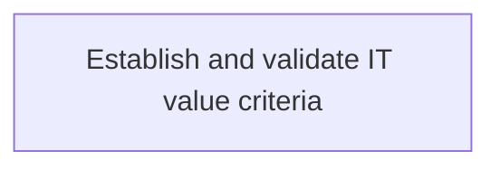
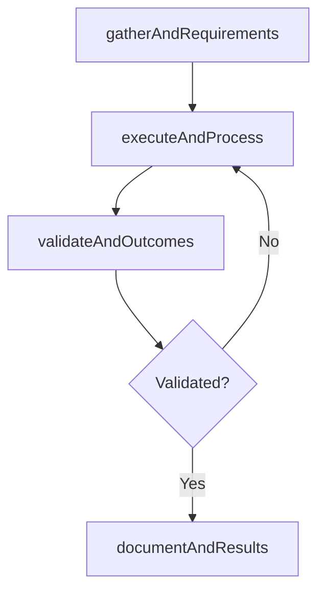

# Establish and validate IT value criteria

> Business-as-Code definition for establish and validate it value criteria. Models the process of create and certify the standards to determine the value of the investments, projects, and activities of it function for .

## Overview

Create and certify the standards to determine the value of the investments, projects, and activities of IT function for the overall business objectives.

## Process Hierarchy



## GraphDL

```yaml
establish:
  object: And Validate IT Value Criteria
  actor: EnterpriseArchitect
  result: EstablishAndValidateItValueCriteria
```

## Actions

| Action | Description |
|--------|-------------|
| gatherAndRequirements | Collect requirements and inputs for establish and validate it value criteria |
| executeAndProcess | Perform the core activities of establish and validate it value criteria |
| validateAndOutcomes | Verify that outcomes meet defined criteria and standards |
| documentAndResults | Record findings and results for stakeholder review |

## Events

| Event | Description |
|-------|-------------|
| andRequirementsGathered | Requirements for establish and validate it value criteria collected |
| andProcessExecuted | Core activities of establish and validate it value criteria completed |
| andOutcomesValidated | Outcomes verified against defined criteria |
| andResultsDocumented | Results recorded and distributed to stakeholders |

## Searches

| Search | Description |
|--------|-------------|
| getAndStatus | Retrieve current status of establish and validate it value criteria |
| findAndRecords | List records related to establish and validate it value criteria by date or status |
| getAndReport | Retrieve summary report for establish and validate it value criteria |

## Process Flow



## RACI Matrix

| Activity | Responsible | Accountable | Consulted | Informed |
|----------|-------------|-------------|-----------|----------|
| gatherAndRequirements | EnterpriseArchitect | ITPortfolioManager | BusinessUnitLeaders | CIO |
| executeAndProcess | EnterpriseArchitect | ITPortfolioManager | ITOperations | ITServiceManager |
| validateAndOutcomes | EnterpriseArchitect | ITPortfolioManager | QualityAssurance | ITServiceManager |

## Related Processes

| Process | Relationship |
|---------|-------------|
| 8.2.2 Parent process | Parent - provides context and governance |
| 8.2.2.2 Sibling activity | Parallel - complementary activity in the same process |

## Related Departments

| Department | Role |
|-----------|------|
| IT Strategy and Planning | Owns strategy and governance activities |
| Enterprise Architecture | Provides technical architecture guidance |
| Finance | Validates budgets and investment models |

## Related Occupations

| Occupation | Involvement |
|-----------|-------------|
| IT Strategy Analyst | Conducts strategic research and analysis |
| Enterprise Architect | Designs technology architecture |

## KPIs

| KPI | Description | Unit |
|-----|-------------|------|
| Completion Rate | Percentage of establish and validate it value criteria activities completed on schedule | % |
| Quality Score | Quality assessment score for establish and validate it value criteria outputs | Score (1-10) |
| Cycle Time | Average time to complete establish and validate it value criteria | Days |

## Usage

```typescript
import { establishAndValidateItValueCriteria } from '@headlessly/establish-and-validate-it-value-criteria'

const process = establishAndValidateItValueCriteria()

// Execute the core process
const result = await process.executeAndProcess({
  scope: 'department',
  priority: 'high'
})

// Validate outcomes
const validation = await process.validateAndOutcomes({
  criteria: 'standard',
  period: 'Q4-2025'
})
```
