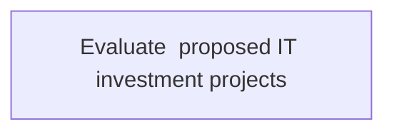
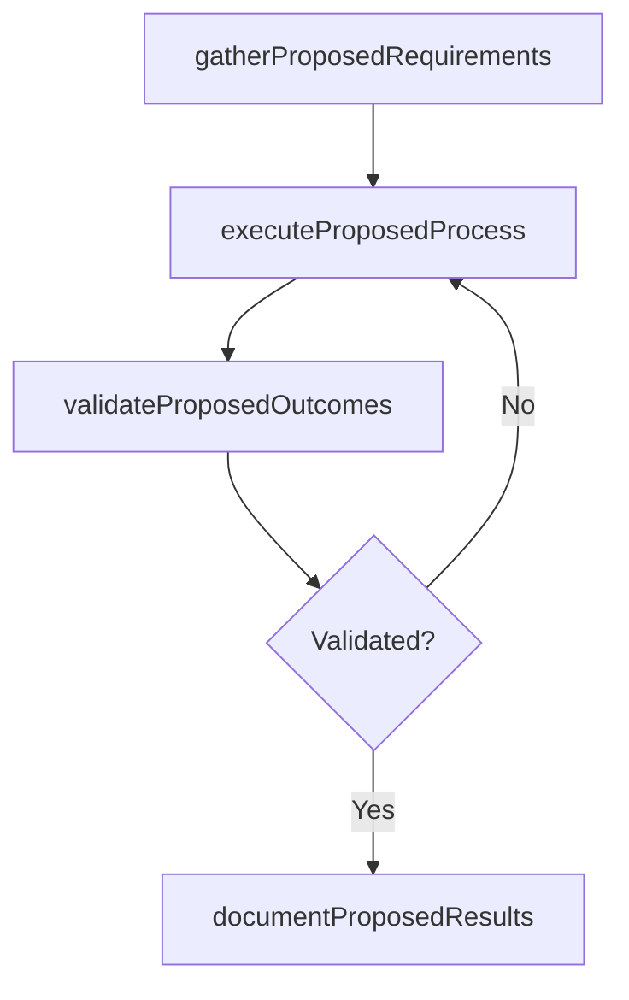

# Evaluate  proposed IT investment projects

> Business-as-Code definition for evaluate  proposed it investment projects. Models the process of evaluating it investment projects to achieve overall business objectives in regard to implementation, efficiency, and pr.

## Overview

Evaluating IT investment projects to achieve overall business objectives in regard to implementation, efficiency, and profitability.

## Process Hierarchy



## GraphDL

```yaml
evaluate:
  object: Proposed IT Investment Projects
  actor: ITInnovationLead
  result: EvaluateProposedItInvestmentProjects
```

## Actions

| Action | Description |
|--------|-------------|
| gatherProposedRequirements | Collect requirements and inputs for evaluate  proposed it investment projects |
| executeProposedProcess | Perform the core activities of evaluate  proposed it investment projects |
| validateProposedOutcomes | Verify that outcomes meet defined criteria and standards |
| documentProposedResults | Record findings and results for stakeholder review |

## Events

| Event | Description |
|-------|-------------|
| proposedRequirementsGathered | Requirements for evaluate  proposed it investment projects collected |
| proposedProcessExecuted | Core activities of evaluate  proposed it investment projects completed |
| proposedOutcomesValidated | Outcomes verified against defined criteria |
| proposedResultsDocumented | Results recorded and distributed to stakeholders |

## Searches

| Search | Description |
|--------|-------------|
| getProposedStatus | Retrieve current status of evaluate  proposed it investment projects |
| findProposedRecords | List records related to evaluate  proposed it investment projects by date or status |
| getProposedReport | Retrieve summary report for evaluate  proposed it investment projects |

## Process Flow



## RACI Matrix

| Activity | Responsible | Accountable | Consulted | Informed |
|----------|-------------|-------------|-----------|----------|
| gatherProposedRequirements | ITInnovationLead | ITStrategyAnalyst | BusinessUnitLeaders | CIO |
| executeProposedProcess | ITInnovationLead | ITStrategyAnalyst | ITOperations | ITServiceManager |
| validateProposedOutcomes | ITInnovationLead | ITStrategyAnalyst | QualityAssurance | ITServiceManager |

## Related Processes

| Process | Relationship |
|---------|-------------|
| 8.2.2 Parent process | Parent - provides context and governance |
| 8.2.2.4 Sibling activity | Parallel - complementary activity in the same process |

## Related Departments

| Department | Role |
|-----------|------|
| IT Strategy and Planning | Owns strategy and governance activities |
| Enterprise Architecture | Provides technical architecture guidance |
| Finance | Validates budgets and investment models |

## Related Occupations

| Occupation | Involvement |
|-----------|-------------|
| IT Strategy Analyst | Conducts strategic research and analysis |
| Enterprise Architect | Designs technology architecture |

## KPIs

| KPI | Description | Unit |
|-----|-------------|------|
| Completion Rate | Percentage of evaluate  proposed it investment projects activities completed on schedule | % |
| Quality Score | Quality assessment score for evaluate  proposed it investment projects outputs | Score (1-10) |
| Cycle Time | Average time to complete evaluate  proposed it investment projects | Days |

## Usage

```typescript
import { evaluateProposedItInvestmentProjects } from '@headlessly/evaluate-proposed-it-investment-projects'

const process = evaluateProposedItInvestmentProjects()

// Execute the core process
const result = await process.executeProposedProcess({
  scope: 'department',
  priority: 'high'
})

// Validate outcomes
const validation = await process.validateProposedOutcomes({
  criteria: 'standard',
  period: 'Q4-2025'
})
```
