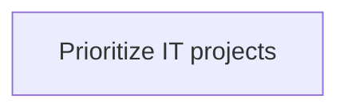
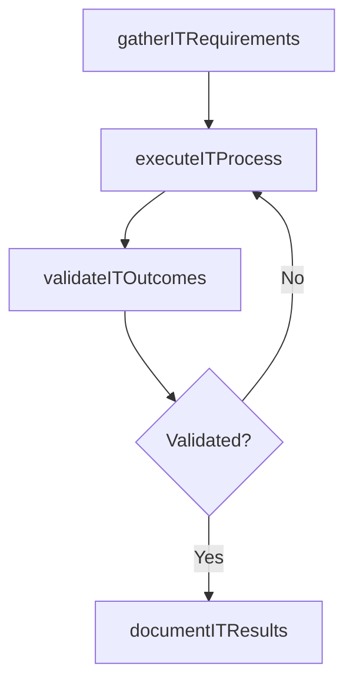

# Prioritize IT projects

> Business-as-Code definition for prioritize it projects. Models the process of listing the it projects in the order of most important to the least. determining which of many it projects are most impo.

## Overview

Listing the IT projects in the order of most important to the least. Determining which of many IT projects are most important or critical to business operations.

## Process Hierarchy



## GraphDL

```yaml
prioritize:
  object: IT Projects
  actor: EnterpriseArchitect
  result: PrioritizeItProjects
```

## Actions

| Action | Description |
|--------|-------------|
| gatherITRequirements | Collect requirements and inputs for prioritize it projects |
| executeITProcess | Perform the core activities of prioritize it projects |
| validateITOutcomes | Verify that outcomes meet defined criteria and standards |
| documentITResults | Record findings and results for stakeholder review |

## Events

| Event | Description |
|-------|-------------|
| itRequirementsGathered | Requirements for prioritize it projects collected |
| itProcessExecuted | Core activities of prioritize it projects completed |
| itOutcomesValidated | Outcomes verified against defined criteria |
| itResultsDocumented | Results recorded and distributed to stakeholders |

## Searches

| Search | Description |
|--------|-------------|
| getITStatus | Retrieve current status of prioritize it projects |
| findITRecords | List records related to prioritize it projects by date or status |
| getITReport | Retrieve summary report for prioritize it projects |

## Process Flow



## RACI Matrix

| Activity | Responsible | Accountable | Consulted | Informed |
|----------|-------------|-------------|-----------|----------|
| gatherITRequirements | EnterpriseArchitect | ITPortfolioManager | BusinessUnitLeaders | CIO |
| executeITProcess | EnterpriseArchitect | ITPortfolioManager | ITOperations | ITServiceManager |
| validateITOutcomes | EnterpriseArchitect | ITPortfolioManager | QualityAssurance | ITServiceManager |

## Related Processes

| Process | Relationship |
|---------|-------------|
| 8.2.2 Parent process | Parent - provides context and governance |
| 8.2.2.5 Sibling activity | Parallel - complementary activity in the same process |

## Related Departments

| Department | Role |
|-----------|------|
| IT Strategy and Planning | Owns strategy and governance activities |
| Enterprise Architecture | Provides technical architecture guidance |
| Finance | Validates budgets and investment models |

## Related Occupations

| Occupation | Involvement |
|-----------|-------------|
| IT Strategy Analyst | Conducts strategic research and analysis |
| Enterprise Architect | Designs technology architecture |

## KPIs

| KPI | Description | Unit |
|-----|-------------|------|
| Completion Rate | Percentage of prioritize it projects activities completed on schedule | % |
| Quality Score | Quality assessment score for prioritize it projects outputs | Score (1-10) |
| Cycle Time | Average time to complete prioritize it projects | Days |

## Usage

```typescript
import { prioritizeItProjects } from '@headlessly/prioritize-it-projects'

const process = prioritizeItProjects()

// Execute the core process
const result = await process.executeITProcess({
  scope: 'department',
  priority: 'high'
})

// Validate outcomes
const validation = await process.validateITOutcomes({
  criteria: 'standard',
  period: 'Q4-2025'
})
```
