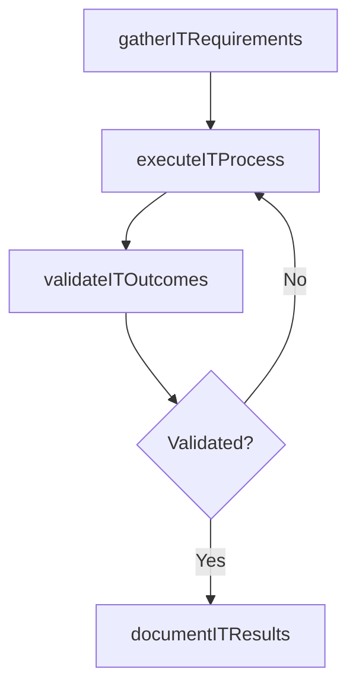

# Align IT resources to strategic priorities

> Business-as-Code definition for align it resources to strategic priorities. Models the process of aligning physical it resources like software, it infrastructure, networks, and non-physical resources like technology ex.

## Overview

Aligning physical IT resources like software, IT infrastructure, networks, and non-physical resources like technology expertise, to strategic objectives ranked by their importance in achieving the strategic goals.

## Process Hierarchy


## GraphDL

```yaml
align:
  object: IT Resources To Strategic Priorities
  actor: ITPortfolioManager
  result: AlignItResourcesToStrategicPriorities
```

## Actions

| Action | Description |
|--------|-------------|
| gatherITRequirements | Collect requirements and inputs for align it resources to strategic priorities |
| executeITProcess | Perform the core activities of align it resources to strategic priorities |
| validateITOutcomes | Verify that outcomes meet defined criteria and standards |
| documentITResults | Record findings and results for stakeholder review |

## Events

| Event | Description |
|-------|-------------|
| itRequirementsGathered | Requirements for align it resources to strategic priorities collected |
| itProcessExecuted | Core activities of align it resources to strategic priorities completed |
| itOutcomesValidated | Outcomes verified against defined criteria |
| itResultsDocumented | Results recorded and distributed to stakeholders |

## Searches

| Search | Description |
|--------|-------------|
| getITStatus | Retrieve current status of align it resources to strategic priorities |
| findITRecords | List records related to align it resources to strategic priorities by date or status |
| getITReport | Retrieve summary report for align it resources to strategic priorities |

## Process Flow



## RACI Matrix

| Activity | Responsible | Accountable | Consulted | Informed |
|----------|-------------|-------------|-----------|----------|
| gatherITRequirements | ITPortfolioManager | ITInnovationLead | BusinessUnitLeaders | CIO |
| executeITProcess | ITPortfolioManager | ITInnovationLead | ITOperations | ITServiceManager |
| validateITOutcomes | ITPortfolioManager | ITInnovationLead | QualityAssurance | ITServiceManager |

## Related Processes

| Process | Relationship |
|---------|-------------|
| 8.2.2 Parent process | Parent - provides context and governance |
| 8.2.2.6 Sibling activity | Parallel - complementary activity in the same process |

## Related Departments

| Department | Role |
|-----------|------|
| IT Strategy and Planning | Owns strategy and governance activities |
| Enterprise Architecture | Provides technical architecture guidance |
| Finance | Validates budgets and investment models |

## Related Occupations

| Occupation | Involvement |
|-----------|-------------|
| IT Strategy Analyst | Conducts strategic research and analysis |
| Enterprise Architect | Designs technology architecture |

## KPIs

| KPI | Description | Unit |
|-----|-------------|------|
| Completion Rate | Percentage of align it resources to strategic priorities activities completed on schedule | % |
| Quality Score | Quality assessment score for align it resources to strategic priorities outputs | Score (1-10) |
| Cycle Time | Average time to complete align it resources to strategic priorities | Days |

## Usage

```typescript
import { alignItResourcesToStrategicPriorities } from '@headlessly/align-it-resources-to-strategic-priorities'

const process = alignItResourcesToStrategicPriorities()

// Execute the core process
const result = await process.executeITProcess({
  scope: 'department',
  priority: 'high'
})

// Validate outcomes
const validation = await process.validateITOutcomes({
  criteria: 'standard',
  period: 'Q4-2025'
})
```
