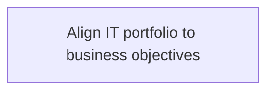
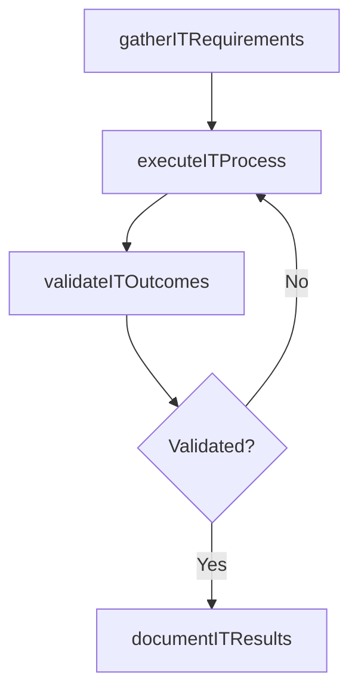

# Align IT portfolio to business objectives

> Business-as-Code definition for align it portfolio to business objectives. Models the process of aligning it investments, projects, and activities to achieve overall business objectives.

## Overview

Aligning IT investments, projects, and activities to achieve overall business objectives.

## Process Hierarchy



## GraphDL

```yaml
align:
  object: IT Portfolio To Business Objectives
  actor: ITStrategyAnalyst
  result: AlignItPortfolioToBusinessObjectives
```

## Actions

| Action | Description |
|--------|-------------|
| gatherITRequirements | Collect requirements and inputs for align it portfolio to business objectives |
| executeITProcess | Perform the core activities of align it portfolio to business objectives |
| validateITOutcomes | Verify that outcomes meet defined criteria and standards |
| documentITResults | Record findings and results for stakeholder review |

## Events

| Event | Description |
|-------|-------------|
| itRequirementsGathered | Requirements for align it portfolio to business objectives collected |
| itProcessExecuted | Core activities of align it portfolio to business objectives completed |
| itOutcomesValidated | Outcomes verified against defined criteria |
| itResultsDocumented | Results recorded and distributed to stakeholders |

## Searches

| Search | Description |
|--------|-------------|
| getITStatus | Retrieve current status of align it portfolio to business objectives |
| findITRecords | List records related to align it portfolio to business objectives by date or status |
| getITReport | Retrieve summary report for align it portfolio to business objectives |

## Process Flow



## RACI Matrix

| Activity | Responsible | Accountable | Consulted | Informed |
|----------|-------------|-------------|-----------|----------|
| gatherITRequirements | ITStrategyAnalyst | EnterpriseArchitect | BusinessUnitLeaders | CIO |
| executeITProcess | ITStrategyAnalyst | EnterpriseArchitect | ITOperations | ITServiceManager |
| validateITOutcomes | ITStrategyAnalyst | EnterpriseArchitect | QualityAssurance | ITServiceManager |

## Related Processes

| Process | Relationship |
|---------|-------------|
| 8.2.2 Parent process | Parent - provides context and governance |
| 8.2.2.7 Sibling activity | Parallel - complementary activity in the same process |

## Related Departments

| Department | Role |
|-----------|------|
| IT Strategy and Planning | Owns strategy and governance activities |
| Enterprise Architecture | Provides technical architecture guidance |
| Finance | Validates budgets and investment models |

## Related Occupations

| Occupation | Involvement |
|-----------|-------------|
| IT Strategy Analyst | Conducts strategic research and analysis |
| Enterprise Architect | Designs technology architecture |

## KPIs

| KPI | Description | Unit |
|-----|-------------|------|
| Completion Rate | Percentage of align it portfolio to business objectives activities completed on schedule | % |
| Quality Score | Quality assessment score for align it portfolio to business objectives outputs | Score (1-10) |
| Cycle Time | Average time to complete align it portfolio to business objectives | Days |

## Usage

```typescript
import { alignItPortfolioToBusinessObjectives } from '@headlessly/align-it-portfolio-to-business-objectives'

const process = alignItPortfolioToBusinessObjectives()

// Execute the core process
const result = await process.executeITProcess({
  scope: 'department',
  priority: 'high'
})

// Validate outcomes
const validation = await process.validateITOutcomes({
  criteria: 'standard',
  period: 'Q4-2025'
})
```
