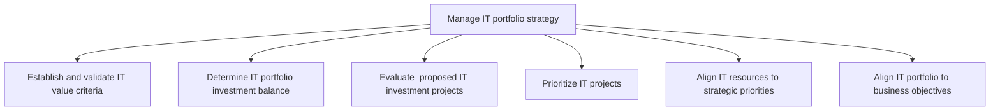
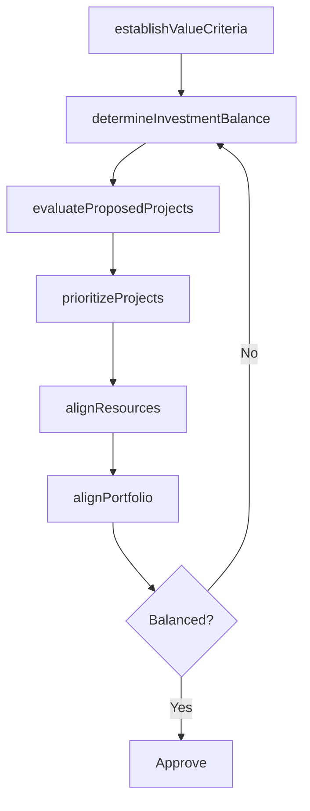

# Manage IT portfolio strategy

> Business-as-Code definition for IT portfolio strategy management. Models the process of establishing value criteria, evaluating investments, prioritizing projects, and aligning the IT portfolio to business objectives.

## Overview

Strategy for systematic management of IT investments, projects, and activities. Analyze and examine the value of the IT portfolio and allocate resources based on business objectives.

## Process Hierarchy



## GraphDL

```yaml
manage:
  object: IT Portfolio Strategy
  actor: ITPortfolioManager
  result: ITPortfolioPlan
```

## Actions

| Action | Description |
|--------|-------------|
| establishValueCriteria | Define and validate criteria for assessing IT investment value |
| determineInvestmentBalance | Analyze and set the target allocation across IT investment categories |
| evaluateProposedProjects | Assess proposed IT projects against value criteria and strategic fit |
| prioritizeProjects | Rank IT projects by business impact, risk, and resource requirements |
| alignResources | Map IT resources to prioritized strategic initiatives |
| alignPortfolio | Ensure the overall IT portfolio supports business objectives |

## Events

| Event | Description |
|-------|-------------|
| valueCriteriaEstablished | IT investment value criteria defined and validated |
| investmentBalanceDetermined | IT portfolio allocation targets set |
| proposedProjectsEvaluated | IT project proposals assessed and scored |
| projectsPrioritized | IT project priority list approved |
| resourcesAligned | IT resources mapped to strategic priorities |
| portfolioAligned | IT portfolio alignment to business objectives confirmed |

## Searches

| Search | Description |
|--------|-------------|
| getPortfolioSummary | Retrieve IT portfolio overview with investment allocations |
| findProjectProposals | List IT project proposals by status, score, or category |
| getResourceAllocation | Get current IT resource allocation by project or initiative |
| getPortfolioAlignment | Retrieve portfolio alignment metrics against business objectives |

## Process Flow



## RACI Matrix

| Activity | Responsible | Accountable | Consulted | Informed |
|----------|-------------|-------------|-----------|----------|
| establishValueCriteria | ITPortfolioManager | CIO | Finance | BusinessUnitLeaders |
| evaluateProposedProjects | ITPortfolioManager | CIO | EnterpriseArchitect | ProjectManagers |
| prioritizeProjects | ITPortfolioManager | CIO | BusinessUnitLeaders | Finance |
| alignPortfolio | ITPortfolioManager | CIO | CEO | Board |

## Sub-Processes

| ID | Name | Description |
|----|------|-------------|
| 8.2.2.1 | Establish and validate IT value criteria | Create and certify the standards to determine the value of the investments, projects, and activities |
| 8.2.2.2 | Determine IT portfolio investment balance | Determining the uninvested amount out of the total approved amount for overall IT management, IT inv |
| 8.2.2.3 | Evaluate  proposed IT investment projects | Evaluating IT investment projects to achieve overall business objectives in regard to implementation |
| 8.2.2.4 | Prioritize IT projects | Listing the IT projects in the order of most important to the least. Determining which of many IT pr |
| 8.2.2.5 | Align IT resources to strategic priorities | Aligning physical IT resources like software, IT infrastructure, networks, and non-physical resource |
| 8.2.2.6 | Align IT portfolio to business objectives | Aligning IT investments, projects, and activities to achieve overall business objectives. |

## Related Processes

| Process | Relationship |
|---------|-------------|
| 8.2.1 Define business technology and governance strategy | Upstream - governance strategy sets portfolio direction |
| 8.2.5 Control IT management system | Downstream - portfolio decisions feed management controls |
| 8.2.6 Manage IT value portfolio | Downstream - portfolio strategy drives value assessment |

## Related Departments

| Department | Role |
|-----------|------|
| IT Portfolio Management | Primary owner of portfolio strategy and prioritization |
| Finance | Validates investment budgets and financial projections |
| Project Management Office | Executes prioritized projects and tracks delivery |
| Business Units | Sponsors and stakeholders for IT investment proposals |

## Related Occupations

| Occupation | Involvement |
|-----------|-------------|
| IT Portfolio Manager | Primary executor of portfolio strategy management |
| IT Financial Analyst | Analyzes investment financials and ROI projections |
| IT Project Manager | Provides project-level data for portfolio decisions |

## KPIs

| KPI | Description | Unit |
|-----|-------------|------|
| Portfolio ROI | Aggregate return on investment across the IT portfolio | % |
| Project Alignment Rate | Percentage of active projects aligned to strategic objectives | % |
| Budget Utilization | Percentage of approved IT budget allocated to active projects | % |
| Portfolio Rebalance Frequency | Number of portfolio rebalancing reviews per year | Count/Year |

## Usage

```typescript
import { manageITPortfolioStrategy } from '@headlessly/manage-it-portfolio-strategy'

const portfolio = manageITPortfolioStrategy()

// Evaluate proposed IT projects
const evaluation = await portfolio.evaluateProposedProjects({
  proposals: ['cloud-migration', 'erp-upgrade', 'ai-platform'],
  criteria: ['strategic-fit', 'roi', 'risk-level']
})

// Prioritize projects for next quarter
const priorities = await portfolio.prioritizeProjects({
  period: 'Q1-2026',
  maxBudget: 2000000
})
```
