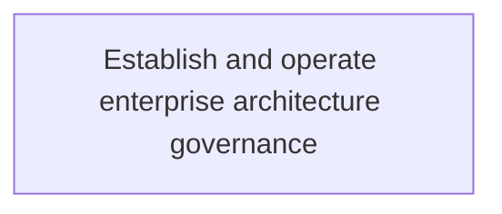
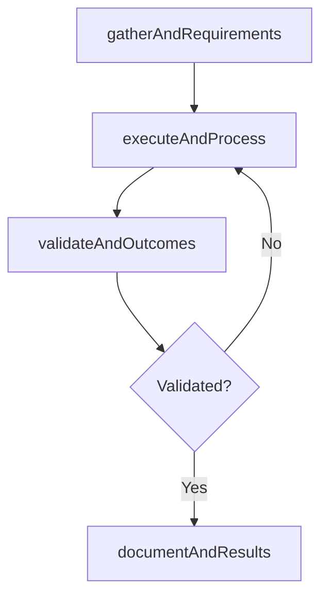

# Establish and operate enterprise architecture governance

> Business-as-Code definition for establish and operate enterprise architecture governance. Models the process of establishing and operating a structure by which an enterprise defines appropriate strategies and ensures development ali.

## Overview

Establishing and operating a structure by which an enterprise defines appropriate strategies and ensures development alignment with those strategies. Create and establish the rules, regulations, policies, and standards that will govern the individual components of the IT architecture, as well as the architecture in its entirety.

## Process Hierarchy



## GraphDL

```yaml
establish:
  object: And Operate Enterprise Architecture Governance
  actor: ITStrategyAnalyst
  result: EstablishAndOperateEnterpriseArchitectureGovernance
```

## Actions

| Action | Description |
|--------|-------------|
| gatherAndRequirements | Collect requirements and inputs for establish and operate enterprise architecture governance |
| executeAndProcess | Perform the core activities of establish and operate enterprise architecture governance |
| validateAndOutcomes | Verify that outcomes meet defined criteria and standards |
| documentAndResults | Record findings and results for stakeholder review |

## Events

| Event | Description |
|-------|-------------|
| andRequirementsGathered | Requirements for establish and operate enterprise architecture governance collected |
| andProcessExecuted | Core activities of establish and operate enterprise architecture governance completed |
| andOutcomesValidated | Outcomes verified against defined criteria |
| andResultsDocumented | Results recorded and distributed to stakeholders |

## Searches

| Search | Description |
|--------|-------------|
| getAndStatus | Retrieve current status of establish and operate enterprise architecture governance |
| findAndRecords | List records related to establish and operate enterprise architecture governance by date or status |
| getAndReport | Retrieve summary report for establish and operate enterprise architecture governance |

## Process Flow



## RACI Matrix

| Activity | Responsible | Accountable | Consulted | Informed |
|----------|-------------|-------------|-----------|----------|
| gatherAndRequirements | ITStrategyAnalyst | EnterpriseArchitect | BusinessUnitLeaders | CIO |
| executeAndProcess | ITStrategyAnalyst | EnterpriseArchitect | ITOperations | ITServiceManager |
| validateAndOutcomes | ITStrategyAnalyst | EnterpriseArchitect | QualityAssurance | ITServiceManager |

## Related Processes

| Process | Relationship |
|---------|-------------|
| 8.2.3 Parent process | Parent - provides context and governance |
| 8.2.3.3 Sibling activity | Parallel - complementary activity in the same process |

## Related Departments

| Department | Role |
|-----------|------|
| IT Strategy and Planning | Owns strategy and governance activities |
| Enterprise Architecture | Provides technical architecture guidance |
| Finance | Validates budgets and investment models |

## Related Occupations

| Occupation | Involvement |
|-----------|-------------|
| IT Strategy Analyst | Conducts strategic research and analysis |
| Enterprise Architect | Designs technology architecture |

## KPIs

| KPI | Description | Unit |
|-----|-------------|------|
| Completion Rate | Percentage of establish and operate enterprise architecture governance activities completed on schedule | % |
| Quality Score | Quality assessment score for establish and operate enterprise architecture governance outputs | Score (1-10) |
| Cycle Time | Average time to complete establish and operate enterprise architecture governance | Days |

## Usage

```typescript
import { establishAndOperateEnterpriseArchitectureGovernance } from '@headlessly/establish-and-operate-enterprise-architecture-governance'

const process = establishAndOperateEnterpriseArchitectureGovernance()

// Execute the core process
const result = await process.executeAndProcess({
  scope: 'department',
  priority: 'high'
})

// Validate outcomes
const validation = await process.validateAndOutcomes({
  criteria: 'standard',
  period: 'Q4-2025'
})
```
