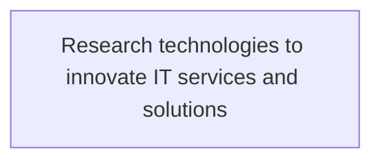
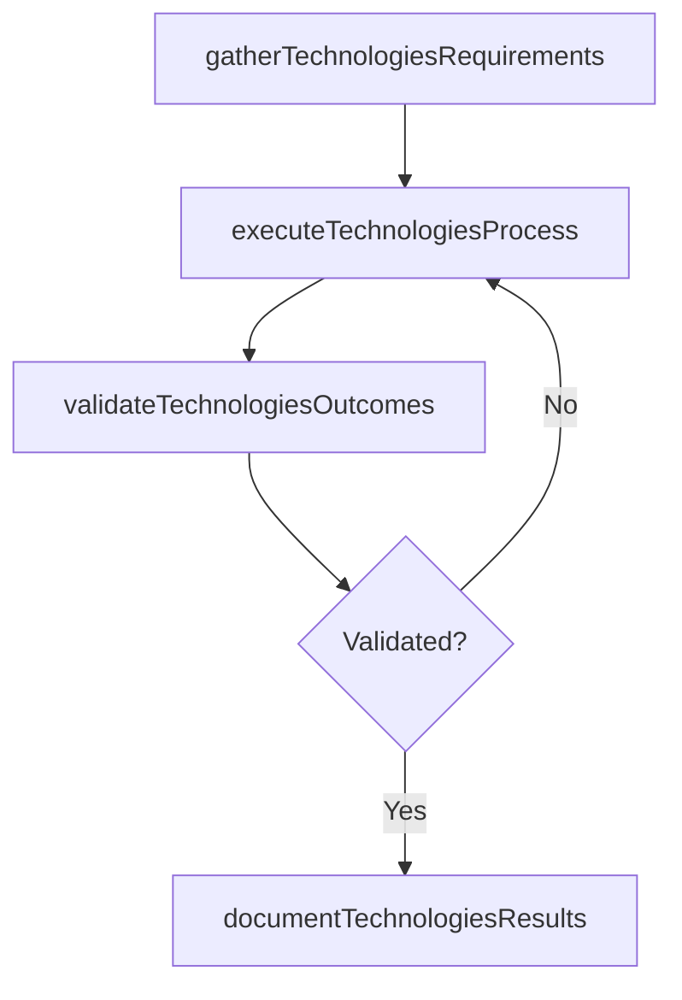

# Research technologies to innovate IT services and solutions

> Business-as-Code definition for research technologies to innovate it services and solutions. Models the process of systematically investigating and studying materials and sources relevant to the it function. reach meaningful insights a.

## Overview

Systematically investigating and studying materials and sources relevant to the IT function. Reach meaningful insights and conclusions in the form of new ideas and innovation for delivering IT services and solutions.

## Process Hierarchy



## GraphDL

```yaml
research:
  object: Technologies To Innovate IT Services And Solutions
  actor: ITInnovationLead
  result: ResearchTechnologiesToInnovateItServicesAndSolutions
```

## Actions

| Action | Description |
|--------|-------------|
| gatherTechnologiesRequirements | Collect requirements and inputs for research technologies to innovate it services and solutions |
| executeTechnologiesProcess | Perform the core activities of research technologies to innovate it services and solutions |
| validateTechnologiesOutcomes | Verify that outcomes meet defined criteria and standards |
| documentTechnologiesResults | Record findings and results for stakeholder review |

## Events

| Event | Description |
|-------|-------------|
| technologiesRequirementsGathered | Requirements for research technologies to innovate it services and solutions collected |
| technologiesProcessExecuted | Core activities of research technologies to innovate it services and solutions completed |
| technologiesOutcomesValidated | Outcomes verified against defined criteria |
| technologiesResultsDocumented | Results recorded and distributed to stakeholders |

## Searches

| Search | Description |
|--------|-------------|
| getTechnologiesStatus | Retrieve current status of research technologies to innovate it services and solutions |
| findTechnologiesRecords | List records related to research technologies to innovate it services and solutions by date or status |
| getTechnologiesReport | Retrieve summary report for research technologies to innovate it services and solutions |

## Process Flow



## RACI Matrix

| Activity | Responsible | Accountable | Consulted | Informed |
|----------|-------------|-------------|-----------|----------|
| gatherTechnologiesRequirements | ITInnovationLead | ITStrategyAnalyst | BusinessUnitLeaders | CIO |
| executeTechnologiesProcess | ITInnovationLead | ITStrategyAnalyst | ITOperations | ITServiceManager |
| validateTechnologiesOutcomes | ITInnovationLead | ITStrategyAnalyst | QualityAssurance | ITServiceManager |

## Related Processes

| Process | Relationship |
|---------|-------------|
| 8.2.3 Parent process | Parent - provides context and governance |
| 8.2.3.4 Sibling activity | Parallel - complementary activity in the same process |

## Related Departments

| Department | Role |
|-----------|------|
| IT Strategy and Planning | Owns strategy and governance activities |
| Enterprise Architecture | Provides technical architecture guidance |
| Finance | Validates budgets and investment models |

## Related Occupations

| Occupation | Involvement |
|-----------|-------------|
| IT Strategy Analyst | Conducts strategic research and analysis |
| Enterprise Architect | Designs technology architecture |

## KPIs

| KPI | Description | Unit |
|-----|-------------|------|
| Completion Rate | Percentage of research technologies to innovate it services and solutions activities completed on schedule | % |
| Quality Score | Quality assessment score for research technologies to innovate it services and solutions outputs | Score (1-10) |
| Cycle Time | Average time to complete research technologies to innovate it services and solutions | Days |

## Usage

```typescript
import { researchTechnologiesToInnovateItServicesAndSolutions } from '@headlessly/research-technologies-to-innovate-it-services-and-solutions'

const process = researchTechnologiesToInnovateItServicesAndSolutions()

// Execute the core process
const result = await process.executeTechnologiesProcess({
  scope: 'department',
  priority: 'high'
})

// Validate outcomes
const validation = await process.validateTechnologiesOutcomes({
  criteria: 'standard',
  period: 'Q4-2025'
})
```
