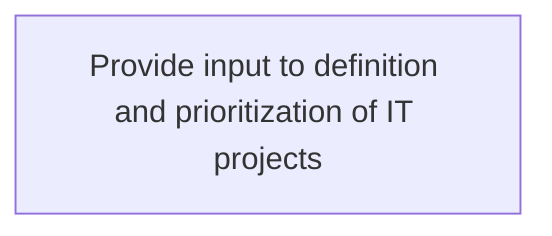
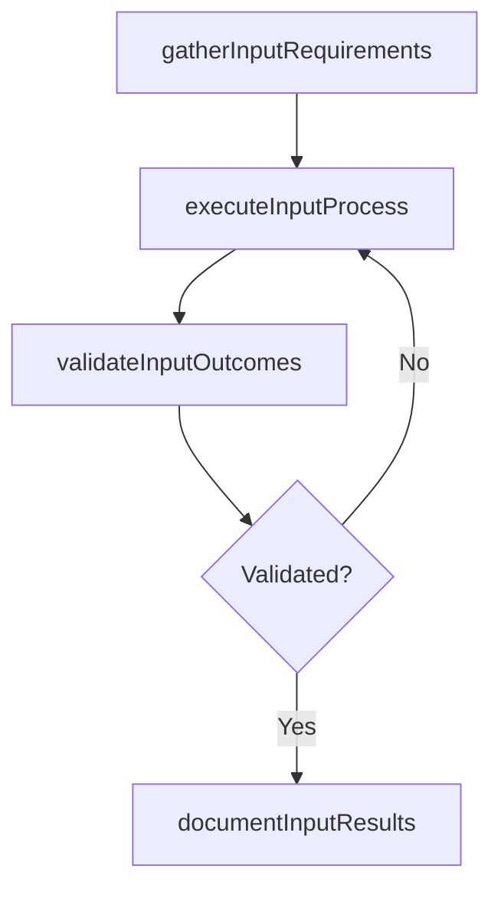

# Provide input to definition and prioritization of IT projects

> Business-as-Code definition for provide input to definition and prioritization of it projects. Models the process of analyze the value driven through it projects and redefine and/or reprioritize. evaluate planning, organizing, and implem.

## Overview

Analyze the value driven through IT projects and redefine and/or reprioritize. Evaluate planning, organizing, and implementation of IT projects based on research outcomes and business objectives.

## Process Hierarchy



## GraphDL

```yaml
provide:
  object: Input To Definition And Prioritization Of IT Projects
  actor: EnterpriseArchitect
  result: ProvideInputToDefinitionAndPrioritizationOfItProjects
```

## Actions

| Action | Description |
|--------|-------------|
| gatherInputRequirements | Collect requirements and inputs for provide input to definition and prioritization of it projects |
| executeInputProcess | Perform the core activities of provide input to definition and prioritization of it projects |
| validateInputOutcomes | Verify that outcomes meet defined criteria and standards |
| documentInputResults | Record findings and results for stakeholder review |

## Events

| Event | Description |
|-------|-------------|
| inputRequirementsGathered | Requirements for provide input to definition and prioritization of it projects collected |
| inputProcessExecuted | Core activities of provide input to definition and prioritization of it projects completed |
| inputOutcomesValidated | Outcomes verified against defined criteria |
| inputResultsDocumented | Results recorded and distributed to stakeholders |

## Searches

| Search | Description |
|--------|-------------|
| getInputStatus | Retrieve current status of provide input to definition and prioritization of it projects |
| findInputRecords | List records related to provide input to definition and prioritization of it projects by date or status |
| getInputReport | Retrieve summary report for provide input to definition and prioritization of it projects |

## Process Flow



## RACI Matrix

| Activity | Responsible | Accountable | Consulted | Informed |
|----------|-------------|-------------|-----------|----------|
| gatherInputRequirements | EnterpriseArchitect | ITPortfolioManager | BusinessUnitLeaders | CIO |
| executeInputProcess | EnterpriseArchitect | ITPortfolioManager | ITOperations | ITServiceManager |
| validateInputOutcomes | EnterpriseArchitect | ITPortfolioManager | QualityAssurance | ITServiceManager |

## Related Processes

| Process | Relationship |
|---------|-------------|
| 8.2.3 Parent process | Parent - provides context and governance |
| 8.2.3.5 Sibling activity | Parallel - complementary activity in the same process |

## Related Departments

| Department | Role |
|-----------|------|
| IT Strategy and Planning | Owns strategy and governance activities |
| Enterprise Architecture | Provides technical architecture guidance |
| Finance | Validates budgets and investment models |

## Related Occupations

| Occupation | Involvement |
|-----------|-------------|
| IT Strategy Analyst | Conducts strategic research and analysis |
| Enterprise Architect | Designs technology architecture |

## KPIs

| KPI | Description | Unit |
|-----|-------------|------|
| Completion Rate | Percentage of provide input to definition and prioritization of it projects activities completed on schedule | % |
| Quality Score | Quality assessment score for provide input to definition and prioritization of it projects outputs | Score (1-10) |
| Cycle Time | Average time to complete provide input to definition and prioritization of it projects | Days |

## Usage

```typescript
import { provideInputToDefinitionAndPrioritizationOfItProjects } from '@headlessly/provide-input-to-definition-and-prioritization-of-it-projects'

const process = provideInputToDefinitionAndPrioritizationOfItProjects()

// Execute the core process
const result = await process.executeInputProcess({
  scope: 'department',
  priority: 'high'
})

// Validate outcomes
const validation = await process.validateInputOutcomes({
  criteria: 'standard',
  period: 'Q4-2025'
})
```
