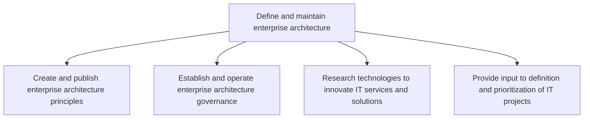
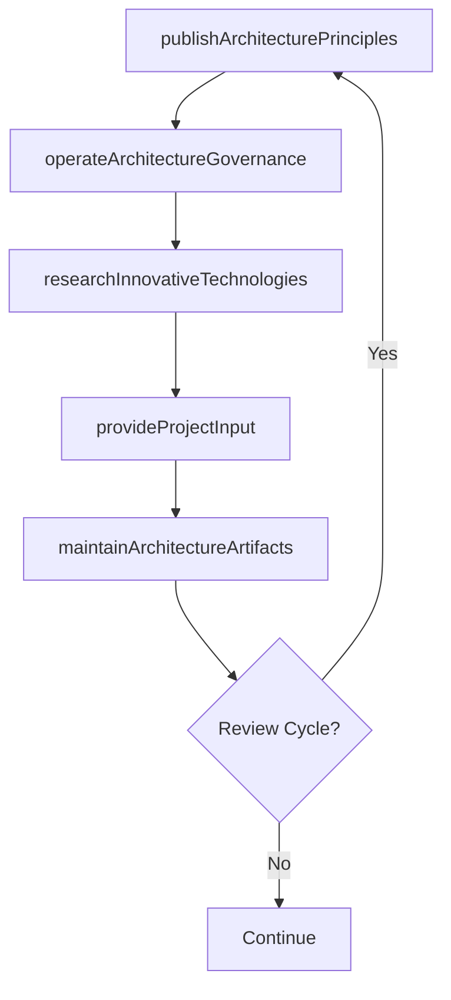

# Define and maintain enterprise architecture

> Business-as-Code definition for enterprise architecture management. Models the process of creating architecture principles, establishing governance, researching innovative technologies, and providing input to IT project prioritization.

## Overview

Outlining and maintaining the organization's IT architecture. Establish the IT architecture definition and framework. Ensure the relevance of IT. Create and confirm the approach for IT maintenance. Create rules and regulations to guide IT architecture. Authenticate and finalize all IT related research and innovation that takes place within the organization.

## Process Hierarchy



## GraphDL

```yaml
define:
  object: And Maintain Enterprise Architecture
  actor: EnterpriseArchitect
  result: EnterpriseArchitectureBlueprint
```

## Actions

| Action | Description |
|--------|-------------|
| publishArchitecturePrinciples | Create and distribute enterprise architecture guiding principles |
| operateArchitectureGovernance | Run architecture review boards and governance processes |
| researchInnovativeTechnologies | Investigate emerging technologies for potential IT innovation |
| provideProjectInput | Advise on architecture implications for IT project definition and prioritization |
| maintainArchitectureArtifacts | Keep architecture models, diagrams, and standards current |

## Events

| Event | Description |
|-------|-------------|
| architecturePrinciplesPublished | Enterprise architecture principles approved and distributed |
| architectureGovernanceOperated | Architecture review board session completed |
| innovativeTechnologiesResearched | Technology research findings documented and shared |
| projectInputProvided | Architecture input delivered for project definition |
| architectureArtifactsMaintained | Architecture models and standards updated |

## Searches

| Search | Description |
|--------|-------------|
| getArchitecturePrinciples | Retrieve current enterprise architecture principles |
| findArchitectureDecisions | List architecture decision records by domain or date |
| getTechnologyResearch | Get technology research findings by topic or maturity |
| getArchitectureCompliance | Retrieve project compliance status against architecture standards |

## Process Flow



## RACI Matrix

| Activity | Responsible | Accountable | Consulted | Informed |
|----------|-------------|-------------|-----------|----------|
| publishArchitecturePrinciples | EnterpriseArchitect | CTO | CIO | DevelopmentTeams |
| operateArchitectureGovernance | ArchitectureGovernanceLead | CTO | ITDirectors | ProjectManagers |
| researchInnovativeTechnologies | TechnologyResearcher | EnterpriseArchitect | ITInnovationLead | CTO |
| provideProjectInput | EnterpriseArchitect | CTO | ITPortfolioManager | ProjectManagers |

## Sub-Processes

| ID | Name | Description |
|----|------|-------------|
| 8.2.3.1 | Create and publish enterprise architecture principles | Creating and publishing high level statements of the fundamental values (principles) based on the or |
| 8.2.3.2 | Establish and operate enterprise architecture governance | Establishing and operating a structure by which an enterprise defines appropriate strategies and ens |
| 8.2.3.3 | Research technologies to innovate IT services and solutions | Systematically investigating and studying materials and sources relevant to the IT function. Reach m |
| 8.2.3.4 | Provide input to definition and prioritization of IT projects | Analyze the value driven through IT projects and redefine and/or reprioritize. Evaluate planning, or |

## Related Processes

| Process | Relationship |
|---------|-------------|
| 8.2.1 Define business technology and governance strategy | Upstream - governance strategy shapes architecture direction |
| 8.2.2 Manage IT portfolio strategy | Parallel - architecture standards constrain portfolio decisions |
| 8.5 Develop and manage services/solutions | Downstream - architecture blueprints guide solution design |

## Related Departments

| Department | Role |
|-----------|------|
| Enterprise Architecture | Primary owner of architecture definition and governance |
| Software Engineering | Implements solutions within architecture standards |
| Infrastructure and Operations | Manages platforms aligned to architecture blueprints |
| IT Security | Ensures security architecture integration |

## Related Occupations

| Occupation | Involvement |
|-----------|-------------|
| Enterprise Architect | Primary executor of architecture management |
| Solution Architect | Applies architecture patterns to specific solutions |
| Technology Researcher | Evaluates emerging technologies for architecture relevance |

## KPIs

| KPI | Description | Unit |
|-----|-------------|------|
| Architecture Compliance Rate | Percentage of projects compliant with architecture standards | % |
| Architecture Review Cadence | Number of architecture reviews conducted per quarter | Count/Quarter |
| Technical Debt Ratio | Proportion of IT estate with known architecture deviations | % |
| Standards Currency | Percentage of architecture standards reviewed within the last year | % |

## Usage

```typescript
import { defineAndMaintainEnterpriseArchitecture } from '@headlessly/define-and-maintain-enterprise-architecture'

const architecture = defineAndMaintainEnterpriseArchitecture()

// Publish architecture principles
const principles = await architecture.publishArchitecturePrinciples({
  domain: 'application-architecture',
  principles: ['api-first', 'cloud-native', 'event-driven']
})

// Research emerging technologies
const research = await architecture.researchInnovativeTechnologies({
  topics: ['serverless', 'edge-computing', 'generative-ai'],
  evaluationCriteria: ['maturity', 'relevance', 'cost']
})
```
