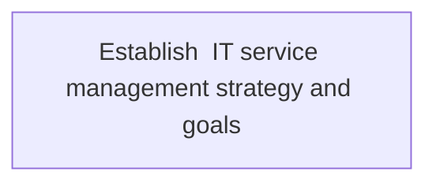
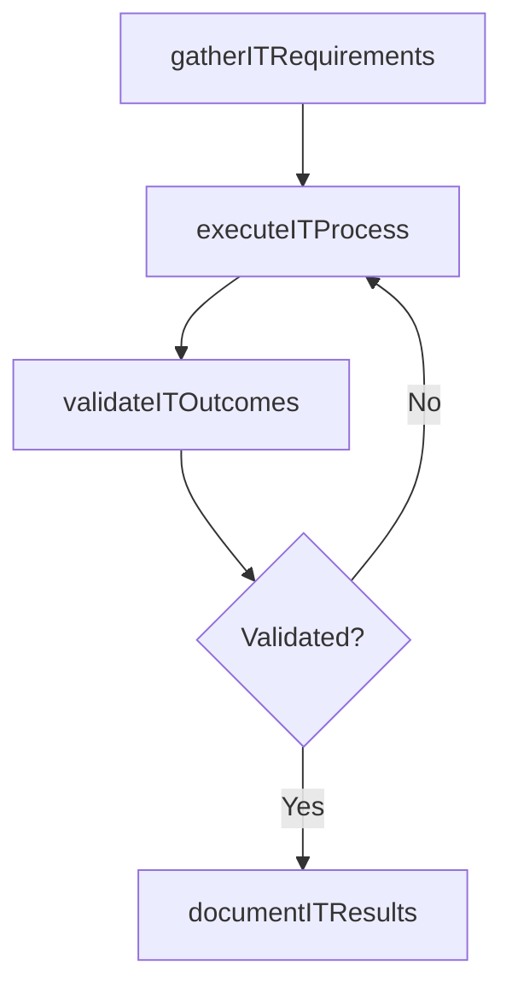

# Establish  IT service management strategy and goals

> Business-as-Code definition for establish  it service management strategy and goals. Models the process of implementing strategy for designing, delivering, managing, and improving the way information technology be used in the o.

## Overview

Implementing strategy for designing, delivering, managing, and improving the way information technology be used in the organization. The goal of IT Service Management is to ensure that the right processes, people, and technology are in place to meet business goals.

## Process Hierarchy



## GraphDL

```yaml
establish:
  object: IT Service Management Strategy And Goals
  actor: ITStrategyAnalyst
  result: EstablishItServiceManagementStrategyAndGoals
```

## Actions

| Action | Description |
|--------|-------------|
| gatherITRequirements | Collect requirements and inputs for establish  it service management strategy and goals |
| executeITProcess | Perform the core activities of establish  it service management strategy and goals |
| validateITOutcomes | Verify that outcomes meet defined criteria and standards |
| documentITResults | Record findings and results for stakeholder review |

## Events

| Event | Description |
|-------|-------------|
| itRequirementsGathered | Requirements for establish  it service management strategy and goals collected |
| itProcessExecuted | Core activities of establish  it service management strategy and goals completed |
| itOutcomesValidated | Outcomes verified against defined criteria |
| itResultsDocumented | Results recorded and distributed to stakeholders |

## Searches

| Search | Description |
|--------|-------------|
| getITStatus | Retrieve current status of establish  it service management strategy and goals |
| findITRecords | List records related to establish  it service management strategy and goals by date or status |
| getITReport | Retrieve summary report for establish  it service management strategy and goals |

## Process Flow



## RACI Matrix

| Activity | Responsible | Accountable | Consulted | Informed |
|----------|-------------|-------------|-----------|----------|
| gatherITRequirements | ITStrategyAnalyst | EnterpriseArchitect | BusinessUnitLeaders | CIO |
| executeITProcess | ITStrategyAnalyst | EnterpriseArchitect | ITOperations | ITServiceManager |
| validateITOutcomes | ITStrategyAnalyst | EnterpriseArchitect | QualityAssurance | ITServiceManager |

## Related Processes

| Process | Relationship |
|---------|-------------|
| 8.2.4 Parent process | Parent - provides context and governance |
| 8.2.4.2 Sibling activity | Parallel - complementary activity in the same process |

## Related Departments

| Department | Role |
|-----------|------|
| IT Strategy and Planning | Owns strategy and governance activities |
| Enterprise Architecture | Provides technical architecture guidance |
| Finance | Validates budgets and investment models |

## Related Occupations

| Occupation | Involvement |
|-----------|-------------|
| IT Strategy Analyst | Conducts strategic research and analysis |
| Enterprise Architect | Designs technology architecture |

## KPIs

| KPI | Description | Unit |
|-----|-------------|------|
| Completion Rate | Percentage of establish  it service management strategy and goals activities completed on schedule | % |
| Quality Score | Quality assessment score for establish  it service management strategy and goals outputs | Score (1-10) |
| Cycle Time | Average time to complete establish  it service management strategy and goals | Days |

## Usage

```typescript
import { establishItServiceManagementStrategyAndGoals } from '@headlessly/establish-it-service-management-strategy-and-goals'

const process = establishItServiceManagementStrategyAndGoals()

// Execute the core process
const result = await process.executeITProcess({
  scope: 'department',
  priority: 'high'
})

// Validate outcomes
const validation = await process.validateITOutcomes({
  criteria: 'standard',
  period: 'Q4-2025'
})
```
