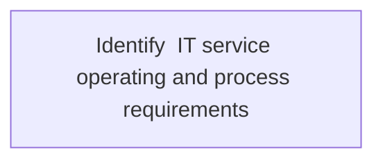
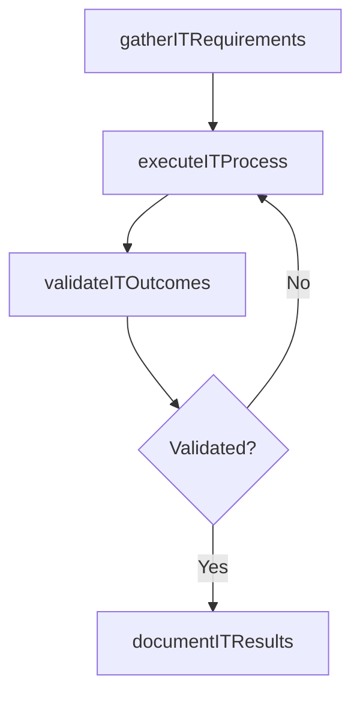

# Identify  IT service operating and process requirements

> Business-as-Code definition for identify  it service operating and process requirements. Models the process of identifying operating and process requirement for designing, delivering, managing, and improving the way information tec.

## Overview

Identifying operating and process requirement for designing, delivering, managing, and improving the way information technology be used in the organization.

## Process Hierarchy



## GraphDL

```yaml
identify:
  object: IT Service Operating And Process Requirements
  actor: ITStrategyAnalyst
  result: IdentifyItServiceOperatingAndProcessRequirements
```

## Actions

| Action | Description |
|--------|-------------|
| gatherITRequirements | Collect requirements and inputs for identify  it service operating and process requirements |
| executeITProcess | Perform the core activities of identify  it service operating and process requirements |
| validateITOutcomes | Verify that outcomes meet defined criteria and standards |
| documentITResults | Record findings and results for stakeholder review |

## Events

| Event | Description |
|-------|-------------|
| itRequirementsGathered | Requirements for identify  it service operating and process requirements collected |
| itProcessExecuted | Core activities of identify  it service operating and process requirements completed |
| itOutcomesValidated | Outcomes verified against defined criteria |
| itResultsDocumented | Results recorded and distributed to stakeholders |

## Searches

| Search | Description |
|--------|-------------|
| getITStatus | Retrieve current status of identify  it service operating and process requirements |
| findITRecords | List records related to identify  it service operating and process requirements by date or status |
| getITReport | Retrieve summary report for identify  it service operating and process requirements |

## Process Flow



## RACI Matrix

| Activity | Responsible | Accountable | Consulted | Informed |
|----------|-------------|-------------|-----------|----------|
| gatherITRequirements | ITStrategyAnalyst | EnterpriseArchitect | BusinessUnitLeaders | CIO |
| executeITProcess | ITStrategyAnalyst | EnterpriseArchitect | ITOperations | ITServiceManager |
| validateITOutcomes | ITStrategyAnalyst | EnterpriseArchitect | QualityAssurance | ITServiceManager |

## Related Processes

| Process | Relationship |
|---------|-------------|
| 8.2.4 Parent process | Parent - provides context and governance |
| 8.2.4.3 Sibling activity | Parallel - complementary activity in the same process |

## Related Departments

| Department | Role |
|-----------|------|
| IT Strategy and Planning | Owns strategy and governance activities |
| Enterprise Architecture | Provides technical architecture guidance |
| Finance | Validates budgets and investment models |

## Related Occupations

| Occupation | Involvement |
|-----------|-------------|
| IT Strategy Analyst | Conducts strategic research and analysis |
| Enterprise Architect | Designs technology architecture |

## KPIs

| KPI | Description | Unit |
|-----|-------------|------|
| Completion Rate | Percentage of identify  it service operating and process requirements activities completed on schedule | % |
| Quality Score | Quality assessment score for identify  it service operating and process requirements outputs | Score (1-10) |
| Cycle Time | Average time to complete identify  it service operating and process requirements | Days |

## Usage

```typescript
import { identifyItServiceOperatingAndProcessRequirements } from '@headlessly/identify-it-service-operating-and-process-requirements'

const process = identifyItServiceOperatingAndProcessRequirements()

// Execute the core process
const result = await process.executeITProcess({
  scope: 'department',
  priority: 'high'
})

// Validate outcomes
const validation = await process.validateITOutcomes({
  criteria: 'standard',
  period: 'Q4-2025'
})
```
