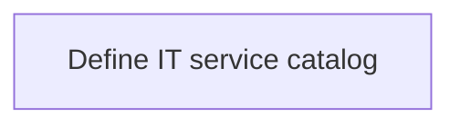
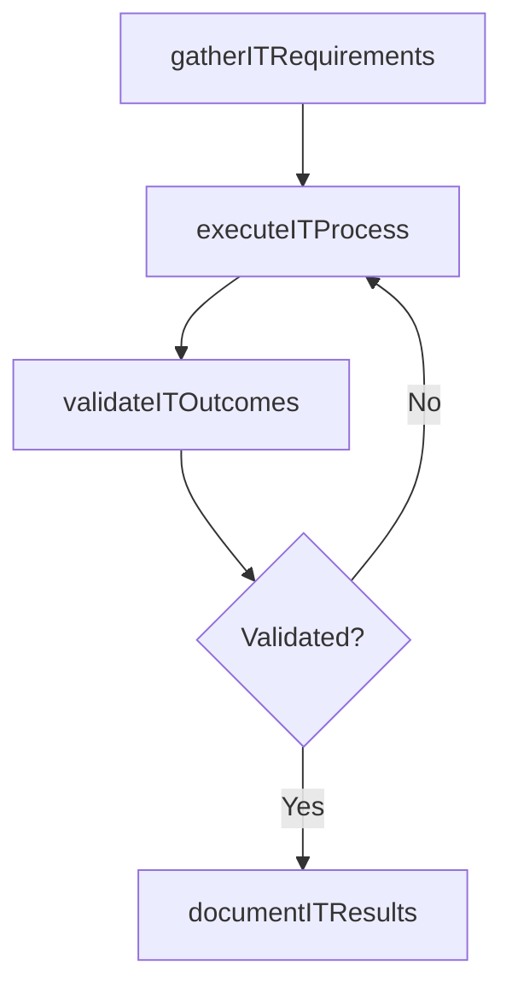

# Define IT service catalog

> Business-as-Code definition for define it service catalog. Models the process of create and design an organized and curated collection of all it-related services that can be performed by, for, or withi.

## Overview

Create and design an organized and curated collection of all IT-related services that can be performed by, for, or within the organization.

## Process Hierarchy



## GraphDL

```yaml
define:
  object: IT Service Catalog
  actor: ITPortfolioManager
  result: DefineItServiceCatalog
```

## Actions

| Action | Description |
|--------|-------------|
| gatherITRequirements | Collect requirements and inputs for define it service catalog |
| executeITProcess | Perform the core activities of define it service catalog |
| validateITOutcomes | Verify that outcomes meet defined criteria and standards |
| documentITResults | Record findings and results for stakeholder review |

## Events

| Event | Description |
|-------|-------------|
| itRequirementsGathered | Requirements for define it service catalog collected |
| itProcessExecuted | Core activities of define it service catalog completed |
| itOutcomesValidated | Outcomes verified against defined criteria |
| itResultsDocumented | Results recorded and distributed to stakeholders |

## Searches

| Search | Description |
|--------|-------------|
| getITStatus | Retrieve current status of define it service catalog |
| findITRecords | List records related to define it service catalog by date or status |
| getITReport | Retrieve summary report for define it service catalog |

## Process Flow



## RACI Matrix

| Activity | Responsible | Accountable | Consulted | Informed |
|----------|-------------|-------------|-----------|----------|
| gatherITRequirements | ITPortfolioManager | ITInnovationLead | BusinessUnitLeaders | CIO |
| executeITProcess | ITPortfolioManager | ITInnovationLead | ITOperations | ITServiceManager |
| validateITOutcomes | ITPortfolioManager | ITInnovationLead | QualityAssurance | ITServiceManager |

## Related Processes

| Process | Relationship |
|---------|-------------|
| 8.2.4 Parent process | Parent - provides context and governance |
| 8.2.4.4 Sibling activity | Parallel - complementary activity in the same process |

## Related Departments

| Department | Role |
|-----------|------|
| IT Strategy and Planning | Owns strategy and governance activities |
| Enterprise Architecture | Provides technical architecture guidance |
| Finance | Validates budgets and investment models |

## Related Occupations

| Occupation | Involvement |
|-----------|-------------|
| IT Strategy Analyst | Conducts strategic research and analysis |
| Enterprise Architect | Designs technology architecture |

## KPIs

| KPI | Description | Unit |
|-----|-------------|------|
| Completion Rate | Percentage of define it service catalog activities completed on schedule | % |
| Quality Score | Quality assessment score for define it service catalog outputs | Score (1-10) |
| Cycle Time | Average time to complete define it service catalog | Days |

## Usage

```typescript
import { defineItServiceCatalog } from '@headlessly/define-it-service-catalog'

const process = defineItServiceCatalog()

// Execute the core process
const result = await process.executeITProcess({
  scope: 'department',
  priority: 'high'
})

// Validate outcomes
const validation = await process.validateITOutcomes({
  criteria: 'standard',
  period: 'Q4-2025'
})
```
