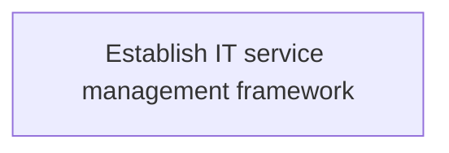
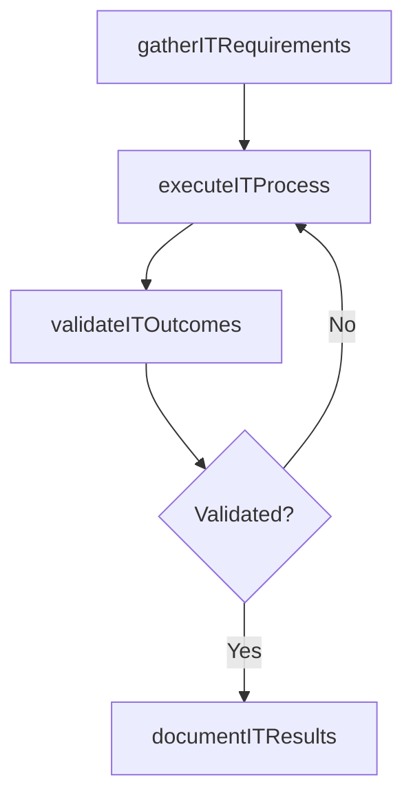

# Establish IT service management framework

> Business-as-Code definition for establish it service management framework. Models the process of create a layered structure for it service management framework ensuring right processes, people, and technology are in p.

## Overview

Create a layered structure for IT service management framework ensuring right processes, people, and technology are in place to meet business goals.

## Process Hierarchy



## GraphDL

```yaml
establish:
  object: IT Service Management Framework
  actor: ITPortfolioManager
  result: EstablishItServiceManagementFramework
```

## Actions

| Action | Description |
|--------|-------------|
| gatherITRequirements | Collect requirements and inputs for establish it service management framework |
| executeITProcess | Perform the core activities of establish it service management framework |
| validateITOutcomes | Verify that outcomes meet defined criteria and standards |
| documentITResults | Record findings and results for stakeholder review |

## Events

| Event | Description |
|-------|-------------|
| itRequirementsGathered | Requirements for establish it service management framework collected |
| itProcessExecuted | Core activities of establish it service management framework completed |
| itOutcomesValidated | Outcomes verified against defined criteria |
| itResultsDocumented | Results recorded and distributed to stakeholders |

## Searches

| Search | Description |
|--------|-------------|
| getITStatus | Retrieve current status of establish it service management framework |
| findITRecords | List records related to establish it service management framework by date or status |
| getITReport | Retrieve summary report for establish it service management framework |

## Process Flow



## RACI Matrix

| Activity | Responsible | Accountable | Consulted | Informed |
|----------|-------------|-------------|-----------|----------|
| gatherITRequirements | ITPortfolioManager | ITInnovationLead | BusinessUnitLeaders | CIO |
| executeITProcess | ITPortfolioManager | ITInnovationLead | ITOperations | ITServiceManager |
| validateITOutcomes | ITPortfolioManager | ITInnovationLead | QualityAssurance | ITServiceManager |

## Related Processes

| Process | Relationship |
|---------|-------------|
| 8.2.4 Parent process | Parent - provides context and governance |
| 8.2.4.5 Sibling activity | Parallel - complementary activity in the same process |

## Related Departments

| Department | Role |
|-----------|------|
| IT Strategy and Planning | Owns strategy and governance activities |
| Enterprise Architecture | Provides technical architecture guidance |
| Finance | Validates budgets and investment models |

## Related Occupations

| Occupation | Involvement |
|-----------|-------------|
| IT Strategy Analyst | Conducts strategic research and analysis |
| Enterprise Architect | Designs technology architecture |

## KPIs

| KPI | Description | Unit |
|-----|-------------|------|
| Completion Rate | Percentage of establish it service management framework activities completed on schedule | % |
| Quality Score | Quality assessment score for establish it service management framework outputs | Score (1-10) |
| Cycle Time | Average time to complete establish it service management framework | Days |

## Usage

```typescript
import { establishItServiceManagementFramework } from '@headlessly/establish-it-service-management-framework'

const process = establishItServiceManagementFramework()

// Execute the core process
const result = await process.executeITProcess({
  scope: 'department',
  priority: 'high'
})

// Validate outcomes
const validation = await process.validateITOutcomes({
  criteria: 'standard',
  period: 'Q4-2025'
})
```
