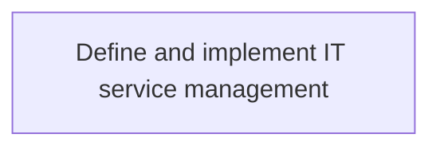
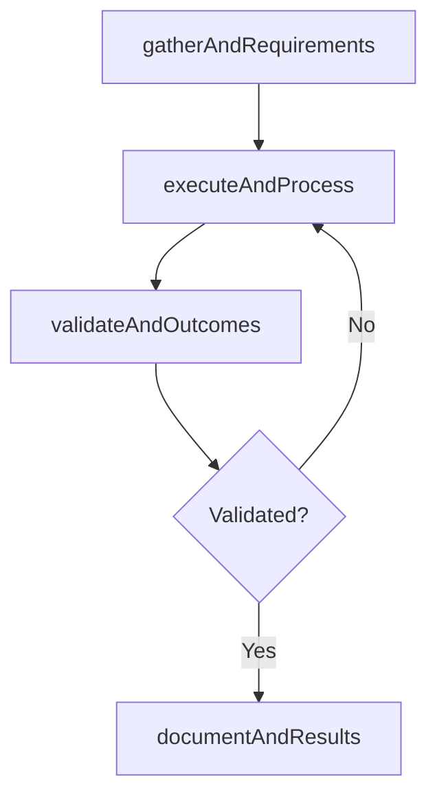

# Define and implement IT service management

> Business-as-Code definition for define and implement it service management. Models the process of defining and implementing activities involved in designing, creating, delivering, supporting, and managing the lifecycle.

## Overview

Defining and implementing activities involved in designing, creating, delivering, supporting, and managing the lifecycle of information technology services within an organization.

## Process Hierarchy



## GraphDL

```yaml
define:
  object: And Implement IT Service Management
  actor: ITPortfolioManager
  result: DefineAndImplementItServiceManagement
```

## Actions

| Action | Description |
|--------|-------------|
| gatherAndRequirements | Collect requirements and inputs for define and implement it service management |
| executeAndProcess | Perform the core activities of define and implement it service management |
| validateAndOutcomes | Verify that outcomes meet defined criteria and standards |
| documentAndResults | Record findings and results for stakeholder review |

## Events

| Event | Description |
|-------|-------------|
| andRequirementsGathered | Requirements for define and implement it service management collected |
| andProcessExecuted | Core activities of define and implement it service management completed |
| andOutcomesValidated | Outcomes verified against defined criteria |
| andResultsDocumented | Results recorded and distributed to stakeholders |

## Searches

| Search | Description |
|--------|-------------|
| getAndStatus | Retrieve current status of define and implement it service management |
| findAndRecords | List records related to define and implement it service management by date or status |
| getAndReport | Retrieve summary report for define and implement it service management |

## Process Flow



## RACI Matrix

| Activity | Responsible | Accountable | Consulted | Informed |
|----------|-------------|-------------|-----------|----------|
| gatherAndRequirements | ITPortfolioManager | ITInnovationLead | BusinessUnitLeaders | CIO |
| executeAndProcess | ITPortfolioManager | ITInnovationLead | ITOperations | ITServiceManager |
| validateAndOutcomes | ITPortfolioManager | ITInnovationLead | QualityAssurance | ITServiceManager |

## Related Processes

| Process | Relationship |
|---------|-------------|
| 8.2.4 Parent process | Parent - provides context and governance |
| 8.2.4.6 Sibling activity | Parallel - complementary activity in the same process |

## Related Departments

| Department | Role |
|-----------|------|
| IT Strategy and Planning | Owns strategy and governance activities |
| Enterprise Architecture | Provides technical architecture guidance |
| Finance | Validates budgets and investment models |

## Related Occupations

| Occupation | Involvement |
|-----------|-------------|
| IT Strategy Analyst | Conducts strategic research and analysis |
| Enterprise Architect | Designs technology architecture |

## KPIs

| KPI | Description | Unit |
|-----|-------------|------|
| Completion Rate | Percentage of define and implement it service management activities completed on schedule | % |
| Quality Score | Quality assessment score for define and implement it service management outputs | Score (1-10) |
| Cycle Time | Average time to complete define and implement it service management | Days |

## Usage

```typescript
import { defineAndImplementItServiceManagement } from '@headlessly/define-and-implement-it-service-management'

const process = defineAndImplementItServiceManagement()

// Execute the core process
const result = await process.executeAndProcess({
  scope: 'department',
  priority: 'high'
})

// Validate outcomes
const validation = await process.validateAndOutcomes({
  criteria: 'standard',
  period: 'Q4-2025'
})
```
