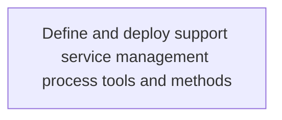
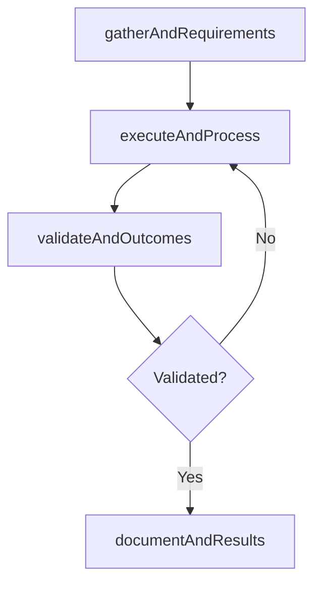

# Define and deploy support service management process tools and methods

> Business-as-Code definition for define and deploy support service management process tools and methods. Models the process of establishing services for providing support to users of it services and solutions. define the plethora of services along.

## Overview

Establishing services for providing support to users of IT services and solutions. Define the plethora of services along with tools and methods by which the organization assists users of computers, software products, or other electronic/mechanical products.

## Process Hierarchy



## GraphDL

```yaml
define:
  object: And Deploy Support Service Management Process Tools And Methods
  actor: ITPortfolioManager
  result: DefineAndDeploySupportServiceManagementProcessToolsAndMethods
```

## Actions

| Action | Description |
|--------|-------------|
| gatherAndRequirements | Collect requirements and inputs for define and deploy support service management process tools and methods |
| executeAndProcess | Perform the core activities of define and deploy support service management process tools and methods |
| validateAndOutcomes | Verify that outcomes meet defined criteria and standards |
| documentAndResults | Record findings and results for stakeholder review |

## Events

| Event | Description |
|-------|-------------|
| andRequirementsGathered | Requirements for define and deploy support service management process tools and methods collected |
| andProcessExecuted | Core activities of define and deploy support service management process tools and methods completed |
| andOutcomesValidated | Outcomes verified against defined criteria |
| andResultsDocumented | Results recorded and distributed to stakeholders |

## Searches

| Search | Description |
|--------|-------------|
| getAndStatus | Retrieve current status of define and deploy support service management process tools and methods |
| findAndRecords | List records related to define and deploy support service management process tools and methods by date or status |
| getAndReport | Retrieve summary report for define and deploy support service management process tools and methods |

## Process Flow



## RACI Matrix

| Activity | Responsible | Accountable | Consulted | Informed |
|----------|-------------|-------------|-----------|----------|
| gatherAndRequirements | ITPortfolioManager | ITInnovationLead | BusinessUnitLeaders | CIO |
| executeAndProcess | ITPortfolioManager | ITInnovationLead | ITOperations | ITServiceManager |
| validateAndOutcomes | ITPortfolioManager | ITInnovationLead | QualityAssurance | ITServiceManager |

## Related Processes

| Process | Relationship |
|---------|-------------|
| 8.2.4 Parent process | Parent - provides context and governance |
| 8.2.4.7 Sibling activity | Parallel - complementary activity in the same process |

## Related Departments

| Department | Role |
|-----------|------|
| IT Strategy and Planning | Owns strategy and governance activities |
| Enterprise Architecture | Provides technical architecture guidance |
| Finance | Validates budgets and investment models |

## Related Occupations

| Occupation | Involvement |
|-----------|-------------|
| IT Strategy Analyst | Conducts strategic research and analysis |
| Enterprise Architect | Designs technology architecture |

## KPIs

| KPI | Description | Unit |
|-----|-------------|------|
| Completion Rate | Percentage of define and deploy support service management process tools and methods activities completed on schedule | % |
| Quality Score | Quality assessment score for define and deploy support service management process tools and methods outputs | Score (1-10) |
| Cycle Time | Average time to complete define and deploy support service management process tools and methods | Days |

## Usage

```typescript
import { defineAndDeploySupportServiceManagementProcessToolsAndMethods } from '@headlessly/define-and-deploy-support-service-management-process-tools-and-methods'

const process = defineAndDeploySupportServiceManagementProcessToolsAndMethods()

// Execute the core process
const result = await process.executeAndProcess({
  scope: 'department',
  priority: 'high'
})

// Validate outcomes
const validation = await process.validateAndOutcomes({
  criteria: 'standard',
  period: 'Q4-2025'
})
```
